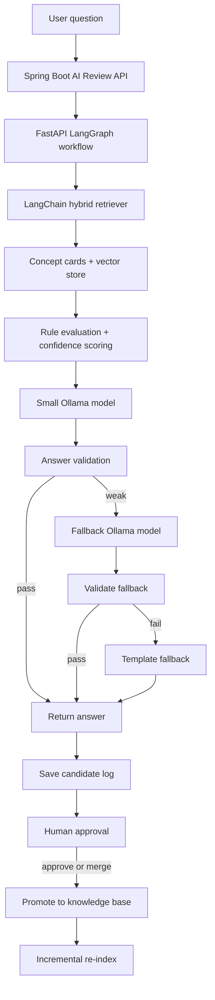

# AI Review Local RAG + LangGraph Architecture

작성일: 2026-05-16

## 목적

DevMatch AI 리뷰 기능의 응답 속도와 정확도를 동시에 개선하기 위해 로컬 LLM, LangChain RAG, LangGraph workflow, 승인형 knowledge 관리, 정량 평가 파이프라인을 도입한다.

핵심 목표는 다음과 같다.

- OpenAI, RunPod 의존도를 최소화한다.
- 노트북 로컬 환경에서도 평균 응답 시간 8초 이하, p95 12초 이하를 목표로 한다.
- 작은 로컬 모델을 쓰더라도 RAG, 규칙 검증, fallback으로 정확도를 보완한다.
- AI 답변을 자동으로 지식화하지 않고, 사람 승인 후에만 RAG knowledge base에 반영한다.
- Golden set 기반 evaluation으로 RAG/프롬프트/모델 변경 시 품질 회귀를 잡는다.
- 이력서에 LangChain, LangGraph를 자연스럽게 설명할 수 있는 실제 문제 해결 구조를 만든다.

## 전체 구조

```text
Frontend
→ Spring Boot
   - AI 리뷰 세션/메시지 관리
   - FastAPI AI 서버 호출
   - timeout/retry/circuit breaker
   - 후보 승인 API
   - 로그, tracing, metrics 저장
→ FastAPI AI Service
   - LangChain RAG 검색
   - LangGraph workflow 실행
   - Ollama 로컬 모델 호출
   - 응답 검증, fallback, 후보 생성
→ Local Knowledge Base
   - Markdown concept cards
   - approved QA
   - vector store
→ Evaluation Pipeline
   - golden dataset
   - offline regression test
   - retrieval/answer 품질 metric
```

역할은 명확히 나눈다.

```text
LangChain = 지식 로딩, chunking, embedding, retrieval
LangGraph = 답변 생성, 검증, fallback, 승인 흐름 제어
Spring Boot = 서비스 상태, 사용자 세션, 후보 승인, 운영 API
Ollama = 로컬 생성 모델
Evaluation = 변경 후 품질 회귀 방지
Human approval = RAG 지식 품질 최종 게이트
```

Mermaid workflow:



## 모델 전략

작은 모델 하나에 모든 판단을 맡기지 않는다. 정답 판단과 품질 관리는 RAG, 규칙, validator가 맡고, 모델은 자연어 답변 생성을 담당한다.

추천 구성:

```text
기본 생성 모델:
- qwen3:1.7b
- qwen2.5:3b-instruct

fallback 생성 모델:
- qwen3:4b-q4_K_M

embedding 모델:
- bge-m3

최종 fallback:
- 템플릿 기반 응답
```

fallback 기준:

```text
retrieval score가 낮음
OR 필수 개념 키워드가 누락됨
OR 답변이 한국어가 아님
OR 답변이 context와 모순됨
OR 질문 복잡도가 높음
OR 작은 모델 응답 검증 실패
```

## Knowledge Base 구조

초기에는 파일 기반 Markdown knowledge base로 시작한다. DB부터 붙이면 관리 UI, migration, versioning 부담이 커지므로 Git으로 추적 가능한 파일 기반이 적합하다.

추천 경로:

```text
ai/app/knowledge/
  concepts/
    spring/
      n-plus-one.md
      fetch-join.md
      entity-graph.md
      transaction.md
    java/
      equals.md
      optional.md
      stream-api.md
  approved_qa/
    spring-n-plus-one-common.md
  candidates/
    README.md
  prompts/
    follow_up_v1.prompt
    free_question_v1.prompt
    validators.yml
```

Concept card 예시:

```md
---
id: spring-n-plus-one
category: spring-jpa
difficulty: intermediate
version: java17-springboot3
last_updated: 2026-05-16
---

# N+1 문제

## 핵심 설명
N+1 문제는 목록 조회 1번 이후 각 엔티티의 연관 데이터를 접근할 때 추가 쿼리가 반복 발생하는 성능 문제다.

## 대표 해결
- fetch join
- EntityGraph
- batch size

## 흔한 오해
- 단순히 트랜잭션 문제라고 설명하는 것은 부정확하다.
- 네트워크 지연 문제라고 설명하는 것은 부정확하다.

## 평가 키워드
- 지연 로딩
- 연관 엔티티
- 추가 쿼리
- 반복 쿼리
```

중요 원칙:

```text
AI 답변을 RAG knowledge에 자동 저장하지 않는다.
AI 답변은 후보로만 저장한다.
사람이 승인한 내용만 concepts 또는 approved_qa로 승격한다.
```

### Knowledge Card Quality Gate

Concept card는 사람이 작성하더라도 형식이 흔들리면 retrieval 품질이 떨어진다. 따라서 card template과 lint 스크립트를 둔다.

필수 섹션:

```text
front matter:
- id
- category
- difficulty
- version
- last_updated

body:
- 핵심 설명
- 대표 해결
- 흔한 오해
- 평가 키워드
```

검증 스크립트:

```text
ai/scripts/lint_knowledge_cards.py
```

검증 항목:

```text
필수 metadata 존재 여부
필수 heading 존재 여부
concept id 중복 여부
평가 키워드 2개 이상 작성 여부
last_updated 형식
approved_qa의 concept_id 참조 유효성
```

### Prompt Versioning

프롬프트는 성능과 정확도에 큰 영향을 주므로 코드 안에 문자열로만 두지 않는다. 별도 디렉토리에서 버전 관리한다.

추천 경로:

```text
ai/app/knowledge/prompts/
  first_question_v1.prompt
  follow_up_v1.prompt
  free_question_v1.prompt
  validation_v1.prompt
  prompt_versions.yml
```

FastAPI 응답과 candidate 로그에는 `prompt_version`을 함께 저장한다.

```text
prompt_version: follow_up_v1
model_used: qwen3:1.7b
retrieved_concept_ids: spring-n-plus-one,spring-fetch-join
```

프롬프트를 바꾼 뒤에는 golden dataset evaluation을 실행해 품질 회귀를 확인한다.

## RAG 검색 전략

초기 검색은 LangChain 기반 hybrid retrieval로 구성한다.

```text
Markdown concept cards
→ MarkdownHeaderTextSplitter
→ chunking
→ bge-m3 embedding
→ semantic retriever
→ BM25 keyword retriever
→ EnsembleRetriever
→ reranker
→ top-k context 반환
```

권장 chunking:

```text
chunk size: 500~800 tokens
overlap: 100~200 tokens
metadata: file_name, concept_id, category, section, difficulty, version, last_updated
```

기술 개념은 `N+1`, `fetch join`, `EntityGraph`, `Optional`, `equals`처럼 키워드 일치가 중요하다. 따라서 vector search만 쓰지 않고 BM25 또는 full-text search를 함께 사용한다.

고도화 후보:

```text
Cross-encoder reranker:
- bge-reranker-large
- flashrank

Advanced retrieval:
- ContextualCompressionRetriever
- Parent-document retrieval
- Multi-query retrieval
- HyDE
- Semantic chunking
```

MVP에서는 hybrid retrieval과 reranker까지만 우선 적용하고, HyDE나 multi-query는 retrieval 품질이 부족할 때 추가한다.

Vector store 선택:

```text
MVP:
- Chroma
- 이유: 로컬 개발 편의성, persistence, LangChain 연동이 쉽다.

고도화:
- FAISS
- 이유: 단순하고 빠른 로컬 vector search에 적합하다.

운영 확장:
- PGVector
- 이유: Spring Boot/PostgreSQL 운영 DB와 함께 관리하기 쉽고 백업/권한/운영 체계가 단순해진다.
```

## LangGraph Workflow

LangGraph는 상태 기반 workflow orchestration에 사용한다.

기본 workflow:

```text
normalize_input
→ retrieve_context
→ rule_evaluate
→ generate_answer_small_model
→ validate_answer
→ confidence_gate
   → pass: return_answer
   → weak: generate_answer_fallback_model
→ validate_fallback
→ save_candidate
→ return_answer
```

고도화 workflow:

```text
retrieve
→ generate
→ validate
→ validation failed?
   → query_rewrite
   → re_retrieve
   → regenerate
→ still failed?
   → fallback_model
→ still failed?
   → template_fallback
→ save_candidate
→ return_answer
```

Self-correcting loop는 로컬 응답 시간을 위해 최대 1~2회로 제한한다.

Subgraph 분리:

```text
retrieval subgraph
generation subgraph
validation subgraph
approval subgraph
```

Persistent checkpoint는 추후 long-running workflow나 human-in-the-loop resume이 필요할 때 PostgreSQL/PostgresSaver로 확장한다.

Interrupt는 사용자 응답을 지연시키는 구간이 아니라 지식 승격/승인 단계에 제한적으로 사용한다.

### Error Handling & Recovery

LangGraph에는 정상 경로뿐 아니라 실패 경로를 명시한다.

대표 오류:

```text
Ollama 연결 실패
Ollama timeout
context length 초과
retriever 결과 없음
JSON parse 실패
prompt template 누락
embedding/vector store 로딩 실패
```

복구 전략:

```text
retry policy:
- Ollama timeout은 1회 retry
- retriever 오류는 keyword-only search로 fallback
- context length 초과는 context 압축 후 재시도

on_error node:
- 오류 유형을 candidate/error log에 저장
- 사용자에게는 짧은 템플릿 fallback 반환

dead-end state:
- workflow가 더 진행할 수 없으면 `FAILED_WITH_FALLBACK` 상태로 종료
- Spring Boot에는 fallback_used=true, confidence_score=0을 반환
```

오류도 evaluation 대상에 포함한다.

```text
ollama_error_rate
retriever_error_rate
template_fallback_rate
json_parse_error_count
```

## Confidence Scoring

fallback과 후보 승인 우선순위를 정하기 위해 confidence score를 계산한다.

```text
confidence_score =
retrieval_score
+ rule_match_score
+ answer_validation_score
+ model_self_check_score
```

예시 기준:

```text
0.80 이상: 정상 반환
0.60~0.79: 반환하되 후보 저장
0.60 미만: fallback 모델 호출
fallback 후에도 낮음: 템플릿 fallback + 후보 저장
```

검증 항목:

```text
한국어 여부
필수 키워드 포함 여부
금지 오해 포함 여부
context와 모순 여부
답변 길이
정답 직접 노출 금지 단계 준수 여부
```

## Spring Boot와 FastAPI 연동

기존 Spring Boot AI 리뷰 구조는 유지하고, Python AI 서버 내부만 LangChain/LangGraph 기반으로 확장한다.

FastAPI 응답 DTO 예시:

```json
{
  "answer": "N+1 문제는 목록 조회 후 각 항목의 연관 데이터를 접근할 때 추가 쿼리가 반복 발생하는 문제입니다.",
  "provider": "ollama",
  "model_used": "qwen3:1.7b",
  "fallback_used": false,
  "confidence_score": 0.82,
  "retrieved_concept_ids": ["spring-n-plus-one", "spring-fetch-join"],
  "candidate_required": true,
  "latency_ms": 12840,
  "prompt_version": "follow_up_v1"
}
```

Spring Boot에서 추가로 관리할 값:

```text
correlation_id
model_used
latency_ms
fallback_used
confidence_score
retrieved_concept_ids
candidate_id
```

운영 안정성:

```text
HTTP timeout
retry
Resilience4j circuit breaker
correlation_id 전달
FastAPI /health
FastAPI /models
Ollama warm-up
```

### Multi-Process와 Concurrency

로컬 Ollama는 노트북 환경에서 동시 요청이 늘어나면 latency가 급격히 늘 수 있다. 초기에는 무리한 병렬 처리보다 queueing과 rate limit이 안전하다.

초기 전략:

```text
FastAPI request queue
동시 Ollama 생성 요청 1~2개로 제한
나머지는 짧은 대기 또는 fallback
사용자별 rate limit
```

고도화 전략:

```text
small model 전용 Ollama instance
fallback model 전용 Ollama instance
GPU 사용 가능 시 model별 instance 분리
CPU fallback 시 timeout을 더 짧게 설정
```

동시성 지표:

```text
queue_wait_ms
active_generation_count
rate_limited_count
ollama_concurrent_requests
```

## 후보 승인 흐름

AI 답변은 바로 RAG 지식으로 저장하지 않는다. 후보로만 저장하고, 검토자가 승인한 것만 knowledge base에 반영한다.

후보 테이블 예시:

```text
ai_review_candidates
- id
- session_id
- question
- user_answer
- ai_answer
- retrieved_concept_ids
- confidence_score
- model_used
- prompt_version
- fallback_used
- status: PENDING / APPROVED / REJECTED / MERGED
- reviewer_feedback
- reviewer_id
- reviewed_at
- created_at
```

승인 액션:

```text
APPROVED:
- approved_qa에 저장

EDIT_AND_APPROVE:
- 검토자가 수정한 답변을 approved_qa에 저장

MERGED:
- 기존 concept card에 반영

REJECTED:
- 로그만 유지하고 RAG에는 반영하지 않음
```

초기 구현은 관리자 API와 CLI로 시작한다. 이후 Spring Admin 페이지 또는 간단한 Streamlit 검토 화면으로 확장한다.

Data retention:

```text
PENDING 후보: 90일 보관 후 anonymize 또는 delete
REJECTED 후보: 30~90일 보관 후 delete
APPROVED/MERGED 후보: 승인된 knowledge와 audit log만 유지
사용자 원문 답변: 개인정보 패턴 제거 후 저장
```

approved_qa 활용:

```text
자주 나오는 질문의 few-shot 예시
evaluator의 reference answer
low-confidence answer 검토 기준
```

## Evaluation과 Golden Set

Golden set은 모델 학습용 데이터가 아니다. RAG/프롬프트/검색/모델 변경 후 품질이 깨졌는지 확인하는 회귀 테스트 데이터다.

RAG 시스템에서 바뀔 수 있는 요소:

```text
concept card 내용
chunking 방식
embedding 모델
retriever top-k
hybrid search 가중치
reranker
prompt
fallback 기준
생성 모델
```

이 중 하나만 바뀌어도 답변 품질이 변할 수 있으므로, golden set으로 회귀를 잡는다.

추천 경로:

```text
ai/evals/
  golden_dataset.jsonl
  reports/
ai/scripts/
  evaluate_rag.py
```

Golden dataset 예시:

```json
{
  "id": "spring-n-plus-one-001",
  "question": "N+1 문제가 왜 생겨?",
  "expected_concepts": ["spring-n-plus-one"],
  "required_keywords": ["지연 로딩", "추가 쿼리", "연관 엔티티"],
  "forbidden_claims": ["트랜잭션 문제", "네트워크 문제"],
  "reference_answer": "N+1 문제는 목록 조회 후 각 엔티티의 연관 데이터를 접근할 때 추가 쿼리가 반복 발생하는 문제다."
}
```

초기 metric:

```text
retrieval_hit_rate
expected_concept_recall
answer_contains_required_keywords
forbidden_claims_absent
answer_grounded_in_context
fallback_rate
average_latency_ms
```

고도화 metric:

```text
Ragas:
- Context Precision
- Context Recall
- Faithfulness
- Answer Relevancy
- Groundedness

Tracing:
- LangSmith
- Langfuse
```

초기에는 custom evaluation script로 시작하고, 이후 Ragas와 Langfuse 또는 LangSmith를 붙인다.

## Observability와 운영 안정성

필수 로그:

```text
correlation_id
session_id
question_id
model_used
latency_ms
retrieval_score
confidence_score
fallback_used
retrieved_concept_ids
candidate_status
```

Metrics:

```text
평균 응답 시간
p95 응답 시간
fallback rate
approval rate
rejection rate
low-confidence rate
retrieval miss rate
Ollama error rate
```

Grafana dashboard 주요 패널:

```text
p50/p95 latency by endpoint
fallback rate by model
low confidence answer top 10
retrieval miss top concepts
approval rate by category
rejection rate by category
candidate backlog count
Ollama timeout/error trend
average queue wait time
```

추천 도구:

```text
Logging: structlog
Metrics: Prometheus + Grafana
Tracing: Langfuse 또는 LangSmith
App tracing: OpenTelemetry
```

## Caching과 Resource Management

Cache:

```text
Redis final answer cache
- TTL 1~7일
- key: normalized question + concept ids + model version

Retrieval result cache
- key: normalized question
- value: retrieved concept ids
```

Ollama 운영:

```text
small model은 항상 warm 상태 유지
fallback model은 keep_alive 길게 설정
/health에서 Ollama 연결 확인
/models에서 사용 가능한 모델 확인
rate limiting으로 과도한 요청 방지
```

## Security와 Guardrails

초기 guardrail:

```text
input length 제한
개인정보 패턴 필터링
prompt injection 문구 감지
출력 한국어 여부 검사
context 밖 단정 표현 제한
FastAPI와 Spring Boot 간 인증 토큰
```

고도화 후보:

```text
LlamaGuard
NeMo Guardrails
LLM judge 기반 output validation
PII masking
```

## Knowledge Management 확장

초기:

```text
Markdown 파일 기반 concept cards
수동 re-index 명령
후보 승인 API
```

확장:

```text
Git PR 기반 concept card 변경
CI에서 evaluation 실행
승인 후 vector store incremental update
concept card version/hash 관리
approved_qa를 few-shot 예시로 활용
```

### Incremental Indexing & Re-index

전체 re-index는 단순하지만 concept card가 늘어나면 느려지고 운영 중 반영이 부담스럽다. 따라서 hash 기반 incremental indexing 전략을 명시한다.

권장 방식:

```text
1. concept card 파일 hash 계산
2. 이전 index manifest와 비교
3. 변경된 concept_id만 삭제 후 재색인
4. 삭제된 파일은 vector store에서도 제거
5. 변경 결과를 index manifest에 저장
```

추천 파일:

```text
ai/app/vectorstore/index_manifest.json
ai/scripts/reindex_knowledge.py
```

LangChain indexing API를 활용해 source id와 hash를 기준으로 중복 색인과 stale chunk를 방지한다.

```text
source_id: concept_id + section
content_hash: sha256(section content)
metadata_hash: sha256(front matter)
```

운영 흐름:

```text
concept card 변경
→ lint_knowledge_cards.py
→ evaluate_rag.py quick mode
→ reindex_knowledge.py --changed-only
→ smoke retrieval test
```

## 구현 순서

권장 단계:

```text
1. Python AI 서버 모듈화
   - rag/, graph/, ollama/, validation/, knowledge/ 분리

2. Markdown concept card 작성
   - Java/Spring 빈출 개념 10~20개부터 시작
   - card template과 lint rule 포함

3. LangChain 기본 retriever 구현
   - Markdown loader
   - MarkdownHeaderTextSplitter
   - bge-m3 embedding
   - Chroma 또는 FAISS

3.5. Hybrid retriever + reranker 구현
   - semantic retriever
   - BM25 retriever
   - EnsembleRetriever
   - reranker

4. LangGraph 기본 workflow 구현
   - retrieve
   - generate
   - validate
   - save_candidate
   - on_error
   - dead-end state

4.5. Confidence scoring + fallback routing 구현
   - retrieval score
   - rule check
   - validator
   - fallback model

5. 기존 FastAPI endpoint 연결
   - /api/review/first-question
   - /api/review/follow-up
   - /api/review/free-question

6. Spring Boot DTO 확장
   - confidence_score
   - model_used
   - fallback_used
   - retrieved_concept_ids

7. Candidate 저장/승인 API 구현
   - PENDING
   - APPROVED
   - REJECTED
   - MERGED

7.5. Logging, tracing, metrics 기본 추가
   - correlation_id
   - latency
   - fallback rate
   - confidence histogram

8. Re-index 명령 추가
   - concept card 변경 후 changed-only incremental indexing
   - index_manifest hash 관리

8.5. Golden dataset + evaluate_rag.py 추가
   - retrieval regression
   - answer keyword validation
   - latency/fallback metric

9. Redis cache 추가
   - final answer cache
   - retrieval result cache

9.5. Rate limit + Ollama warm-up/health check 추가
   - FastAPI queue
   - 동시 Ollama 요청 제한

10. 관리자 승인 UI 추가

11. Ragas + Langfuse/LangSmith 고도화

12. Self-correcting loop, parent-document retrieval, multi-query retrieval 고도화
```

## 이력서 표현 예시

```text
LangChain 기반 Markdown knowledge base RAG를 구축하고, bge-m3 embedding과 hybrid retrieval로 Java/Spring 진단 테스트 개념 검색 정확도를 개선했습니다.

LangGraph로 로컬 LLM 답변 생성, 규칙 기반 검증, confidence scoring, fallback model routing, human-in-the-loop 승인 흐름을 상태 그래프로 설계했습니다.

Ollama 기반 로컬 LLM과 승인형 knowledge promotion 구조를 결합해 외부 LLM API 의존도를 낮추고, Golden set 기반 evaluation pipeline으로 RAG 품질 회귀를 관리했습니다.
```

## 우선순위 요약

MVP에 반드시 포함:

```text
LangChain RAG
LangGraph workflow
Markdown concept cards
confidence scoring
fallback routing
candidate approval
golden dataset
offline evaluation script
```

운영 고도화:

```text
hybrid retriever
reranker
Redis cache
Prometheus metrics
Langfuse/LangSmith tracing
Ragas evaluation
```

나중에 고려:

```text
multi-agent
LoRA fine-tuning
Git PR 기반 knowledge workflow
PostgresSaver checkpoint
LlamaGuard/NeMo Guardrails
personalization
```
