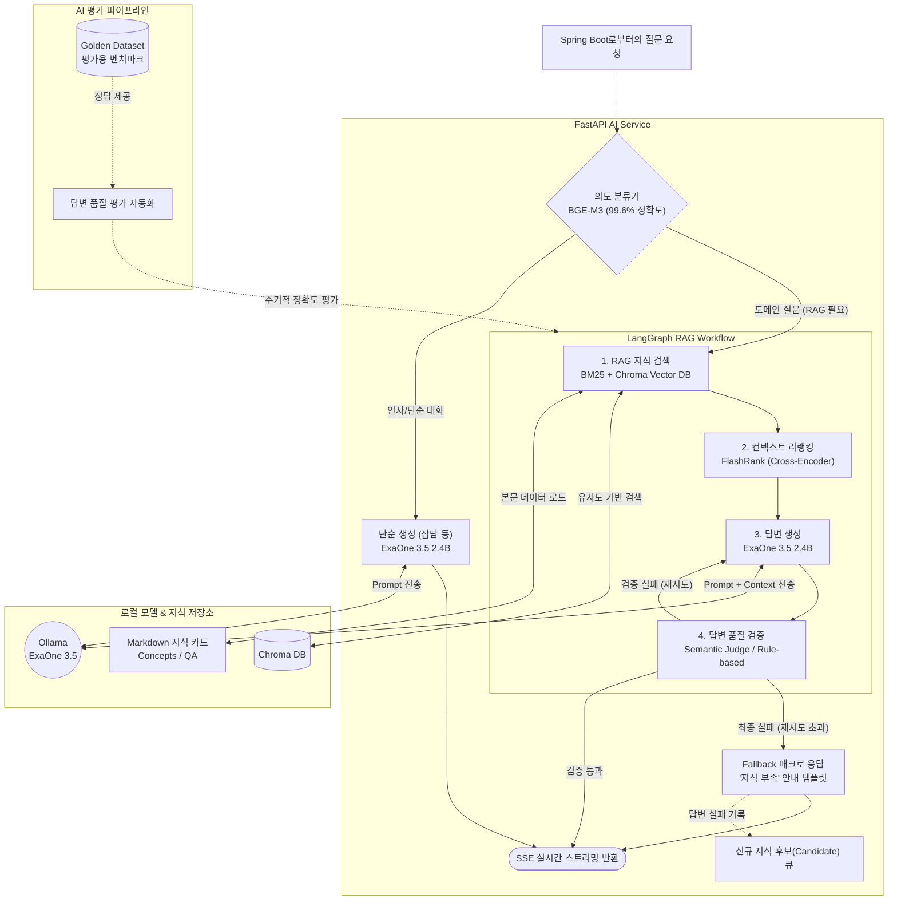

# DevMatch AI 전용 아키텍처 다이어그램 (Python AI Service 집중)

이 다이어그램은 프론트엔드/백엔드(Spring)를 제외하고, 순수하게 **FastAPI 및 LangGraph 기반의 AI 파이프라인 내부 동작 구조**만 집중적으로 보여줍니다.

## 🤖 AI 내부 파이프라인 (Mermaid)

&nbsp;

## 📌 주요 모듈별 역할 (AI 전용)

1. **의도 분류기 (Router)**
   * `BGE-M3` 다국어 임베딩을 사용해 질문의 의도를 파악합니다.
   * "스프링 N+1 문제" 같은 기술 질문은 RAG 파이프라인으로, "안녕?" 같은 인사말은 단순 생성 파이프라인으로 분기합니다.

2. **LangGraph RAG Workflow**
   * **검색**: `BM25`(키워드)와 `Chroma`(의미 유사도) 하이브리드 검색으로 관련 Markdown 카드를 찾습니다.
   * **리랭킹**: `FlashRank`를 통해 검색된 컨텍스트 중 질문에 가장 관련성 높은 상위 카드만 추려냅니다.
   * **생성 & 검증**: `ExaOne 3.5` 모델이 답변을 생성하고, Rule-based(필수 키워드, 금지어) 및 Semantic 검증기를 통과하는지 확인합니다.

3. **Fallback & Candidate 로직**
   * 검증기를 깐깐하게 설정하여, 할루시네이션(환각) 우려가 있는 경우 무리해서 대답하지 않고 **템플릿 매크로 (Fallback)**로 전환합니다.
   * 실패한 질문은 **지식 후보 큐 (Candidate Queue)**에 쌓이며, 이후 관리자가 새 Markdown 카드를 만들어 넣을 수 있는 기반 데이터가 됩니다.
