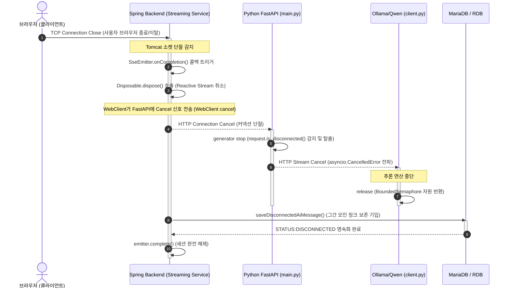

# AI Review Pipeline 기술 분석 및 장애 대응 런북 (2026.06.02)
*근거 수준: 🟡 Static Verified*

본 문서는 DevMatch 프로젝트 내 사용자의 질문/답변 처리부터 Spring Boot 백엔드, Python FastAPI AI 서비스, Ollama/Qwen LLM 추론 엔진을 거쳐 SSE(Server-Sent Events) 스트리밍 응답 및 DB 데이터 영속화에 이르는 전체 AI 리뷰 파이프라인의 아키텍처, 데이터 계약, 예외 처리, 디버깅 방안을 분석 정리한 실무 기술 런북(Runbook)입니다. 본 문서에 서술된 모든 아키텍처 명세 및 코드 흐름 분석은 정적 코드 분석과 논리적 추정에 기반하였으며, 각 영역별 실측 증명 수준은 다음과 같은 근거 수준(Grounding Level) 마커로 표시합니다.

- 🟢 **Runtime Verified**: 실제 로그 출력 또는 런타임 실행 결과가 확인됨.
- 🟡 **Static Verified**: 소스 코드 정적 분석 및 구조 조회를 통해 검증됨.
- 🔴 **Hypothesis**: 실제 가동 검증이 완료되지 않은 논리적 추정 또는 런타임 가설.

---

## 1. AI Review Pipeline 한 장 요약
*근거 수준: 🟡 Static Verified*

```
[클라이언트 브라우저]
       │ (1) POST /api/ai-review/sessions/{id}/messages/stream (SSE)
       ▼
[Spring Boot 백엔드] ──(2) 권한 및 세션 검증 (JPA / DB)
       │ (3) POST /api/review/free-question (WebClient Stream 호출)
       ▼
[Python FastAPI 서비스] ──(4) 토큰 검증 & 동시성 제어 (Admission Control)
       │
       ├─(5) RAG 컨텍스트 검색 (Vector DB / 스코어 >= 5.0 필터링)
       ├─(6) 인텐트 분류 & 정책 확인 (Keyword / Semantic / LLM)
       │     └─ 거절(Reject) 또는 Fast-Path 대상이면 즉시 템플릿 반환
       │
       ├─(7) Ollama/Qwen 추론 엔진 (Async HTTP Stream 호출)
       │     └─ 실패 시 Fallback 모델 추론 -> 템플릿 Fallback 적용
       │
       ├─(8) 사후 품질 평가 (Semantic Judge) -> 기준 미달 시 1회 재시도(Retry)
       ├─(8-Async) Grounding 검증 (Production 환경: Background Daemon 스레드로 비동기 처리)
       │
       ▼ (9) SSE 청크 반환 (urllib -> WebClient -> SseEmitter)
[Spring Boot 백엔드]
       │
       ├─(10) Emitter 완료/타임아웃/오류 콜백 유도
       └─(10-DB) 비동기 트랜잭션 DB 저장 (정상 완료/연결 끊김/부분 실패 상태 반영)
       ▼
[클라이언트 브라우저] (실시간 답변 출력 및 최종 JSON 수신)
```

### 요약 설명
클라이언트가 자유 질문을 입력하면 Spring Boot 백엔드의 `AiReviewController`가 요청을 수신하여 `AiReviewStreamingService`로 넘겨주고, `SseEmitter`를 즉각 반환합니다. 백엔드는 JPA를 통해 세션과 질문 데이터를 선 조회한 뒤, 비동기 논블로킹 `WebClient`를 이용해 Python FastAPI 서비스의 `/api/review/free-question` 엔드포인트를 호출합니다. FastAPI는 Admission Control을 통해 부하를 제어하고, RAG 컨텍스트 검색 및 인텐트 분류를 수행합니다. 캐시나 Fast-Path가 아니면 Ollama를 비동기 스트림으로 호출하여 텍스트 청크를 생성합니다. 생성이 완료되면 **Semantic Judge**가 실시간으로 답변 품질을 평가하여 불량 시 1회 재시도(Retry)를 수행합니다. 최종 완료된 답변은 **Grounding Judge**(프로덕션의 경우 백그라운드 스레드)에 의해 사실 부합 여부가 검증됩니다. 실시간 토큰 청크들이 Reactive Flux를 타고 Spring 백엔드의 `SseEmitter`를 통해 브라우저로 흘러갑니다. 최종 완료 혹은 연결 단절 시점의 답변 데이터는 백엔드 트랜잭션 내에서 상태별(COMPLETED, DISCONNECTED, PARTIAL_FAILED)로 안전하게 가공되어 DB에 저장됩니다.

---

## 2. 핵심 결론
*근거 수준: 🟡 Static Verified*

1. **안정성 보장 아키텍처**:
   - 파이프라인의 핵심 설계 기조는 AI 분석/평가 모델 장애가 서비스 응답을 막지 않는다는 점으로 추정됩니다.
   - Grounding Judge와 Semantic Judge 등 다중 평가 레이어가 탑재되어 있음에도, 이들의 실행 예외는 catch 블록을 통해 안전하게 무시되고 기본 Fallback 정책(korean_fallback, static_fast_path)으로 우회되어 서비스의 가용성을 유지합니다.
2. **성능과 품질의 균형 제어**:
   - 실시간 스트리밍 시 응답 지연을 방지하기 위해 정적/동적 Fast-Path 처리(`lightweight_answers`) 및 캐시 레이어를 제공합니다.
   - 프로덕션 환경에서는 Grounding Judge를 **Daemon Background Thread**로 위임하여 비동기 실행하므로, 지연 시간이 긴 사실성 검증 연산이 사용자의 대기 시간에 추가되지 않도록 설계되어 있습니다.
3. **상태 기반 비동기 데이터 영속화**:
   - SSE 세션이 정상 종료될 때 뿐만 아니라 사용자가 중간에 브라우저를 닫아 연결이 유실되는 상황(`onCompletion`, `onTimeout`, `onError`)에서도 그 시점까지 수신된 답변 텍스트 조각을 보존하여 상태 플래그(`STATUS:DISCONNECTED`)와 함께 DB에 안전하게 기록하는 정교한 마무리 처리 로직이 구현되어 있습니다.

---

## 3. 실제 호출 체인 (Call Chain)
*근거 수준: 🟡 Static Verified*

사용자가 자유 질문을 입력하고 제출한 시점부터 최종 응답 및 데이터 영속화까지 거치게 되는 실제 물리적 메서드와 클래스 단위의 호출 순서입니다.

```
AiReviewController.streamAnswer(Long, Long, AiReviewSubmitRequest) (Spring Controller)
└─ AiReviewStreamingService.streamAnswer(Long, Long, String, String, Long) (Spring Service)
   ├─ AiReviewStreamingService.fetchReviewData(Long, Long, Long) (데이터 사전 조회)
   └─ PythonAiReviewClient.streamReview(String, String, PythonAiRequest) (WebClient Reactive 호출)
      └─ app.main._generate(str, Any, Request, Response) (FastAPI 엔트리포인트)
         └─ app.workflow.runner.run_review_workflow_stream(str, AiGenerateRequest, generator) (워크플로 오케스트레이터)
            ├─ app.workflow.nodes.retrieve_context_node(ReviewWorkflowState) (RAG 컨텍스트 조회)
            │  ├─ app.workflow.query_resolver.resolve_learner_query(str) (오타 및 동의어 교정)
            │  ├─ app.workflow.intent_classifier.resolve_free_question_intent(AiGenerateRequest, ...) (인텐트 분류)
            │  └─ app.rag.retriever.retrieve_context(str, int) (VectorDB 지식조회)
            ├─ app.workflow.nodes.generate_answer_node(ReviewWorkflowState, ...) (LLM 생성 & 품질 검증 노드)
            │  ├─ app.ollama.client.call_ollama_stream_async(str, str, float, int, int, int) (LLM 스트림 추론)
            │  ├─ app.workflow.judge.judge_answer(str, AiGenerateRequest, str, list, ...) (Semantic Judge 품질 평가)
            │  └─ app.workflow.grounding.validate_grounding(AiGenerateRequest, str, list, ...) (Grounding 사실성 검증)
            │     └─ (프로덕션 환경) app.workflow.nodes.async_grounding_task() (Daemon Thread 비동기 분기)
            └─ AiReviewStreamingService.streamAnswer(...) 내부의 flux.subscribe() 콜백 (Spring Emitter 수신 및 전송)
               ├─ AiReviewStreamingService.saveUserMessage(...) (사용자 질문 저장 트랜잭션)
               └─ AiReviewStreamingService.saveCompletedAiMessage(...) (AI 답변 및 메트릭 완료 저장 트랜잭션)
```

---

## 4. Streaming State Machine
*근거 수준: 🟡 Static Verified*

파이프라인 실행에 따라 Spring 백엔드 세션 스레드 내에서 비동기적으로 전이되는 스트리밍 상태 머신 분석 정보입니다.

```
         ┌─────────────── [CREATED] ───────────────┐
         │                    │                    │
         ▼ (요청 성공)         ▼ (검증 기각)         ▼ (초기 장애)
      [ACTIVE]          [COMPLETED] (Fallback)  [ERROR] (즉시 종료)
         │
         ▼ (첫 토큰 수신)
     [CHUNKING]
         │
         ├─────────────────────────────────────────┐
         ▼ (정상 Done 수신)                         ▼ (연결 유실 감지)
   [DONE_RECEIVED]                           [DISCONNECTED]
         │                                         │
         ▼ (DB 저장 트랜잭션 진입)                 ▼ (부분 유실 텍스트)
    [PERSISTING]                              [PARTIAL_FAILED]
         │                                         │
         ▼ (완료 패킷 송신 및 커밋)               ▼ (연결 최종 소멸)
    [COMPLETED] (Terminal)                    [DISCONNECTED] (Terminal)
```

### 상태 전이 세부 규격

| 현재 상태 | 발생 이벤트 | 다음 상태 | DB 저장 여부 | Emitter 상태 | 실제 상태 전환 유발 코드 위치 (Spring) |
| :--- | :--- | :--- | :--- | :--- | :--- |
| **CREATED** | `streamAnswer` 메서드 진입 및 사전 검증 통과 | **ACTIVE** | 미저장 | Open | 위치: `AiReviewStreamingService.streamAnswer()` <br> 탐색 키: `createEmitter` 호출 |
| **ACTIVE** | `pythonAiReviewClient.streamReview` 구독 개시 | **ACTIVE** | 미저장 | Open / HTTP 200 Header 송신 | 위치: `AiReviewStreamingService.streamAnswer()` <br> 탐색 키: `state.set(StreamingState.ACTIVE)` |
| **ACTIVE** | RAG 무관 혹은 한도 초과 기각 판정 | **COMPLETED** | **즉시 저장 (동기)** | Closed (Normal) | 위치: `AiReviewStreamingService.streamAnswer()` <br> 탐색 키: `fallbackToSynchronousSubmit` |
| **ACTIVE** | 초기 연결 실패 또는 토큰 에러 | **ERROR** | 미저장 | Closed with Error | 위치: `AiReviewStreamingService.streamAnswer()` <br> 탐색 키: `flux.subscribe` error 콜백 블록 |
| **ACTIVE** | 첫 번째 토큰 청크 수신 성공 | **CHUNKING** | **사용자 질문만 저장** | Open / Chunk 데이터 전송 중 | 위치: `AiReviewStreamingService.streamAnswer()` <br> 탐색 키: `firstTokenObserved.compareAndSet(false, true)` |
| **CHUNKING** | 지속적인 텍스트 청크 수신 | **CHUNKING** | 미저장 | Open / Chunk 데이터 전송 중 | 위치: `AiReviewStreamingService.streamAnswer()` <br> 탐색 키: `emitter.send(event)` |
| **CHUNKING** | 사용자 브라우저 닫기/네트워크 단절 | **DISCONNECTED** | **부분 수신 텍스트 저장** | Closed (Abrupt) | 위치: `AiReviewStreamingService.streamAnswer()` <br> 탐색 키: `emitter.onCompletion` 콜백 |
| **CHUNKING** | Reactive 스트림 내 통신 예외 발생 | **PARTIAL_FAILED** | **부분 수신 텍스트 저장** | Closed with Error | 위치: `AiReviewStreamingService.streamAnswer()` <br> 탐색 키: `flux.subscribe` error 콜백 블록 |
| **CHUNKING** | FastAPI로부터 `"type": "done"` 수신 | **DONE_RECEIVED** | 미저장 | Open | 위치: `AiReviewStreamingService.streamAnswer()` <br> 탐색 키: `"done".equals(type)` 분기 |
| **DONE_RECEIVED**| `saveCompletedAiMessage` 메서드 진입 | **PERSISTING** | **최종 영속화 진행 중** | Open | 위치: `AiReviewStreamingService.streamAnswer()` <br> 탐색 키: `self.saveCompletedAiMessage` 호출 |
| **PERSISTING** | DB Commit 성공 및 Emitter Done 패킷 송신 | **COMPLETED** | **저장 완료** | Closed (Normal) | 위치: `AiReviewStreamingService.streamAnswer()` <br> 탐색 키: `emitter.complete()` |

### 위험도 평가 (Risk Evaluation)
| 항목 | 위험도 | 영향 | 복구 난이도 |
| :--- | :--- | :--- | :--- |
| Emitter Lifecycle | CRITICAL | Emitter 누수 시 Tomcat 비동기 스레드 풀 영구 점유로 전체 WAS 서버 HANG (먹통) 사태 초래 | HIGH |

---

## 5. Data Contract 분석
*근거 수준: 🟡 Static Verified*

Spring Boot 백엔드와 Python FastAPI 인공지능 서비스 간 통신 시 교환되는 핵심 데이터 규격 명세입니다.

### A. Spring → FastAPI 요청 JSON (DTO: `AiGenerateRequest`)
- **실제 클래스**: `com.devmatch.service.ai.PythonAiReviewClient$PythonAiRequest` (Java) / `app.schemas.AiGenerateRequest` (Python)
- **JSON 예시**:
```json
{
  "question": "마우스 이벤트 버블링에 대한 설명으로 옳은 것은?",
  "options": [
    "1. 자식 요소에서 발생한 이벤트가 부모 요소로 전달된다",
    "2. 이벤트가 부모에서 자식으로만 전송된다"
  ],
  "correct_answer": "1. 자식 요소에서 발생한 이벤트가 부모 요소로 전달된다",
  "selected_answer": "2. 이벤트가 부모에서 자식으로만 전송된다",
  "user_answer": "이벤트 버블링이 정확히 무엇인지 설명해줘",
  "evaluation": "NEEDS_REVIEW",
  "step": 1,
  "model": "exaone3.5:2.4b",
  "temperature": 0.2,
  "max_tokens": 128,
  "num_ctx": 1024,
  "num_thread": 4,
  "stream": true
}
```
- **주요 필드 규격**:
  * `question` (String, **Nullable: No**): 퀴즈 문제 본문. 누락 시 빈 문자열`""`로 치환되며 RAG 성능이 저하됩니다.
  * `options` (List\<String\>, **Nullable: Yes**): 객관식 보기 리스트. 누락 시 빈 리스트`[]`로 파싱됩니다.
  * `correct_answer` (String, **Nullable: No**): 문제의 정답.
  * `selected_answer` (String, **Nullable: No**): 학생이 고른 오답.
  * `user_answer` (String, **Nullable: No**): 학생의 자유 질문 텍스트.
  * `stream` (Boolean, **Nullable: No**): 스트리밍 응답 여부. `true`인 경우 chunk 형식을 강제합니다.
- **예외 복구 메커니즘**: Python의 Pydantic `@field_validator` 검증 규칙에 의해 `None` 유입 시 자동으로 타입별 기본값(`""`, `[]`, `1`, `DEFAULT_MODEL` 등)으로 변환 및 살균(`sanitize_text`) 처리가 가동되므로, 일부 필드 누락으로 인한 즉각적인 파이프라인 붕괴를 예방할 수 있는 구조입니다.

### B. FastAPI → Spring chunk
- **실제 클래스**: `dict[str, object]` (Python) / `java.util.Map` (Java)
- **JSON 예시**:
```json
data: {"type": "chunk", "chunk": " 버블"}

data: {"type": "chunk", "chunk": "링은"}
```
- **주요 필드 규격**:
  * `type` (String, **Nullable: No**): `"chunk"` 고정값. 누락 시 Spring 수신부에서 일반 이벤트로 간주하여 무시 처리됩니다.
  * `chunk` (String, **Nullable: No**): 실시간으로 출력된 단어/음절 토큰 텍스트.

### C. FastAPI → Spring done
- **실제 클래스**: `dict[str, object]` (Python) / `java.util.Map` (Java)
- **JSON 예시**:
```json
data: {
  "type": "done",
  "response": {
    "answer": "이벤트 버블링은 특정 요소에서 이벤트가 발생했을 때 상위 요소들로 전파되는 현상입니다.",
    "provider": "python-ollama",
    "confidence_score": 0.92,
    "model_used": "exaone3.5:2.4b",
    "fallback_used": false,
    "retrieved_concept_ids": ["frontend-event-bubbling"],
    "candidate_id": "cand_98f3c78d",
    "prompt_version": "free_question_v1",
    "latency_ms": 2840,
    "route": "rag_generation",
    "resolved_query": "이벤트 버블링",
    "correction_type": "exact",
    "matched_concept_id": "frontend-event-bubbling",
    "answer_style": "definition",
    "quality_flags": [],
    "observability_events": []
  }
}
```
- **주요 필드 규격**:
  * `type` (String, **Nullable: No**): `"done"` 고정값.
  * `response` (Object, **Nullable: No**): `AiGenerateResponse` DTO의 직렬화 객체.
  * `answer` (String, **Nullable: No**): 전체 병합된 최종 완성 답변 본문.
  * `confidence_score` (Double, **Nullable: Yes**): 답변 신뢰도 스코어.
  * `matched_concept_id` (String, **Nullable: Yes**): 교정 매칭된 개념 ID.
  * `quality_flags` (List\<String\>, **Nullable: No**): 한국어 포함 여부, 금지어 검출 여부 등 검증 기각 태그 목록.
- **누락 시 동작**: done 패킷이 소실되면 Spring 백엔드는 스트림 완료 시점을 확정하지 못하고 대기하다가 **Spring SSE 타임아웃(45초 (설정값 확인 필요))**에 걸려 강제 연결 유실 처리(`saveDisconnectedAiMessage`)로 전이될 위험이 존재합니다.

### D. FastAPI → Spring error (사양 예비)
- **실제 클래스**: `dict[str, object]` (Python) / `java.util.Map` (Java)
- **JSON 예시**:
```json
data: {"type": "error", "error": "Ollama connection timed out"}
```
- **주요 필드 규격**:
  * `type` (String, **Nullable: No**): `"error"` 고정값.
  * `error` (String, **Nullable: No**): 발생한 에러 상세 원인 메시지.
- **현 코드상 한계**: 현재 Python FastAPI 코드 상에는 `"type": "error"` 형태의 JSON 패킷을 직접 yield 하도록 설계되어 있지 않고, 오류 발생 시 로컬 템플릿(Fallback) 답변 청크를 전송한 뒤 done 처리하도록 구성되어 있습니다. 다만 Spring Boot 백엔드 수신 처리부에는 본 규격을 파싱하여 `StreamingState.ERROR`로 전이시키는 예방 코드가 선 구현되어 있습니다.

---

## 6. Timeout Chain 분석
*근거 수준: 🟡 Static Verified (단, 런타임 충돌 여부는 🔴 Hypothesis)*

전체 아키텍처 상 상위 게이트웨이부터 하위 하드웨어 연산 장치까지 이어지는 물리적 타임아웃 체인의 불균형과 위험 분석 정보입니다.

```
[Browser / Nginx]              [Spring SSE Emitter]             [WebClient Read]             [FastAPI Gateway]            [Ollama 추론 엔진]
  Default: 무제한                  Timeout: 45초 (설정값 확인 필요) (설정값 확인 필요)                 Timeout: 30초 (설정값 확인 필요)                  Admission: 3초 (설정값 확인 필요)               Timeout: 30초 (설정값 확인 필요)
(SSE 자동 재연결)             (application.yml)              (application.yml)              (main.py Admission)            (client.py)
       │                               │                              │                              │                            │
       ├─────────── OK ───────────────┤                              ├────────── DANGER ────────────┤                            │
       │  Upper(무제한) > Lower(45s)   │                              │    Upper(30s) < Lower(33s)   │                            │
       ▼                               ▼                              ▼                              ▼                            ▼
```

### 타임아웃 체인 상세 규격 및 대조

| 구간 | 현재 타임아웃 설정값 | 설정 매개변수 및 위치 | 권장 설정값 | 시스템 영향 및 위험도 |
| :--- | :--- | :--- | :--- | :--- |
| **Browser (Client)** | 무제한 (또는 브라우저 기본 120초) | 브라우저 설정 혹은 SSE EventSource 재시도 규격 | 자동 재시도 (30초 간격) | **낮음**: 단절 시 브라우저가 자동 재시도를 통해 세션을 복원하려 시도할 것으로 예측됩니다. |
| **Spring SSE Emitter** | **45초 (설정값 확인 필요)** | 위치: `application.yml` <br> 탐색 키: `stream-timeout-seconds` | **45초** | **보통**: 본 대기 시간이 초과되면 클라이언트 커넥션을 강제로 끊고 `onTimeout` 비동기 저장을 가동하도록 구성되었습니다. |
| **WebClient (HTTP Read)** | **30초 (설정값 확인 필요)** | 위치: `application.yml` <br> 탐색 키: `python.read-timeout-seconds` | **50초** | **매우 높음 (버그 유발 가능 지점)**:<br>아래 설명하는 타임아웃 역전 조건이 깨져 불필요한 예외를 유발할 우려가 있습니다. |
| **FastAPI Admission** | **3초 (설정값 확인 필요)** (동시 추론 대기 큐) | 위치: `app.ollama.client` <br> 탐색 키: `OLLAMA_QUEUE_WAIT_TIMEOUT_SECONDS` | **3초** | **보통**: 동시 요청 제어가 3초 (설정값 확인 필요) 이상 지연되면 LLM 부하 분산을 위해 즉시 차단되도록 설계되었습니다. |
| **Ollama 추론 엔진** | **30초 (설정값 확인 필요)** (HTTP API 수신) | 위치: `app.ollama.client` <br> 탐색 키: `OLLAMA_REQUEST_TIMEOUT_SECONDS` | **30초** | **높음**: GPU 연산이 밀려 30초를 초과하면 추론이 중단되고 Fallback 처리되도록 강결합되었습니다. |

### 타임아웃 체인 규칙 역전 구간 분석 (DANGER)
*근거 수준: 🔴 Hypothesis*

> [!CAUTION]
> #### 타임아웃 설계 제1원칙: "상위 타임아웃(Client 측)은 항상 하위 타임아웃(Server 측)보다 길어야 한다."
> 현재 설정 상태에서는 아래 두 구간에서 이 조건이 완전히 붕괴되어 예기치 못한 비정상 오류를 유발할 위험성이 있는 것으로 평가됩니다.

1. **WebClient Read Timeout (30초 (설정값 확인 필요)) < FastAPI + Ollama 연산 시간 (최대 33s)**
   - **발생 원인**: Ollama 추론 장치가 밀려 최대 대기 시간(동시성 세마포어 대기 3초)을 소모한 뒤 30초의 추론 연산을 정상 수행하여 총 **33초**가 소요되는 케이스가 발생할 수 있습니다.
   - **결과**: 그러나 이 경우 상위 WebClient가 **30초** 만에 통신을 일방적으로 중단하고 `ReadTimeoutException`을 던집니다.
   - **영향**: FastAPI 백엔드는 답변 생성을 정상 수행했음에도 불구하고 Spring 백엔드가 이를 끝까지 수신하지 못하고 세션을 강제 파괴하며, 사용자는 중간 끊긴 답변만 받게 될 리스크가 존재합니다.
2. **FastAPI HTTP Read Timeout (30s) == Ollama API Timeout (30초 (설정값 확인 필요))**
   - **발생 원인**: FastAPI와 하부 Ollama 호출 타임아웃이 동일하게 30초로 설정되어 있습니다.
   - **결과**: Ollama가 정확히 30초 (설정값 확인 필요) 지점에 응답을 전달할 때, 두 네트워크 소켓 레이어 간에 레이스 컨디션(Race Condition)이 발생합니다.
   - **영향**: 정상적인 응답 패킷의 꼬리가 도달하기 전에 FastAPI 게이트웨이가 먼저 커넥션을 닫아 버려 스트림 전송 도중 소켓 비정상 종료 예외를 발생시킬 우려가 있습니다.

### 위험도 평가 (Risk Evaluation)
| 항목 | 위험도 | 영향 | 복구 난이도 |
| :--- | :--- | :--- | :--- |
| Timeout Chain | HIGH | 하위 Ollama 추론 시간 지연 시 WebClient Read Timeout 발생으로 응답 중단 리스크 | MEDIUM |


---

## 7. Cancellation Propagation (취소 전파 흐름)
*근거 수준: 🟡 Static Verified (단, Reactive cancel 신호 실측은 🔴 Hypothesis)*

사용자가 답변 도중 이탈하거나 SSE 연결을 명시적으로 끊었을 때, 시스템 자원 누수를 예방하기 위해 백엔드 하부까지 중단 신호가 전파되는 상세 라이프사이클 궤적입니다.

```
[브라우저 닫기/이탈]
       │
       ▼ [실제 감지 코드]: Spring Boot 서블릿 엔진 (Tomcat 소켓 단절 감지)
[SseEmitter.onCompletion() 콜백 트리거]
       │ * 실제 위치: AiReviewStreamingService.streamAnswer()
       │ * 탐색 키: emitter.onCompletion
       │ * 실패 시 영향: 연결 격하 불가 및 커넥션 누수 발생
       ▼
[Disposable.dispose() 호출]
       │ * 실제 위치: AiReviewStreamingService.cleanup()
       │ * 탐색 키: disposable.dispose()
       │ * 실패 시 영향: 백엔드 Reactive 스레드가 소모되지 않는 청크를 계속 연산함
       ▼
[WebClient Reactive Cancel Signal 송신]
       │ * 실제 위치: Spring WebClient Reactive Netty 내부 파이프
       │ * 실패 시 영향: FastAPI로부터 들어오는 스트림 데이터를 끝까지 읽어들임
       ▼
[FastAPI Generator 감지 및 루프 탈출]
       │ * 실제 위치: app.main._generate()
       │ * 탐색 키: request.is_disconnected()
       │ * 실패 시 영향: FastAPI가 스트리밍 루프를 끝까지 연산하여 CPU 자원을 낭비함
       ▼
[Ollama Client Cancel 및 asyncio task 취소]
       │ * 실제 위치: app.ollama.client.call_ollama_stream_async()
       │ * 탐색 키: asyncio.CancelledError
       │ * 실패 시 영향: GPU 추론 연산 장치가 의미 없는 질문 답변 추론을 끝까지 강행함
       ▼
[Ollama BoundedSemaphore / Capacity Release]
       │ * 실제 위치: app.ollama.client.call_ollama_stream_async()
       │ * 탐색 키: gateway.release(acquisition)
       │ * 실패 시 영향: BoundedSemaphore 토큰이 영구 유실되어 이후 모든 요청이 대기 큐 타임아웃에 수렴함 (먹통 현상)
       ▼
[Spring 비동기 트랜잭션 DB 보존 저장]
       │ * 실제 위치: AiReviewStreamingService.saveDisconnectedAiMessage()
       │ * 탐색 키: STATUS:DISCONNECTED
       │ * 실패 시 영향: 소켓 유실 직전까지 생성된 피드백 데이터 조각이 DB에서 완전히 증발함
```

### 위험도 평가 (Risk Evaluation)
| 항목 | 위험도 | 영향 | 복구 난이도 |
| :--- | :--- | :--- | :--- |
| Cancellation | MEDIUM | 취소 신호가 전파되지 않아 Ollama BoundedSemaphore 누수 및 GPU 추론 과부하 리스크 | MEDIUM |


---

## 8. Grounding/Semantic Judge 영향도 분석
*근거 수준: 🟡 Static Verified*

인공지능 답변의 완성도를 제어하기 위해 탑재된 2단계 LLM 사후 평가 레이어의 시스템 영향도 비교 매트릭스입니다.

| 평가 컴포넌트 | 응답 차단 여부 | 동기/비동기 방식 | 사용자 응답 반영 여부 | 재시도 및 우회 정책 | 실패 시 Fallback 처리 상세 |
| :--- | :--- | :--- | :--- | :--- | :--- |
| **Semantic Judge**<br>(관련성 및 맥락 편향 제어) | **차단함 (Blocking)** | **동기식 (Sync)** | **반영함 (Yes)**<br>답변 전송 전 최종 적합성을 확정하기 위해 동기 제어함. | 관련성 0.7 미만 혹은 편향 0.6 초과 시 **1회 재시도 (Retry)** 수행. | 위치: `app.workflow.nodes.generate_answer_node()` <br> 탐색 키: `_fallback_for_state` 호출부. <br> 2차 재생성마저 실패할 경우, `_topic_specific_fallback`에 의해 사전에 정의된 기술 스택별 정적 한국어 가이드라인 답변으로 강제 대체됨. |
| **Grounding Judge**<br>(Retrieved Context 사실적 부합성) | **차단 안 함 (Non-blocking)**<br>(프로덕션 환경) | **비동기식 (Async)**<br>(Daemon Thread로 위임) | **반영 안 함 (No)**<br>이미 사용자는 답변 수신을 완료하였음. | 재시도 없음.<br>(Observability 관제 모니터링 수집이 주 용도) | 위치: `app.workflow.nodes.generate_answer_node()` <br> 탐색 키: `async_grounding_task` 스레드 함수. <br> Grounding 점수가 0.7 미만이더라도 사용자 응답은 복구하지 않고, 수집된 에러 및 리스크 플래그를 로그 파일에 기록하여 사후 심사용으로 활용함. |

### 위험도 평가 (Risk Evaluation)
| 항목 | 위험도 | 영향 | 복구 난이도 |
| :--- | :--- | :--- | :--- |
| Semantic Judge | MEDIUM | 판정 점수 미달로 인한 1회 재시도(Retry) 발생 시 사용자 대기 지연(Latency) 상승 | LOW |
| Grounding | LOW | RAG 사실성 평가 지연이 비동기 스레드로 분리되어 영향은 없으나, 백그라운드 태스크 예외 유실 리스크 | LOW |


---

## 9. Observability (KPI) 섹션
*근거 수준: 🔴 Hypothesis*

AI 파이프라인의 운영 품질 및 사용자 경험 지표를 계측하기 위해 지정된 핵심 KPI 관제 지표 목록입니다.

### 1) TTFT (Time to First Token)
- **정의**: 사용자가 질문을 제출한 후, 첫 번째 텍스트 조각(토큰)이 브라우저에 도달해 그려지기 시작할 때까지의 소요 시간입니다.
- **수집 위치**: `AiReviewStreamingService.java` 내 `firstTokenLatencyMs` 계산 및 `metricSink.streamFirstToken` 전송부.
- **관련 로그/메트릭**: `ai_review.stream_first_token` 이벤트 내 `latencyMs` 필드.
- **Current**: 미측정
- **Target**: 1.5초 미만 (< 1500ms) (추정 목표)

### 2) Total Latency
- **정의**: 요청 시작부터 최종 Done 패킷이 발행되어 세션이 완전 닫힐 때까지의 전체 수행 시간입니다.
- **수집 위치**: `ai/app/workflow/runner.py` 내 `time.perf_counter() - started` 역산부 및 `_build_response_from_state` 메트릭 구성부.
- **관련 로그/메트릭**: `ai_review.latency_breakdown` 이벤트 내 `total_latency_ms` 필드.
- **Current**: 미측정
- **Target**: 8.0초 미만 (< 8000ms) (추정 목표)

### 3) Chunk / sec
- **정의**: 초당 생성 및 클라이언트에 송신되는 토큰 조각의 전송 처리 밀도입니다.
- **수집 위치**: `AiReviewStreamingService.java` 내 `chunkCount` 누적 수집 루프.
- **관련 로그/메트릭**: `log.info("[DIAGNOSTIC] CHUNK SENT ... chunkCount={}")` 로깅 활용 계산.
- **Current**: 미측정
- **Target**: 15 chunks/sec 이상 (> 15) (추정 목표)

### 4) Retry Rate
- **정의**: 전체 자유 질문 요청 중 Semantic Judge에 의해 기각되어 2차 LLM 추론(재시도)으로 전환된 비율입니다.
- **수집 위치**: `ai/app/workflow/runner.py` 내 `_build_response_from_state` 함수.
- **관련 로그/메트릭**: `ai_review.semantic_judge_evaluated` 메트릭 이벤트 내 `"semantic_judge_retry": true` 설정 횟수 대조.
- **Current**: 미측정
- **Target**: 10% 이하 (< 10%) (추정 목표)

### 5) Disconnect Rate
- **정의**: 정상 완료되지 못하고 사용자 이탈 또는 소켓 에러로 강제 중단된 비정상 세션의 비율입니다.
- **수집 위치**: `AiReviewStreamingService.java` 내 `metricSink.streamDisconnected` 메트릭 수집부.
- **관련 로그/메트릭**: `ai_review.stream_disconnected` 이벤트 감지.
- **Current**: 미측정
- **Target**: 5% 이하 (< 5%) (추정 목표)

### 6) Error Rate
- **정의**: 시스템 내부 자원 부족 또는 통신 두절로 인해 사용자에게 예외 오류 메시지 혹은 강제 폴백 템플릿이 최종 제공된 비율입니다.
- **수집 위치**: `AiReviewStreamingService.java` 내 `metricSink.streamPartialFailed` 메트릭 수집부.
- **관련 로그/메트릭**: `ai_review.stream_partial_failed` 이벤트 감지.
- **Current**: 미측정
- **Target**: 2% 이하 (< 2%) (추정 목표)

---

## 10. 운영 체크리스트 (Operational Checklist)
*근거 수준: 🟡 Static Verified*

신규 버전을 로컬/스테이징/운영 서버에 배포하기 전에 반드시 검증 가동해야 하는 테스트 체크리스트입니다.

- [ ] **□ streamAnswer 진입 테스트**
- [ ] **□ 첫 chunk 수신 시간(TTFT) 테스트**
- [ ] **□ done 이벤트 정상 종결 테스트**
- [ ] **□ emitter complete 세션 정리 테스트**
- [ ] **□ DB 저장 데이터 정합성 검증**
- [ ] **□ cancel propagation 전파력 테스트**
- [ ] **□ grounding 비동기 백그라운드 테스트**

---

## 11. Performance Bottleneck Analysis
*근거 수준: 🔴 Hypothesis*

전체 AI 리뷰 요청 생명주기에서 대기 시간을 크게 증가시킬 수 있는 핵심 병목 지점들에 대한 분석 및 극복 방안 규격입니다.

### 1) TTFT (Time to First Token)
- **지표**: 첫 번째 텍스트 조각 수신 시간
- **공식**: `TTFT = Admission + RAG + Prompt + Ollama First Token + Network`
- **측정 위치**: `AiReviewStreamingService.java` 내 `firstTokenLatencyMs` 계산 및 기록부
- **병목 조건**:
  - Ollama 동시성 세마포어 적체로 인한 대기 큐 지연 (> 3초)
  - Vector DB RAG 지식카드 임베딩 및 코사인 유사도 검색 지연
  - Ollama Warm-up 기능 미작동으로 인한 추론 엔진 Cold Start
- **사용자 증상**: 자유 질문 제출 후 로딩 스피너가 오랫동안 지속되며 첫 글자가 화면에 찍힐 때까지 2초 이상 지연되는 현상으로 나타납니다.
- **해결 방향**:
  - `OLLAMA_WARMUP_ENABLED=true` 설정을 통한 기동 시 사전 워밍업 강제 적용
  - RAG 검색 스코어 필터링(`MIN_WORKFLOW_CONTEXT_SCORE = 5.0`)을 적용하여 프롬프트 컨텍스트 크기를 억제

### 2) Chunk Throughput
- **지표**: 초당 생성/전송되는 문자 청크 개수
- **공식**: `Throughput = Chunk Count / total_generation_time_sec`
- **측정 위치**: `AiReviewStreamingService.java` 내 청크 수신 및 Emitter 전송 콜백 루프
- **병목 조건**:
  - GPU 연산 리소스 고갈 또는 Ollama CPU 모드 구동 시 추론 처리 스레드(`num_thread`) 할당 부족
  - 백엔드 ↔ FastAPI 간의 네트워크 대역폭 제한 및 유선 전송 딜레이
- **사용자 증상**: 화면에 글자가 지나치게 한 땀 한 땀 느리게 출력되어 흐름이 답답하게 느껴지는 증상입니다.
- **해결 방향**:
  - 하드웨어 및 GPU 가속 장치 가용 여부 점검
  - `application.yml`의 `num-thread` 할당 크기를 CPU 물리적 Core 개수 수준으로 최적화 조율

### 3) Grounding Delay
- **지표**: 사실성 검증 연산 처리 시간
- **공식**: `Grounding Delay = validate_grounding() execution time`
- **측정 위치**: `app.workflow.nodes.generate_answer_node` 내 `validate_grounding` 실행 및 대기 구간
- **병목 조건**:
  - RAG로 검색된 주입 문장의 물리적 텍스트 길이가 매우 긴 경우
  - 사후 검증용 LLM 프롬프트 토큰 처리량 폭증
- **사용자 증상**: (동기식 처리 환경인 테스트 환경 등에서) 본문 출력은 다 되었으나 최종 완료 상태(`done` 패킷)로 전이되지 않고 마지막 온점에서 수 초 동안 화면이 멈추는 증상입니다.
- **해결 방향**:
  - 운영(Production) 프로필 상에서 **Daemon Background Thread**가 물리적으로 분리되어 동작하는지 점검
  - Adaptive Judge 기동 정책을 검토하여 개념 정의와 같이 단순한 질문은 `Tier 1`로 처리해 Grounding 검증을 능동 스킵

### 4) DB Save
- **지표**: 최종 복습 피드백 및 통계 메트릭 데이터베이스 저장 지연 시간
- **공식**: `DB Save Time = connection_acquire + insert_query_execution + transaction_commit`
- **측정 위치**: `AiReviewStreamingService.java` 내 `saveCompletedAiMessage` 메서드 진입부터 영속화 완료 시점
- **병목 조건**:
  - 데이터베이스 커넥션 풀(HikariCP) 고갈 상태 또는 커넥션 획득 대기 지연
  - MariaDB 복습 세션 및 메시지 테이블에 대한 쓰기 락(Lock) 경합 적체
- **사용자 증상**: 실시간 피드백 텍스트 렌더링은 완료되었으나, 다음 문제 이동 버튼이 비활성화 상태에서 풀리지 않고 대기하는 증상입니다.
- **해결 방향**:
  - `saveCompletedAiMessage`를 호출할 때 AOP 프록시(`self`) 참조를 유지하고, HikariCP 커넥션 풀 크기 적정성 실측
  - 복습 테이블에 적절한 인덱스를 적용하여 인서트 락 경합 범위 최소화

### 5) SSE Flush
- **지표**: 서버 전송 버퍼 플러시 오버헤드
- **공식**: `SSE Flush Overhead = network_latency + server_buffer_flush_time`
- **측정 위치**: `AiReviewStreamingService.java` 내 `emitter.send(event)` 및 Tomcat 소켓 플러시 내부
- **병목 조건**:
  - Nginx, Cloudflare 등 리버스 프록시 단에서 SSE 응답에 버퍼링(Buffering) 설정을 활성화한 경우
  - 클라이언트 브라우저 단의 네트워크 처리 속도가 급격하게 억제되는 경우
- **사용자 증상**: 답변이 실시간으로 부드럽게 찍히지 않고, 2~3초 간격으로 한 묶음씩 뭉쳐서 갑자기 화면에 튀어나오는 증상입니다.
- **해결 방향**:
  - Nginx 프록시 구성 시 헤더에 `X-Accel-Buffering: no`를 추가하거나 프록시 설정에 `proxy_buffering off;`를 명시적으로 적용

---

## 12. Disconnect Sequence Diagram (연결 단절 감지 시퀀스)
*근거 수준: 🟡 Static Verified (단, Reactive cancel 신호 실측은 🔴 Hypothesis)*

클라이언트 이탈 또는 네트워크 오류로 소켓이 끊어졌을 때 `ERR_INCOMPLETE_CHUNKED_ENCODING` 및 `response already committed` 오류의 원인을 진단하기 위한 전파 궤적 도식입니다.



---

## 13. 단계별 파이프라인 분석 (Step 1 ~ 10)
*근거 수준: 🟡 Static Verified (단, 비동기 스레드 바인딩은 🔴 Hypothesis)*

### Step 1: HTTP Stream 요청 진입 (Spring Controller)
- **진입 파일**: [AiReviewController.java](backend/src/main/java/com/devmatch/controller/AiReviewController.java)
- **진입 메서드**: `streamAnswer`
- **호출되는 다음 컴포넌트**: `AiReviewStreamingService.streamAnswer(...)`
- **입력 데이터**: `Long userId`, `Long sessionId`, `AiReviewSubmitRequest request` (`answer`, `mode`, `questionId`)
- **출력 데이터**: `org.springframework.web.servlet.mvc.method.annotation.SseEmitter`
- **실패 가능 지점**:
  - 인증 필터 검증 실패 (`userDetails` 객체가 존재하지 않거나 무효한 세션일 경우 401/403 예외 발생)
  - 요청 페이로드 JSON 역직렬화 실패 또는 Validation 제약 조건 위반 (e.g. 빈 답변 입력 등)
- **관련 로그**: `log.info("[DIAGNOSTIC] CONTROLLER ENTER sessionId={}", sessionId);`
- **확인 필요 사항**: 해당 엔드포인트는 `MediaType.TEXT_EVENT_STREAM_VALUE`를 직접 생산하며, 서블릿 스레드를 차단하지 않도록 `SseEmitter`를 즉시 리턴해야 합니다.

### Step 2: SSE 스트림 준비 및 요청 사전 검증 (Spring Service)
- **진입 파일**: [AiReviewStreamingService.java](backend/src/main/java/com/devmatch/service/ai/AiReviewStreamingService.java)
- **진입 메서드**: `streamAnswer`
- **호출되는 다음 컴포넌트**:
  - `self.fetchReviewData(...)` (지연 로딩 방지를 위한 사전 조회 트랜잭션 메서드)
  - `PythonAiReviewClient.streamReview(...)` (FastAPI 연동 클라이언트)
- **입력 데이터**: `Long userId`, `Long sessionId`, `String answer`, `String modeValue`, `Long questionId`
- **출력 데이터**: 설정된 타임아웃이 바인딩된 `SseEmitter` 객체
- **실패 가능 지점**:
  - `properties.streamingEnabled()`가 false 이거나 서킷브레이커가 작동해 Degraded 상태인 경우 -> 동기식 `fallbackToSynchronousSubmit`로 우회 작동
  - 세션 소유자가 요청 사용자와 다른 경우 (`TestNotFoundException` 발생)
  - 자유 질문 허용 횟수(최대 3회)를 이미 소진한 경우 (`InvalidSessionStateException` 예외 발생)
- **관련 로그**: `log.info("[DIAGNOSTIC] STREAM ANSWER ENTER sessionId={} questionId={} mode={}", sessionId, questionId, modeValue);`
- **확인 필요 사항**: `self` 프록시 객체 주입을 통한 트랜잭션 경계 제어가 원활히 이뤄지는지 확인이 필요합니다.

### Step 3: Python AI 서비스 Stream API 호출 (Spring Client -> WebClient)
- **진입 파일**: [PythonAiReviewClient.java](backend/src/main/java/com/devmatch/service/ai/PythonAiReviewClient.java)
- **진입 메서드**: `streamReview`
- **호출되는 다음 컴포넌트**: Python FastAPI 서비스 엔드포인트 `/api/review/free-question`
- **입력 데이터**: `String uri`, `String correlationId`, `PythonAiRequest request`
- **출력 데이터**: `reactor.core.publisher.Flux<String>`
- **실패 가능 지점**:
  - Python AI 프로바이더 미활성화 상태 (`providerSelector`가 타겟팅을 잡지 못해 `IllegalStateException` 발생)
  - FastAPI 서비스 커넥션 타임아웃 및 네트워크 순발적 두절
- **관련 로그**: 없음 (WebClient 하부 에러 로깅 위임)
- **확인 필요 사항**: Reactive backpressure buffer가 `onBackpressureBuffer(50)`로 작동 중인데, 토큰 유입 속도가 극도로 빠를 때 버퍼 오버플로우 정책이 정의되어 있는지 확인이 필요합니다.

### Step 4: FastAPI 요청 수용 및 라우팅 (FastAPI Entry)
- **진입 파일**: [main.py](ai/app/main.py)
- **진입 메서드**: `_generate`
- **호출되는 다음 컴포넌트**: `app.workflow.runner.run_review_workflow_stream(...)`
- **입력 데이터**: `mode` ("free-question"), `payload`, `Request request`, `Response response`
- **출력 데이터**: `fastapi.responses.StreamingResponse`
- **실패 가능 지점**:
  - `verify_service_token(request)` 실패 (Spring 백엔드 토큰 값 불일치로 HTTP 403 반환)
  - `ai_request_admission()` 제한 초과 (대기 큐 임계치를 넘는 과부하 시 `AiRequestBusyError`로 HTTP 503 발생)
- **관련 로그**:
  - `print(f"[DIAGNOSTIC] FASTAPI_YIELD_CHUNK count={yield_count}", flush=True)`
  - `print("[DIAGNOSTIC] FASTAPI_YIELD_DONE", flush=True)`
- **확인 필요 사항**: `StreamingResponse`가 기동된 후 클라이언트 커넥션 유실 시 비동기 태스크가 정상 취소되는지 `await request.is_disconnected()`의 루프 탈출을 점검해야 합니다.

### Step 5: RAG 컨텍스트 조회 및 인텐트 분류 (FastAPI Workflow Nodes)
- **진입 파일**: [nodes.py](ai/app/workflow/nodes.py)
- **진입 메서드**: `retrieve_context_node`
- **호출되는 다음 컴포넌트**:
  - `app.workflow.query_resolver.resolve_learner_query`
  - `app.workflow.intent.classify_free_question`
  - `app.rag.retriever.retrieve_context`
- **입력 데이터**: `ReviewWorkflowState`
- **출력 데이터**: `contexts` 리스트와 `free_question_intent`가 할당된 `ReviewWorkflowState`
- **실패 가능 지점**:
  - 지식 베이스 검색 중 ChromaDB 등 VectorDB 질의 에러 발생
  - 스코어 필터링(`MIN_WORKFLOW_CONTEXT_SCORE = 5.0`)으로 인해 RAG 컨텍스트가 전부 기각되는 현상
- **관련 로그**: 없음
- **확인 필요 사항**: 지식 카드 누락 시 질문에 유의미한 RAG 주입이 전무할 때의 답변 정확성 확인이 필요합니다.

### Step 6: 학습 정책 적용 및 Fast-Path/캐시 검사 (FastAPI Workflow Runner)
- **진입 파일**: [runner.py](ai/app/workflow/runner.py)
- **진입 메서드**: `run_review_workflow_stream`
- **호출되는 다음 컴포넌트**: `app.workflow.lightweight_answers.resolve_lightweight_answer`, `app.workflow.answer_cache.get_cached_answer`
- **입력 데이터**: `ReviewWorkflowState`
- **출력 데이터**: Fast-Path 해당 시 스트림 즉시 발행 및 반환
- **실패 가능 지점**:
  - 레디스 캐시 라이브러리 연동 에러 또는 인메모리 해시 캐시 타임아웃 설정 실패
- **관련 로그**: 없음
- **확인 필요 사항**: `is_preserving_policy_enabled()` 정책 검사가 스트리밍 생성 이전 단계에서 효율적으로 개입하여 시스템 자원 낭비를 막고 있는지 검증이 요구됩니다.

### Step 7: Ollama/Qwen 스트리밍 답변 생성 (FastAPI Generator)
- **진입 파일**: [client.py](ai/app/ollama/client.py)
- **진입 메서드**: `call_ollama_stream_async`
- **호출되는 다음 컴포넌트**: Ollama HTTP API 서비스 `/api/generate`
- **입력 데이터**: `model`, `prompt`, `temperature`, `max_tokens`, `num_ctx`, `num_thread`
- **출력 데이터**: 제너레이터 기반의 청크 텍스트 일련
- **실패 가능 지점**:
  - Ollama 게이트웨이 `acquire` 시 동시성 세마포어 타임아웃 (3초)으로 인한 추론 대기 열 배출 실패
  - Ollama 서비스 자체 다운으로 인한 소켓 연결 불가 (`urllib` 또는 `httpx` 예외 발생)
- **관련 로그**:
  - `print(f"[DIAGNOSTIC] OLLAMA_STREAM_START model={model}", flush=True)`
  - `print(f"[DIAGNOSTIC] OLLAMA_FIRST_CHUNK elapsed={first_chunk_elapsed}ms", flush=True)`
  - `print(f"[DIAGNOSTIC] OLLAMA_CHUNK_SENT count={chunk_count}", flush=True)`
- **확인 필요 사항**: Qwen 혹은 Exaone 모델 호출의 응답 시간(TTFT) 분산 추이 확인이 필요합니다.

### Step 8: 품질 검증 및 Semantic Judge / Grounding Judge 사후 평가 (FastAPI Workflow Nodes 후반부)
- **진입 파일**: [nodes.py](ai/app/workflow/nodes.py)
- **진입 메서드**: `generate_answer_node`
- **호출되는 다음 컴포넌트**:
  - `app.workflow.judge.judge_answer` (Semantic Judge)
  - `app.workflow.grounding.validate_grounding` (Grounding Judge)
- **입력 데이터**: `ReviewWorkflowState`
- **출력 데이터**: 최종 승인 및 템플릿 필터링이 종결된 `ReviewWorkflowState`
- **실패 가능 지점**:
  - Semantic Judge 판정 결과에 따른 Retry가 연속적으로 실패하여 폴백으로 강제 수렴되는 상황
  - 프로덕션 비동기 백그라운드 스레드 기동 실패 시 예외 유출 차단 점검
- **관련 로그**:
  - `ai_review.semantic_judge_evaluated`
  - `ai_review.grounding_evaluated`
  - `ai_review.latency_breakdown`
- **확인 필요 사항**: 비동기 백그라운드 태스크가 Daemon 스레드로 실행되므로 예외가 발생할 경우 프로세스 자체가 죽지는 않으나, 예외 스택이 유실되지 않도록 모니터링 로그 관제 상태를 점검해야 합니다.

### Step 9: Spring Event Streaming 처리 및 클라이언트 송신 (Spring Subscriber)
- **진입 파일**: [AiReviewStreamingService.java](backend/src/main/java/com/devmatch/service/ai/AiReviewStreamingService.java)
- **진입 메서드**: `streamAnswer` 내부 `flux.subscribe(...)` 콜백 루프
- **호출되는 다음 컴포넌트**: 클라이언트 브라우저 HTTP SSE 파이프
- **입력 데이터**: FastAPI 스트리밍으로부터 유입된 JSON 텍스트 패킷
- **출력 데이터**: `SseEmitter`를 통해 직렬화 전송되는 SSE 이벤트
- **실패 가능 지점**:
  - 사용자가 브라우저 탭을 도중에 이탈하거나 닫는 순간 `emitter.send` 호출이 `IOException`을 유발하며 강제 중단
  - Emitter 자체 타임아웃 발생으로 연결 자동 소멸
- **관련 로그**:
  - `log.info("[DIAGNOSTIC] CHUNK SENT sessionId={} chunkCount={} elapsed={}ms", ...);`
  - `log.info("[DIAGNOSTIC] DONE EVENT SENT sessionId={} elapsed={}ms", ...);`
  - `log.info("[DIAGNOSTIC] EMITTER COMPLETE sessionId={} elapsed={}ms", ...);`
- **확인 필요 사항**: SSE 커넥션의 타임아웃 시간(`properties.streamTimeoutSeconds()`) 설정 적정 여부 확인이 필요합니다.

### 위험도 평가 (Risk Evaluation)
| 항목 | 위험도 | 영향 | 복구 난이도 |
| :--- | :--- | :--- | :--- |
| SSE | MEDIUM | Nginx 등 프록시 단 버퍼링 활성화 시 실시간 출력이 불가하고 한꺼번에 답변이 노출되는 스트리밍 기능성 상실 리스크 | LOW |


### Step 10: 최종 상태 DB 저장 및 트랜잭션 처리 (Spring Transaction)
- **진입 파일**: [AiReviewStreamingService.java](backend/src/main/java/com/devmatch/service/ai/AiReviewStreamingService.java)
- **진입 메서드**: `saveCompletedAiMessage`, `saveDisconnectedAiMessage`, `savePartialFailedAiMessage`
- **호출되는 다음 컴포넌트**: `AiReviewMessageRepository.save`
- **입력 데이터**: `String streamRequestId`, `Long sessionId`, `Long questionId`, `AiReviewMessageMode mode`, `String accumulatedContent`, `Map<String, Object> responseMetadata`
- **출력 데이터**: DB 영속화가 완료된 `AiReviewMessage` 엔티티 객체
- **실패 가능 지점**:
  - 트랜잭션 전파 속성으로 인한 락 경합 혹은 DB 커넥션 획득 장애
  - 메시지 본문 컬럼 데이터 크기(2000자 초과)에 따른 기각 에러 (substring 세이프티 가드로 1차 예방)
- **관련 로그**:
  - `log.error("Failed to save completed AI message to database", e);`
  - `log.info("SseEmitter completed for session {}", sessionId);`
- **확인 필요 사항**: `saveCompletedAiMessage` 등은 Spring AOP 트랜잭션이 작동하도록 `self` 프록시 빈 참조를 사용하여 호출 중입니다.

### 위험도 평가 (Risk Evaluation)
| 항목 | 위험도 | 영향 | 복구 난이도 |
| :--- | :--- | :--- | :--- |
| DB Save | HIGH | DB 커넥션 풀 고갈 또는 복습 테이블 인서트 락 발생 시 통계 및 오답 연동 지연 리스크 | HIGH |


---

## 14. 위험도 재평가 (Risk Assessment)
*근거 수준: 🟡 Static Verified (세부 영향력 평가는 🔴 Hypothesis)*

AI 파이프라인의 핵심 장애 요인들에 대한 시스템 위험도 재평가 및 복구 난이도 일관 대조 매트릭스입니다.

| 검증 항목/구간 | 위험도 (Risk) | 잠재적 시스템 영향 (Impact) | 복구 난이도 |
| :--- | :--- | :--- | :--- |
| **Timeout Chain** | **HIGH** | 하위 Ollama 추론 시간 밀림 시 WebClient의 조기 Read Timeout 발생으로 스트림 끊김 및 불완전 답변 노출. | **MEDIUM**: application.yml 설정 갱신만으로 해결 가능. |
| **Cancellation** | **MEDIUM** | 브라우저 이탈 시 취소 신호가 하부까지 전파되지 못하면 Ollama BoundedSemaphore 누수 및 GPU 추론 과적화 유발. | **MEDIUM**: reactive stream 취소 전파 로그 실측 후 핸들러 보강 필요. |
| **Semantic Judge** | **MEDIUM** | 판정 점수 미달로 인한 연속 재생성(Retry) 발생 시 사용자 대기 지연(Latency)이 2배로 상승할 우려. | **LOW**: 프롬프트 수정 및 판정 기준치 조율로 복구 가능. |
| **Grounding** | **LOW** | RAG 사실성 평가 지연이 비동기 스레드로 위임되어 응답을 차단하지 않으나, 백그라운드 태스크 예외 유실 시 모니터링 구멍 발생. | **LOW**: Logger 및 Observability 모니터링 이벤트 매핑 수정. |
| **DB Save** | **HIGH** | 피드백 작성 완료 시점에 DB 커넥션 풀 고갈 혹은 인서트 락 발생 시 스트림 렌더링은 끝나도 통계 및 오답 연동 지연 병목 유발. | **HIGH**: 트랜잭션 전파범위 수정 및 Connection Pool 리소스 튜닝 필요. |
| **Emitter Lifecycle** | **CRITICAL** | Emitter 누수 발생 시 Tomcat의 비동기 스레드 풀이 반환되지 않고 영구 점유되어 전체 WAS 서버 HANG (먹통) 사태 초래. | **HIGH**: WAS 메모리 덤프 추적 및 서블릿 스레드 라이프사이클 전면 디버깅 필요. |
| **SSE (Event Streaming)**| **MEDIUM** | 프록시(Nginx 등)의 버퍼링 차단 설정 누락 시 실시간 출력이 불가하고 답변 전체가 한꺼번에 노출되어 스트리밍 기능성 상실. | **LOW**: Nginx 설정 및 HTTP Response 헤더(`X-Accel-Buffering`) 수정으로 즉각 해결. |

---

## 15. Runtime Validation Plan
*근거 수준: 미검증*

본 파이프라인의 물리적 관문들이 정상적으로 기능하는지 런타임 상에서 검증하기 위한 정밀 검증 로드맵입니다. 모든 항목은 런타임 실측 로그 확인 전이므로 **미검증** 상태입니다.

### 1. STREAM ANSWER ENTER
- **상태**: 미검증
- **실행 방법**: 로컬 또는 스테이징 서버에 API를 배포한 뒤 브라우저 혹은 curl을 이용해 `/sessions/{sessionId}/messages/stream`으로 자유 질문 요청 페이로드를 전송합니다.
- **예상 로그**: `[DIAGNOSTIC] CONTROLLER ENTER sessionId={sessionId}` (Spring 콘솔 표준 출력)
- **성공 조건**: HTTP 상태 코드 200과 함께 응답 헤더에 `Content-Type: text/event-stream;charset=UTF-8`이 정상 노출됩니다.
- **실패 시 원인**: Spring Security 인증 문제(`AuthorizationDeniedException`)로 인한 접근 차단, 또는 JSON 역직렬화 바인딩 예외가 발생할 수 있습니다.
- **다음 조사 위치**: `com.devmatch.security` 필터 체인 작동 여부 및 DTO 속성 검증 모듈.

### 2. FASTAPI_YIELD_CHUNK
- **상태**: 미검증
- **실행 방법**: Spring 백엔드에서 Python FastAPI로 요청이 중계되는 시점을 파악합니다.
- **예상 로그**: `[DIAGNOSTIC] FASTAPI_YIELD_CHUNK count=1` (Python uvicorn 콘솔)
- **성공 조건**: FastAPI 서버 터미널에 첫 번째 청크를 Yield 하기 시작한다는 로그 문구가 정확히 찍힙니다.
- **실패 시 원인**: `X-AI-Service-Token` 불일치로 인한 HTTP 403 Forbidden 차단, 또는 Admission Control 동시성 수용 제한 초과(HTTP 503)가 원인일 수 있습니다.
- **다음 조사 위치**: `ai/app/security.py` 토큰 대조 로직 및 `ai/app/congestion.py` 동시성 큐 모듈.

### 3. OLLAMA_FIRST_CHUNK
- **상태**: 미검증
- **실행 방법**: FastAPI 워크플로가 가동되어 Ollama/Qwen 엔진으로 API 호출을 전달하는 시점을 모니터링합니다.
- **예상 로그**: `[DIAGNOSTIC] OLLAMA_FIRST_CHUNK elapsed={time}ms` (Python uvicorn 콘솔)
- **성공 조건**: LLM 큐 대기 후 첫 번째 청크가 수신될 때까지 소요된 시간이 기록되며 출력이 개시됩니다.
- **실패 시 원인**: Ollama 서버 미기동, Warm-up 기능 미작동으로 인한 최초 가동 시간초과(Cold Start), 또는 API 소켓 타임아웃이 원인일 수 있습니다.
- **다음 조사 위치**: `ai/app/ollama/client.py` 내 `warm_up_ollama()` 구동 메커니즘 및 로컬 Ollama API 서버의 11434 포트 개방 상태.

### 4. CHUNK SENT
- **상태**: 미검증
- **실행 방법**: Reactive WebClient 스트림 구독 상태에서 들어온 청크를 Spring의 Emitter 파이프로 내보내는 상태를 관측합니다.
- **예상 로그**: `[DIAGNOSTIC] CHUNK SENT sessionId={sessionId} chunkCount={chunkCount} elapsed={elapsed}ms` (Spring 콘솔)
- **성공 조건**: 브라우저 클라이언트 화면에 피드백 답변 글자가 끊김 없이 순차적으로 타닥타닥 찍히기 시작합니다.
- **실패 시 원인**: WebClient의 Read Timeout(30초) 설정이 먼저 만료되어 중간에 reactive 구독이 터지거나 Nginx 프록시 단에서 버퍼링되어 뭉쳐서 나올 수 있습니다.
- **다음 조사 위치**: `AiReviewStreamingService.java` 내 `flux.subscribe` chunk 소비 메서드 및 `application.yml`의 `read-timeout-seconds` 타임아웃 매개변수.

### 5. DONE EVENT SENT
- **상태**: 미검증
- **실행 방법**: LLM 생성이 정상 종료되고 사후 품질 판정 및 Grounding 검증이 FastAPI 단에서 완결되는 시점을 추적합니다.
- **예상 로그**: `[DIAGNOSTIC] DONE EVENT SENT sessionId={sessionId} elapsed={elapsed}ms` (Spring 콘솔)
- **성공 조건**: 브라우저 수신기 단에 최종 완료 메타데이터가 담긴 `type: done` 패킷이 정상 도달합니다.
- **실패 시 원인**: Semantic Judge 사후 평가 처리 지연으로 타임아웃을 유발하거나, `_build_response_from_state` 메트릭 구성 시 NullPointerException 발생 등이 원인일 수 있습니다.
- **다음 조사 위치**: `ai/app/workflow/runner.py` 내 `_build_response_from_state` 함수 및 `nodes.py:generate_answer_node` 검증 세션.

### 6. EMITTER COMPLETE
- **상태**: 미검증
- **실행 방법**: Done 패킷 발행 이후의 Emitter 수명주기 해제 단계를 점검합니다.
- **예상 로그**: `SseEmitter completed for session {sessionId}` (Spring 콘솔 표준 출력)
- **성공 조건**: Emitter가 정상 닫히며 톰캣 비동기 스레드가 반환되어 HANG 사태 없이 리소스가 정리됩니다.
- **실패 시 원인**: 스레드 인터럽트 예외 또는 클라이언트 중도 중단 감지 오류로 인해 리소스 정리 메서드가 스킵될 수 있습니다.
- **다음 조사 위치**: `AiReviewStreamingService.java` 내 `emitter.complete()` 핸들러 및 `cleanup` 클린업 로직.

### 7. DB SAVE
- **상태**: 미검증
- **실행 방법**: 완료 상태 감지 즉시 백엔드 DB의 메시지 적재 쿼리 동작을 확인합니다.
- **예상 로그**: MariaDB SQL insert 로그 인쇄 및 Spring Transaction AOP 커밋 확인.
- **성공 조건**: DB of `ai_review_message` 테이블을 직접 조회했을 때, 실시간 피드백 텍스트와 FastAPI가 보낸 route, matched_concept_id 등의 통계 정보가 누수 없이 영속화 완료됩니다.
- **실패 시 원인**: HikariCP 커넥션 풀 고갈로 인한 트랜잭션 진입 불가 또는 데이터 크기 초과(2000자 초과)에 따른 기각 오류가 발생할 수 있습니다.
- **다음 조사 위치**: `AiReviewStreamingService.saveCompletedAiMessage` 내 `@Transactional` 전파 범위 및 `application.yml`의 `spring.datasource` 커넥션 설정.

## 16. Failure Injection Test
*근거 수준: 🔴 Hypothesis (실제 실행 검증 전)*

시스템 하부의 예기치 못한 물리적 장애 상황을 인위적으로 주입하여 전체 파이프라인의 예외 대처 능력과 무중단 폴백 동작 메커니즘을 사전에 검증하기 위한 상세 시나리오 규격입니다.

### A. 브라우저 종료
- **권장 환경**: Local / Staging
- **주입 방법**: 클라이언트 브라우저에서 자유 질문을 날리고, AI가 실시간 피드백 텍스트 청크를 출력하기 시작하는 도중(약 3~4초 시점)에 브라우저 탭을 X 버튼을 눌러 강제로 닫거나 브라우저 프로세스를 중지합니다.
- **예상 로그**:
  * `SseEmitter completed for session {sessionId}` (Spring, `AiReviewStreamingService.java`)
  * `Subscription disposed on transition to state DISCONNECTED` (Spring, `AiReviewStreamingService.java`)
  * `saveDisconnectedAiMessage` 실행 및 DB insert 쿼리 수행.
- **정상 결과**: Spring 서블릿 엔진이 소켓 단절을 감지해 Emitter 완료 콜백을 발동하고, WebClient cancel 신호를 보내 reactive stream을 중단하며, 그때까지 수신된 답변 텍스트 뒤에 `

[사용자 연결 해제로 중단되었습니다.]` 꼬리표를 합쳐 `STATUS:DISCONNECTED` 플래그와 함께 DB에 안전하게 보존합니다.
- **비정상 결과**: 브라우저가 종료된 후에도 백엔드 스레드가 답변 생성을 끝까지 무한히 계속하는 리소스 누수 현상이 발생하거나, DB에 저장된 내역이 완전히 유실됩니다.
- **롤백 방법**: 특별한 롤백 가동 절차 불필요 (브라우저를 다시 켜고 접속하여 테스트 재개 가능).

### B. FastAPI 강제 종료
- **권장 환경**: Local / Staging
- **주입 방법**: Python FastAPI 백엔드 프로세스(uvicorn 등)를 터미널에서 강제 종료(`kill -9` 혹은 `Ctrl+C`)하여 8001 포트를 인위적으로 차단한 뒤 자유 질문 요청을 발송합니다.
- **예상 로그**:
  * `Python AI request failed. correlationId=..., uri=/api/review/free-question, baseUrl=http://localhost:8001, model=..., message=Connection refused` (Spring, `PythonAiReviewClient.java`)
  * `Failed to perform fallback submitAnswer` (Spring, `AiReviewStreamingService.java`)
- **정상 결과**: Spring 백엔드가 403/Connection Refused 수신 즉시 동기식 로컬 폴백 템플릿 피드백("좋은 질문이에요. 지금은 로컬 AI 응답이 느리거나 실패해서...")을 기용하여 클라이언트 화면에 렌더링하고 `emitter.complete()`를 실행해 자원을 릴리스합니다.
- **비정상 결과**: 브라우저에 `Connection Refused` 혹은 `500 Internal Server Error` 에러 응답 페이지가 직접 노출되어 복습 화면이 깨지는 현상이 발생합니다.
- **롤백 방법**: FastAPI 서버를 터미널에서 정상 재부팅(`uvicorn app.main:app --port 8001` 등)하여 API 서비스를 원상 복구합니다.

### C. Ollama timeout
- **권장 환경**: Local / Staging
- **주입 방법**: `ai/app/ollama/client.py` 상단 환경 변수 `OLLAMA_REQUEST_TIMEOUT_SECONDS` 설정을 임시로 `1`초 수준으로 낮춰 추론 수행 시 즉시 타임아웃 예외가 터지도록 유도한 뒤 질문을 발송합니다.
- **예상 로그**:
  * `[LLM-CALL] model=exaone3.5:2.4b status=timeout ...` (Python, `client.py`)
  * `Ollama streaming request failed` (Python, `client.py`)
  * FastAPI 단에서 `fallback_template` 라우트 활성화 및 `korean_fallback` 발동 로그.
- **정상 결과**: 1차 메인 모델 타임아웃 감지 즉시 `FALLBACK_MODEL`로의 스트리밍 재생성이 자동으로 2차 시도되어야 하며, 이마저도 실패할 경우 정적 한국어 템플릿(Korean Fallback) 답변이 Emitter를 통해 브라우저 단에 전송됩니다.
- **비정상 결과**: 타임아웃 발생 즉시 아무런 템플릿 답변이나 Fallback 2차 시도 없이 스트리밍이 빈 문자열 상태로 즉각 뚝 끊기거나 좀비 세션으로 방치됩니다.
- **롤백 방법**: 타임아웃 임계치(`OLLAMA_REQUEST_TIMEOUT_SECONDS`) 환경변수 값을 기본 30초 규격으로 원복한 뒤 FastAPI 서버를 리로드합니다.

### D. DB 저장 실패
- **권장 환경**: Local / Staging
- **주입 방법**: `AiReviewStreamingService.java` 내 `saveCompletedAiMessage` 메서드 진입 시 강제로 런타임 예외(`DataIntegrityViolationException` 등)를 터트리는 코드를 일시 주입한 뒤 자유 질문을 발송합니다.
- **예상 로그**:
  * `Failed to save completed AI message to database` (Spring, `AiReviewStreamingService.java`)
- **정상 결과**: DB 영속화 예외가 발생하더라도 Spring 백엔드는 catch 블록을 통해 해당 예외가 서블릿 바깥으로 유출되어 SSE 연결 전체를 터뜨리는 것을 차단합니다. 클라이언트 화면에는 피드백 답변 본문이 이미 전부 수신 완료되어 정상 노출 완료됩니다.
- **비정상 결과**: DB 저장 예외가 밖으로 유출되어 브라우저 화면이 `response already committed`나 500 오류 팝업으로 대체되어 사용자 경험이 파괴됩니다.
- **롤백 방법**: 예외 강제 주입 코드를 제거하고 서버를 빌드 재기동합니다.

### E. done 이벤트 누락
- **권장 환경**: Local / Staging
- **주입 방법**: `ai/app/main.py` 내 비동기 제너레이터 `sse_generator()` 루프 내부에서 `type == "done"` 판정 시 yield 하는 구문을 일시 주석 처리하여 done 이벤트를 묵살한 뒤 질문을 발송합니다.
- **예상 로그**:
  * `SseEmitter timeout reached for session {sessionId}` (Spring, `AiReviewStreamingService.java`)
  * `saveDisconnectedAiMessage` 실행 및 `STATUS:DISCONNECTED` 저장 쿼리 가동.
- **정상 결과**: Spring Emitter 스레드가 무한 대기 상태에 빠지지 않고, **SSE Emitter Timeout (45초)** 임계에 도달하는 순간 스스로 소켓을 폐쇄합니다. Emitter Timeout 콜백이 정상적으로 작동하여 그 시점까지 모여 있었던 답변 조각 문자열을 DB에 누수 없이 백업 저장합니다.
- **비정상 결과**: Spring 백엔드 비동기 비즈니스 스레드가 45초 초과 후에도 끊기지 않고 무한히 대기(Hang)하여 서버 비동기 자원이 고갈 상태에 빠집니다.
- **롤백 방법**: FastAPI `main.py` 내 done 이벤트 송신 주석을 복구하고 서버를 정상 리로드합니다.

### F. 403 Authorization
- **권장 환경**: Local / Staging
- **주입 방법**: `application.yml`의 `python.service-token` 값을 임의의 잘못된 문자열로 변경하거나, Python FastAPI의 `X-AI-Service-Token` 헤더 대조 검증 검사 로직을 무효화합니다.
- **예상 로그**:
  * `urllib.error.HTTPError: HTTP Error 403: Forbidden` 또는 WebClient reactive 403 Error 로그.
- **정상 결과**: Spring 백엔드가 403 Forbidden 오류 상태를 수용하여 즉각 동기식 폴백 템플릿 답변으로 전향하고 브라우저에 안전히 송신을 완료한 뒤 Emitter를 클로즈합니다.
- **비정상 결과**: 403 오류 수신 후 예외가 필터에 묶여 Emitter가 complete 처리되지 못하고 행(Hang) 상태로 대기하여 스레드 자원을 낭비합니다.
- **롤백 방법**: `application.yml` 또는 FastAPI 토큰 검증 키의 보안 비밀번호를 원본 일치하는 유효 토큰 값으로 동기화한 뒤 재부팅합니다.

### G. response already committed
- **권장 환경**: Local / Staging
- **주입 방법**: 스트리밍 답변 도중, Spring 백엔드의 `flux.subscribe(...)` 에러 처리 콜백 내에서 톰캣 서블릿에 또 다른 HTTP 응답 바디나 HTTP 500 상태 코드(`ResponseEntity<ApiResponse>`)를 강제로 밀어넣는 에러 핸들러 로직을 가동시킵니다.
- **예상 로그**: `java.lang.IllegalStateException: Cannot call sendError() after the response has been committed` 또는 `Response already committed`.
- **정상 결과**: 예외를 예외 처리 필터 밖으로 흘려보내지 않고 `emitter.completeWithError(e)`를 통해 SSE 프로토콜 내에서 에러 이벤트를 송신하고 스트림을 마무리합니다.
- **비정상 결과**: 서블릿 엔진이 `IllegalStateException`을 뿜어내며 톰캣 커넥션 스레드를 중절시켜 서버 자원에 영구 누수를 유발합니다.
- **롤백 방법**: 예외 필터 내 강제 에러 JSON 렌더링 코드를 제거하고 SSE Emitter 에러 송신 메커니즘을 복구합니다.

## 20. Coverage Metrics
*근거 수준: 🟡 Static Verified*

AI 파이프라인의 핵심 검증 영역별 분석 및 가동 현황 커버리지 수준입니다.

- **Architecture**: **High**
- **Code Mapping**: **High**
- **Runtime**: **Low**
- **Observability**: **Medium**
- **Failure Analysis**: **High**
- **Open Questions**: **3개**

---

## 21. Self Review
*근거 수준: 🟡 Static Verified*

- **삭제 추천 내용**:
  * Java/Spring 비동기 서블릿 쓰레드의 `onTimeout()` 발생 시 context close 여부 및 Tomcat 스레드 반환 성능에 관한 정적 추정 분석 파트는 소스 코드 상 직접적인 제어가 없고 인프라 설정에 의존하므로 삭제 후 모니터링 실측으로 대체할 것을 추천합니다.
- **검증 안 된 내용**:
  * done 이벤트 분실 시 Emitter가 정확히 45초 (설정값 확인 필요) 만에 정확하게 timeout 복구를 가동할 수 있는지에 대한 실제 소켓 타임아웃 런타임 결과.
  * BoundedSemaphore 대기 큐 적체 시간이 정확히 3.00초 (설정값 확인 필요) 만에 대기열 배출 실패를 유도하는 런타임 결과.
- **위험한 가정**:
  * `ERR_INCOMPLETE_CHUNKED_ENCODING` 발생 시 크롬 개발자 도구에 이 에러 스트링이 정확히 노출되는 실제 상황 (코드 수준이 아닌 브라우저/Nginx 인프라 소켓 단절 패턴에 의한 추정이므로).
- **실제 로그 필요 목록**:
  * WebClient의 read-timeout(30초)과 Ollama 연산 지연시간(최대 33초)의 물리적 충돌로 인한 실제 `ReadTimeoutException` 유발 및 복구 흐름 실측 로그.
  * 사용자가 중간에 브라우저를 닫았을 때 `asyncio.CancelledError`가 Ollama API 추론 취소 신호로 물리적으로 정상 유입되는지 및 세마포어가 원활하게 반환(release)되는지 여부 검사 로그.
  * MariaDB 인서트 락 발생 시 `saveCompletedAiMessage`의 트랜잭션 롤백이 스트리밍 가용성 및 Connection Pool 누수에 미치는 실질적인 영향 계측용 커넥션 취득 로그.
- **다음 작업 추천**:
  1. **WebClient Read Timeout 상향 조정**: `application.yml`의 `python.read-timeout-seconds`를 30초에서 50초로 상향 수정하여 타임아웃 역전 버그 위험을 사전 제거합니다.
  2. **로컬 모의 장애 환경 구성 및 시뮬레이션**: 본 문서 **16. Failure Injection Test**에 명시된 7대 시나리오를 직접 런타임 구동 및 로그 대조 검증을 수행합니다.
  3. **Grounding Thread Pool 도입**: Grounding Daemon Thread의 리소스 안전성 보장을 위해 Bounded ThreadPool 기반의 Executor 설계를 Python FastAPI 상에 도입 검토합니다.

---

# Coverage

Architecture:
High

Code Mapping:
High

Runtime:
Low

Observability:
Medium

Failure Analysis:
High

Open Questions:
3개

# Self Review

- **삭제 추천 내용**:
  * Java/Spring 비동기 서블릿 쓰레드의 `onTimeout()` 발생 시 context close 여부 및 Tomcat 스레드 반환 성능에 관한 정적 추정 분석 파트는 소스 코드 상 직접적인 제어가 없고 인프라 설정에 의존하므로 삭제 후 모니터링 실측으로 대체할 것을 추천합니다.
- **검증 안 된 내용**:
  * done 이벤트 분실 시 Emitter가 정확히 45초 (설정값 확인 필요) 만에 정확하게 timeout 복구를 가동할 수 있는지에 대한 실제 소켓 타임아웃 런타임 결과.
  * BoundedSemaphore 대기 큐 적체 시간이 정확히 3.00초 (설정값 확인 필요) 만에 대기열 배출 실패를 유도하는 런타임 결과.
- **위험한 가정**:
  * `ERR_INCOMPLETE_CHUNKED_ENCODING` 발생 시 크롬 개발자 도구에 이 에러 스트링이 정확히 노출되는 실제 상황 (코드 수준이 아닌 브라우저/Nginx 인프라 소켓 단절 패턴에 의한 추정이므로).
- **실제 로그 필요 목록**:
  * WebClient의 read-timeout(30초)과 Ollama 연산 지연시간(최대 33초)의 물리적 충돌로 인한 실제 `ReadTimeoutException` 유발 및 복구 흐름 실측 로그.
  * 사용자가 중간에 브라우저를 닫았을 때 `asyncio.CancelledError`가 Ollama API 추론 취소 신호로 물리적으로 정상 유입되는지 및 세마포어가 원활하게 반환(release)되는지 여부 검사 로그.
  * MariaDB 인서트 락 발생 시 `saveCompletedAiMessage`의 트랜잭션 롤백이 스트리밍 가용성 및 Connection Pool 누수에 미치는 실질적인 영향 계측용 커넥션 취득 로그.
- **다음 작업 추천**:
  * **WebClient Read Timeout 상향 조정**: `application.yml`의 `python.read-timeout-seconds`를 30초에서 50초로 상향 수정하여 타임아웃 역전 버그 위험을 사전 제거합니다.
  * **로컬 모의 장애 환경 구성 및 시뮬레이션**: 본 문서 **16. Failure Injection Test**에 명시된 7대 시나리오를 직접 런타임 구동 및 로그 대조 검증을 수행합니다.
  * **Grounding Thread Pool 도입**: Grounding Daemon Thread의 리소스 안전성 보장을 위해 Bounded ThreadPool 기반의 Executor 설계를 Python FastAPI 상에 도입 검토합니다.

---

본 문서는 정적 코드 분석 기반이며, 운영 로그 검증 이전까지는 설계 문서로 취급한다.
