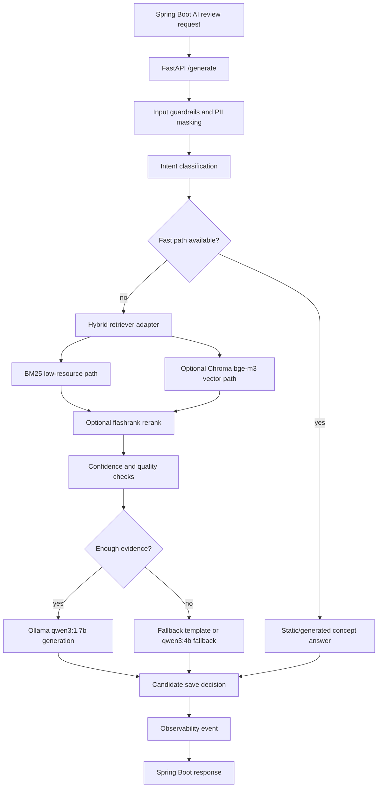

# AI Review Pipeline and I/O Explainer

이 문서는 DevMatch AI 리뷰 기능을 “어떻게 구현했는지” 설명할 때 바로 사용할 수 있도록 입력, 처리 파이프라인, 출력, 승인형 지식 관리 루프를 한 번에 정리한다.

## 한 줄 요약

Spring Boot가 사용자의 오답/질문 맥락을 FastAPI AI 파이프라인에 넘기고, FastAPI는 lightweight fast-path, hybrid retrieval, LangGraph-compatible workflow, Ollama 생성/fallback, candidate capture, observability event를 거쳐 검증 가능한 AI 답변을 반환한다. AI가 만든 후보 지식은 자동 반영하지 않고 관리자 승인 후 concept card로 승격한 뒤 changed-only reindex로 검색 지식에 들어간다.

## Input

Spring Boot 호출부는 AI 리뷰 요청을 만들 때 다음 정보를 FastAPI로 보낸다.

- `question`: 사용자가 풀거나 질문한 원문
- `options`: 객관식 보기
- `correct_answer`: 정답
- `selected_answer`: 사용자가 고른 답
- `user_answer`: 자유 질문 또는 주관식 답변
- `evaluation`: 기존 채점/해설 맥락
- `step`: 리뷰 단계
- `model`, `max_tokens`, `num_ctx`: 필요 시 모델/토큰/컨텍스트 override
- `X-Correlation-Id`: Spring/FastAPI 로그를 묶기 위한 correlation id
- service token: Spring Boot와 FastAPI 간 내부 호출 인증

기본 모델 정책은 `qwen3:1.7b`를 우선 사용하고, 생성 품질이나 실패 상황에서 `qwen3:4b-q4_K_M` fallback을 제한적으로 사용한다.

## Pipeline

## Retrieval

현재 구조는 adapter 기반이다.

- `hybrid:low_resource`: BM25 중심, optional dependency 없이 동작
- `hybrid:high_performance`: Chroma + bge-m3 vector retrieval, BM25 lexical retrieval, `kiwipiepy` tokenizer, `flashrank` reranker를 연결할 수 있는 경로
- optional dependency는 lazy import라서 현재 노트북에서는 설치되지 않은 기능이 전체 앱을 깨지 않는다.

concept card는 Markdown front matter와 section을 파싱해 검색 문서로 만든다. 고성능 환경에서는 `scripts/reindex_knowledge.py --chroma`로 Chroma 인덱스를 만들고 smoke query로 top result를 확인한다.

## Workflow

현재 workflow는 public API를 유지하면서 LangGraph-compatible runner와 optional StateGraph adapter를 함께 둔다.

- node 성격: intent, retrieve, generate, fallback, candidate save, error/dead-end, response build
- route 예시: `static_fast_path`, `generated_card_fast_path`, `rag_generation`, `generation`, `fallback_template`, `error_state`, `dead_end_state`
- 품질 플래그 예시: `missing_topic`, `low_confidence`, `retrieval_miss`
- fallback이 발생하거나 검색 근거가 약한 답변은 candidate capture 대상이 될 수 있다.

## Output

FastAPI는 Spring Boot에 다음 성격의 응답을 돌려준다.

- `answer`: 사용자에게 보여줄 AI 리뷰 답변
- `provider`: `python-fastapi`, `template`, `ollama` 등 제공자 정보
- `model_used`: 실제 사용 모델
- `confidence_score`: 검색/생성 신뢰도
- `retrieved_concept_ids`: 답변에 쓰인 concept card id
- `route`: workflow 경로
- `fallback_used`: fallback 여부
- `candidate_id`: 후보 지식으로 저장된 경우 추적 id
- `quality_flags`: 답변 품질/리스크 플래그
- `observability_events`: 로그/메트릭 sink로 흘릴 구조화 이벤트

Spring Boot는 이 metadata를 결과 화면과 admin candidate 화면에서 추적할 수 있게 보존한다.

## Human Approval Loop

AI 답변이나 추출 후보는 바로 지식화하지 않는다.

1. 후보는 JSONL 또는 DB candidate 테이블에 `PENDING` 상태로 쌓인다.
2. 관리자는 admin 화면에서 `APPROVED`, `REJECTED`, `MERGED`, `EDIT_AND_APPROVE` 중 하나로 리뷰한다.
3. 승인 또는 편집 승인된 후보만 concept card로 promotion된다.
4. `reindex_changed_knowledge()`가 manifest hash를 비교해 변경된 card만 changed-only reindex 대상으로 표시한다.
5. evaluator가 golden dataset 기준으로 retrieval, route, fallback, candidate capture, observability signal을 검증한다.

이 구조의 핵심은 “AI 자동 학습”이 아니라 “AI 후보 생성 + 사람 승인 + 검증 후 반영”이다.

## Golden Evaluation

`ai/evals/golden_dataset.jsonl`은 현재 50개 row로 확장되어 있다.

평가 항목:

- retrieval hit rate
- expected concept recall
- intent accuracy
- RAG policy accuracy
- stale context absent rate
- route accuracy
- required keyword 포함 여부
- forbidden claim 부재
- quality flag absent rate
- fallback expectation accuracy
- candidate capture accuracy
- observability event rate

이 evaluator는 단순히 검색이 맞았는지만 보는 것이 아니라, 운영에서 중요한 fallback/candidate/log 신호까지 함께 확인한다.

## How To Explain The Implementation

면접이나 프로젝트 설명에서는 이렇게 말하면 된다.

“AI 리뷰 기능은 Spring Boot 서비스가 사용자 풀이 맥락을 FastAPI로 넘기고, FastAPI가 먼저 intent를 분류한 뒤 fast-path 답변이 가능한지 확인합니다. 일반 질문은 hybrid retrieval adapter를 거쳐 concept card 근거를 찾고, 현재 노트북에서는 BM25 low-resource 경로를 기본으로 두었습니다. 나중에 더 좋은 PC에서는 같은 adapter에서 Chroma bge-m3, kiwipiepy, flashrank를 켜면 됩니다. 생성은 qwen3:1.7b를 기본으로 쓰고, qwen3:4b-q4_K_M은 fallback으로만 사용합니다. 답변에는 route, confidence, fallback 여부, candidate id, observability event를 같이 붙여서 Spring Boot와 admin UI에서 추적할 수 있게 했습니다. 후보 지식은 자동 반영하지 않고 사람이 승인한 뒤 concept card로 승격하고, changed-only reindex와 golden evaluator를 통과해야 검색 지식으로 안정적으로 들어갑니다.”
