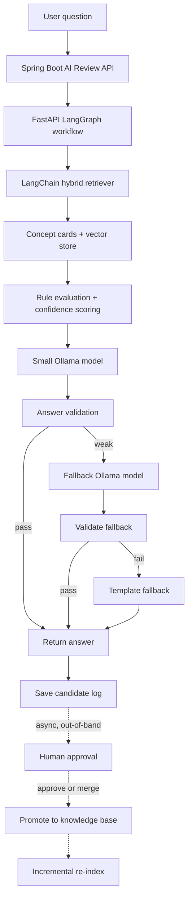

# AI Review Local RAG + LangGraph Architecture — 최종본 (구현용)

작성일: 2026-05-16
상태: 구현 반영 중 (2026-05-22 코드 상태 보정)
선행 문서:
- 초안: [ai-review-local-rag-langgraph-architecture.md](ai-review-local-rag-langgraph-architecture.md)
- 검토 의견: [ai-review-rag-langgraph-architecture-review.md](ai-review-rag-langgraph-architecture-review.md)

이 문서는 위 두 문서를 통합하고 검토 의견의 결함(필수/권장 항목)을 반영한 최종 구현용 사양이다. 구현 순서대로 따라가면 동작하도록 정합성을 맞추는 것이 목표다.

> 2026-05-22 코드 대조 메모: 현재 코드는 Fast-Path, 캐시, Single Flight, 혼잡 제어, fallback chain, 구조화 로그 기반 관측성, feature flag 기반 SSE 스트리밍 경로가 구현되어 있다. 다만 Prometheus/Grafana export와 정식 Circuit Breaker 상태 전이(Open/Half-Open/Closed)는 아직 코드에 없다. 스트리밍 경로도 인프라는 구현되어 있으나 Spring `AiReviewStreamingService`의 Python 요청 컨텍스트가 일부 stub 값에 의존하므로, 기존 non-streaming workflow와 완전히 동일한 의미 컨텍스트를 보장하려면 추가 보강이 필요하다.

---

## 0. 검토 의견 반영 요약

| 항목 | 변경 사항 |
|------|----------|
| 1-1 모델 표기 | 현재 `qwen2.5:1.5b` → 목표 `qwen3:1.7b` 마이그레이션 명시 (§2) |
| 1-2 응답 시간 | CPU 노트북 가정 + 목표 평균 10s / p95 18s로 현실화, 예시 latency 동기화 (§1, §11) |
| 1-3 Confidence | 가중치 정규화 공식으로 변경 (§10) |
| 1-4 Reranker 위치 | FastAPI 프로세스 내 `HuggingFaceCrossEncoder`로 명시, MVP는 `flashrank` (§7) |
| 1-5 Status/Action | `EDIT_AND_APPROVE` → status `APPROVED` + `reviewer_edited_answer` 컬럼 분리 (§12) |
| 1-6 DTO 마이그레이션 | 기존 6개 필드 유지 + 신규 필드 모두 nullable로 추가 (§11) |
| 2-1 RAM 예산 | 학생 노트북 6~8GB 예산표, MVP는 reranker 경량화 (§1) |
| 2-2 BM25 한국어 | `kiwipiepy` 토크나이저 주입 명시 (§6) |
| 2-3 청크 사이즈 | `MarkdownHeaderTextSplitter` 섹션 단위 분할 + 추가 split 없음 (§6) |
| 2-4 Golden set 규모 | MVP 30~50문항, concept당 2~3문항, 회귀 깨질 때마다 추가 (§13) |
| 2-5 Evaluator 순서 | 구현 순서에서 4단계 직후로 이동 (§17) |
| 2-6 PII 패턴 | 한국 휴대폰/주민번호/이메일/카드 정규식 명시 (§15) |
| 2-7 Ollama keep_alive | small=`-1`(영구), fallback=`30m` (§14) |
| 2-8 Vector store 경로 | Chroma → PGVector 직행, FAISS는 실험용 분리 (§6) |
| 3-1 Mermaid | Human approval 비동기 점선 (§1) |
| 3-2 한국어 검증 | "한글 비율 60% 이상" 임계값 명시 (§10) |
| 3-3 이력서 표현 | "candidate state로 승인 게이트 분리"로 정확화 (§18) |
| 3-4 prompt_versions.yml | 스키마 예시 추가 (§5) |
| 3-5 Approval UI | Spring Boot Admin endpoint + 단일 페이지로 일관성 (§12) |

---

## 1. 목적, 목표, 환경 전제

### 목적
DevMatch AI 리뷰 기능의 응답 속도와 정확도를 동시에 개선하기 위해 로컬 LLM, LangChain RAG, LangGraph workflow, 승인형 knowledge 관리, 정량 평가 파이프라인을 도입한다.

### 핵심 목표
- OpenAI, RunPod 의존도를 최소화한다.
- **CPU 학생 노트북 환경에서** 평균 응답 시간 10초 이하, p95 18초 이하를 목표로 한다. (GPU 가용 시 8s/12s까지 단축 가능)
- 작은 로컬 모델을 쓰더라도 RAG, 규칙 검증, fallback으로 정확도를 보완한다.
- AI 답변을 자동으로 지식화하지 않고, 사람 승인 후에만 RAG knowledge base에 반영한다.
- Golden set 기반 evaluation으로 RAG/프롬프트/모델 변경 시 품질 회귀를 잡는다.
- 이력서에 LangChain, LangGraph를 자연스럽게 설명할 수 있는 실제 문제 해결 구조를 만든다.

### 노트북 RAM 예산 (필수 전제)

| 구성 요소 | 메모리 | MVP 포함 |
|----------|--------|---------|
| qwen3:1.7b (small) | ~1.0 GB | O |
| qwen3:4b-q4_K_M (fallback) | ~2.5 GB | O |
| bge-m3 embedding | ~0.6 GB | O |
| **flashrank reranker** | ~0.1 GB | **O (MVP)** |
| bge-reranker-large | ~1.3 GB | X (운영 고도화) |
| Chroma + FastAPI + OS overhead | ~1.5 GB | O |
| **합계 (MVP)** | **~5.7 GB** | |
| **합계 (고도화)** | **~7.0 GB** | |

학생 노트북(16GB RAM 기준)에서 여유는 있으나, IDE/브라우저까지 함께 실행되므로 MVP는 `flashrank`로 시작하고 `bge-reranker-large`는 데모/평가 시점에만 활성화한다.

### 전체 구조

```text
Frontend
→ Spring Boot
   - AI 리뷰 세션/메시지 관리
   - FastAPI AI 서버 호출
   - timeout/retry/backoff 기반 graceful fallback
   - feature flag 기반 SSE 스트리밍 프록시
   - 후보 승인 API
   - correlation id 전파와 구조화 로그 기반 metric event 출력
→ FastAPI AI Service
   - LangChain RAG 검색
   - LangGraph workflow 실행
   - Ollama 로컬 모델 호출(non-streaming + streaming)
   - Reranker 인-프로세스 실행
   - 응답 검증, fallback, 후보 생성
→ Local Knowledge Base
   - Markdown concept cards
   - approved QA
   - vector store (Chroma)
→ Evaluation Pipeline
   - golden dataset
   - offline regression test
   - retrieval/answer 품질 metric
```

역할 분리:

```text
LangChain  = 지식 로딩, chunking, embedding, retrieval
LangGraph  = 답변 생성, 검증, fallback, 승인 흐름 제어
Spring Boot = 서비스 상태, 사용자 세션, 후보 승인, 운영 API
Ollama     = 로컬 생성 모델 (small + fallback)
Reranker   = FastAPI 인-프로세스 (HuggingFaceCrossEncoder/flashrank)
Evaluation = 변경 후 품질 회귀 방지
Human approval = RAG 지식 품질 최종 게이트
Observability = X-Correlation-ID + observability_events + metric.ai_review.* 구조화 로그
```

### Mermaid workflow (승인 흐름 비동기 표기)



(`M → N → O → P`는 사용자 응답 경로가 아닌 비동기 운영 흐름이다.)

---

## 2. 모델 전략

작은 모델 하나에 모든 판단을 맡기지 않는다. 정답 판단과 품질 관리는 RAG, 규칙, validator가 맡고, 모델은 자연어 답변 생성만 담당한다.

### 현재 → 목표 마이그레이션

```text
현재 코드 (ai/app/schemas.py:12):
- 기본 모델: qwen2.5:1.5b

목표:
- 기본 생성 모델: qwen3:1.7b  (또는 qwen2.5:3b-instruct)
- fallback 생성 모델: qwen3:4b-q4_K_M
- embedding 모델: bge-m3
- 최종 fallback: 템플릿 기반 응답

이행:
- Phase 1에서 schemas.py 기본값을 qwen3:1.7b로 교체
- requirements.txt에 ollama-python, langchain, langgraph, chromadb, sentence-transformers, flashrank, kiwipiepy 추가
- ollama pull qwen3:1.7b qwen3:4b-q4_K_M bge-m3 사전 수행
```

### Fallback 트리거 조건

```text
retrieval score가 낮음 (threshold 0.55 미만)
OR 필수 개념 키워드가 누락됨
OR 답변의 한글 비율이 60% 미만
OR 답변이 context와 모순됨 (validator 판단)
OR 질문 복잡도가 높음 (입력 길이/키워드 수 기준)
OR small 모델 응답 validation 실패
```

---

## 3. Knowledge Base 구조

초기에는 파일 기반 Markdown knowledge base로 시작한다. DB부터 붙이면 관리 UI, migration, versioning 부담이 커지므로 Git으로 추적 가능한 파일 기반이 적합하다.

```text
ai/app/knowledge/
  concepts/
    spring/
      n-plus-one.md
      fetch-join.md
      entity-graph.md
      transaction.md
    java/
      equals.md
      optional.md
      stream-api.md
  approved_qa/
    spring-n-plus-one-common.md
  candidates/
    README.md
  prompts/
    first_question_v1.prompt
    follow_up_v1.prompt
    free_question_v1.prompt
    validation_v1.prompt
    prompt_versions.yml
```

### Concept card 예시

```md
---
id: spring-n-plus-one
category: spring-jpa
difficulty: intermediate
version: java17-springboot3
last_updated: 2026-05-16
---

# N+1 문제

## 핵심 설명
N+1 문제는 목록 조회 1번 이후 각 엔티티의 연관 데이터를 접근할 때 추가 쿼리가 반복 발생하는 성능 문제다.

## 대표 해결
- fetch join
- EntityGraph
- batch size

## 흔한 오해
- 단순히 트랜잭션 문제라고 설명하는 것은 부정확하다.
- 네트워크 지연 문제라고 설명하는 것은 부정확하다.

## 평가 키워드
- 지연 로딩
- 연관 엔티티
- 추가 쿼리
- 반복 쿼리
```

### Quality Gate (knowledge card lint)

```text
ai/scripts/lint_knowledge_cards.py
```

검증 항목:

```text
필수 front matter: id, category, difficulty, version, last_updated
필수 heading: 핵심 설명, 대표 해결, 흔한 오해, 평가 키워드
concept id 중복 여부
평가 키워드 2개 이상
last_updated 형식 (YYYY-MM-DD)
approved_qa의 concept_id 참조 유효성
```

### 원칙 (Anti-self-learning)

```text
AI 답변을 RAG knowledge에 자동 저장하지 않는다.
AI 답변은 후보(candidate)로만 저장한다.
사람이 승인한 내용만 concepts 또는 approved_qa로 승격한다.
```

---

## 4. (예약) 

(섹션 번호 유지를 위한 placeholder 없음 - §5로 이어짐)

---

## 5. Prompt Versioning

프롬프트는 성능과 정확도에 큰 영향을 주므로 코드 안에 문자열로만 두지 않는다.

```text
ai/app/knowledge/prompts/
  first_question_v1.prompt
  follow_up_v1.prompt
  free_question_v1.prompt
  validation_v1.prompt
  prompt_versions.yml
```

### `prompt_versions.yml` 스키마

```yaml
prompts:
  - file: first_question_v1.prompt
    version: v1
    created_at: 2026-05-16
    owner: aucu2005@gmail.com
    purpose: "AI 리뷰 첫 질문 생성"
    eval_golden_run: 2026-05-16-001
  - file: follow_up_v1.prompt
    version: v1
    created_at: 2026-05-16
    owner: aucu2005@gmail.com
    purpose: "후속 질문 생성"
    eval_golden_run: 2026-05-16-001
  - file: validation_v1.prompt
    version: v1
    created_at: 2026-05-16
    owner: aucu2005@gmail.com
    purpose: "answer validation (LLM judge)"
    eval_golden_run: 2026-05-16-001
```

FastAPI 응답과 candidate 로그에는 `prompt_version`을 함께 저장한다. 프롬프트 변경 후에는 반드시 `evaluate_rag.py`로 회귀 확인.

---

## 6. RAG 검색 전략

```text
Markdown concept cards
→ MarkdownHeaderTextSplitter (섹션 단위 분할, 추가 split 없음)
→ bge-m3 embedding
→ semantic retriever (Chroma)
→ BM25 keyword retriever (kiwipiepy 한국어 토크나이저)
→ EnsembleRetriever
→ Reranker (flashrank, 인-프로세스)
→ top-k context 반환
```

### 청킹 가이드 (수정됨)

```text
방식: MarkdownHeaderTextSplitter로 섹션(##) 단위 분할
추가 split: 없음 (concept card 자체가 200~400 토큰으로 작음)
overlap: 0 (섹션 단위 분할이므로 overlap 불필요)
metadata: file_name, concept_id, category, section, difficulty, version, last_updated
```

**주의**: 초안의 `chunk size 500~800 tokens, overlap 100~200`은 carrd 크기보다 커서 유효 분할이 일어나지 않으므로 폐기.

### BM25 한국어 토크나이저 (필수)

```python
# 의사 코드
from kiwipiepy import Kiwi
from langchain_community.retrievers import BM25Retriever

kiwi = Kiwi()
def korean_tokenizer(text: str) -> list[str]:
    return [token.form for token in kiwi.tokenize(text)]

bm25 = BM25Retriever.from_documents(docs, preprocess_func=korean_tokenizer)
```

이유: 기본 whitespace split은 "지연로딩" vs "지연 로딩" 같은 한국어 토큰 변형에서 점수가 망가짐.

### Vector store 경로 (수정됨)

```text
MVP:
- Chroma (로컬 persistence, LangChain 연동 쉬움)

운영 확장:
- PGVector (Spring Boot/PostgreSQL과 같은 DB로 백업/권한/운영 일원화)
- 경로: Chroma → PGVector 직행

별도 위치:
- FAISS는 메모리 내 빠른 검색 실험용으로 분리 보관
  (Chroma에서 다운그레이드할 이유는 없음)
```

### 고도화 후보

```text
Cross-encoder reranker 업그레이드:
- flashrank (MVP) → bge-reranker-large (고도화, RAM +1.3GB)

Advanced retrieval:
- ContextualCompressionRetriever
- Parent-document retrieval
- Multi-query retrieval
- HyDE
- Semantic chunking
```

MVP에서는 hybrid retrieval + flashrank reranker까지만. HyDE/multi-query는 retrieval 품질 부족이 evaluator로 확인될 때 추가.

---

## 7. Reranker 서빙 위치 (신규 명시)

reranker는 Ollama로 못 돌리므로 별도 처리 방식을 명시한다.

```text
MVP:
- flashrank 라이브러리를 FastAPI 프로세스 내에서 직접 import
- 메모리 ~100MB
- top-50 retrieval → flashrank rerank → top-5 context

운영 고도화:
- sentence-transformers의 HuggingFaceCrossEncoder("BAAI/bge-reranker-large")
  를 FastAPI 프로세스 내에서 lazy-load
- 메모리 ~1.3GB
- 노트북 환경에서는 evaluation/데모 시에만 활성화

운영 고도화 (분리 서빙):
- TEI(Text Embeddings Inference) 컨테이너로 reranker만 별도 서빙
- 메모리/지연 분리, 다중 프로세스 환경에서 유리
```

설정 플래그:

```yaml
# ai/app/config.yml
reranker:
  enabled: true
  backend: flashrank  # flashrank | hf_cross_encoder | tei
  top_n_input: 50
  top_n_output: 5
```

---

## 8. LangGraph Workflow

```text
기본 workflow:
normalize_input
→ retrieve_context
→ rule_evaluate
→ generate_answer_small_model
→ validate_answer
→ confidence_gate
   → pass: return_answer
   → weak: generate_answer_fallback_model
→ validate_fallback
→ save_candidate
→ return_answer
```

```text
고도화 workflow:
retrieve
→ generate
→ validate
→ validation failed?
   → query_rewrite
   → re_retrieve
   → regenerate
→ still failed?
   → fallback_model
→ still failed?
   → template_fallback
→ save_candidate
→ return_answer
```

- Self-correcting loop는 응답 시간을 위해 최대 1~2회로 제한.
- Subgraph: retrieval / generation / validation / approval.
- PostgresSaver checkpoint는 long-running workflow나 HITL resume이 필요할 때 도입.
- `interrupt`는 사용자 응답 경로가 아닌 지식 승격/승인 단계에만 사용.

### Error Handling & Recovery

대표 오류:

```text
Ollama 연결 실패
Ollama timeout
context length 초과
retriever 결과 없음
JSON parse 실패
prompt template 누락
embedding/vector store 로딩 실패
```

복구 전략:

```text
retry policy:
- Ollama timeout은 1회 retry
- retriever 오류는 keyword-only(BM25) search로 fallback
- context length 초과는 context 압축 후 재시도

on_error node:
- 오류 유형을 candidate/error log에 저장
- 사용자에게는 짧은 템플릿 fallback 반환

dead-end state:
- workflow가 더 진행할 수 없으면 FAILED_WITH_FALLBACK 상태로 종료
- Spring Boot에는 fallback_used=true, confidence_score=0 반환
```

오류 지표:

```text
ollama_error_rate
retriever_error_rate
template_fallback_rate
json_parse_error_count
```

---

## 9. (생략, §10으로 이어짐)

---

## 10. Confidence Scoring (정규화)

각 sub-score는 [0, 1] 스케일로 정규화한 뒤 가중 합산한다.

```text
confidence_score =
    0.4 * retrieval_score        # [0,1]  reranker top-1 score 정규화
  + 0.2 * rule_match_score       # [0,1]  필수 키워드 hit ratio
  + 0.3 * answer_validation      # [0,1]  validator output (LLM judge or rules)
  + 0.1 * model_self_check       # [0,1]  small model의 self-rate
```

판정 기준:

```text
0.80 이상         : 정상 반환
0.60 ~ 0.79       : 반환하되 후보 저장 (review 우선순위 ↑)
0.60 미만         : fallback 모델 호출
fallback 후 낮음  : 템플릿 fallback + 후보 저장
```

### Validation 항목

```text
한글 비율 ≥ 60%
  (메소드명, 클래스명, Stream API 같은 영문은 정상으로 통과)
필수 평가 키워드 포함 여부
"흔한 오해" 문구 미포함
context와의 모순 여부 (LLM judge)
답변 길이 (최소 80자, 최대 800자)
정답 직접 노출 금지 단계 준수 여부
```

`answer_validation` 점수는 위 6개 항목 중 통과한 비율 (예: 5/6 → 0.83).

---

## 11. Spring Boot ↔ FastAPI 연동

### FastAPI 응답 DTO (latency 예시 현실화)

```json
{
  "answer": "N+1 문제는 목록 조회 후 각 항목의 연관 데이터를 접근할 때 추가 쿼리가 반복 발생하는 문제입니다.",
  "provider": "ollama",
  "model_used": "qwen3:1.7b",
  "fallback_used": false,
  "confidence_score": 0.82,
  "retrieved_concept_ids": ["spring-n-plus-one", "spring-fetch-join"],
  "candidate_required": true,
  "candidate_id": "cand_2026051601",
  "latency_ms": 5400,
  "prompt_version": "follow_up_v1"
}
```

(목표 평균 10s 이하 / p95 18s 이하 기준에서 5400ms는 정상 범위)

### Spring Boot DTO 마이그레이션 전략

현재 `backend/src/main/java/com/devmatch/dto/aireview/AiReviewSubmitResponse.java`는 6개 필드:

```java
private String evaluation;
private String feedback;
private String nextQuestion;
private boolean completed;
private String summary;
private List<AiReviewMessageResponse> messages;
```

**호환성 원칙: 기존 필드는 그대로 유지하고, 신규 필드는 모두 nullable로 추가.**

```java
// 신규 추가 (모두 nullable)
private Double confidenceScore;             // null이면 legacy provider
private String modelUsed;                    // ex) "qwen3:1.7b"
private Boolean fallbackUsed;
private List<String> retrievedConceptIds;
private String candidateId;
private String promptVersion;
private Long latencyMs;
```

프론트는 이 신규 필드가 null이면 무시한다. 단계적 롤아웃 가능.

### Spring Boot가 추가로 관리할 값

```text
correlation_id
model_used
latency_ms
fallback_used
confidence_score
retrieved_concept_ids
candidate_id
```

### 운영 안정성

```text
HTTP timeout (20s)
retry (최대 3회, exponential backoff + full jitter)
retry exhaustion 시 Optional.empty() 반환 후 graceful fallback
correlation_id 전달
FastAPI /health
Ollama warm-up (서버 기동 시 small model 호출 1회)
```

현재 코드에는 Resilience4j 기반 Circuit Breaker 상태 전이(Open/Half-Open/Closed)가 없다. 포트폴리오나 면접 설명에서는 "Circuit Breaker"보다 "Retry with Exponential Backoff + Graceful Fallback"으로 표현하는 것이 정확하다.

### Multi-Process & Concurrency

로컬 Ollama는 동시 요청이 늘어나면 latency가 급격히 늘 수 있다. 초기에는 queueing + rate limit이 안전.

```text
초기 전략:
- FastAPI request queue
- 동시 Ollama 생성 요청 1~2개로 제한
- 나머지는 짧은 대기 또는 fallback
- 사용자별 rate limit (예: 분당 6회)

고도화 전략:
- small model 전용 Ollama instance
- fallback model 전용 Ollama instance
- GPU 사용 가능 시 model별 instance 분리
- CPU fallback 시 timeout을 더 짧게
```

지표:

```text
queue_wait_ms
active_generation_count
rate_limited_count
ollama_concurrent_requests
```

---

## 12. 후보 승인 흐름

AI 답변은 바로 RAG 지식이 되지 않는다. **후보로만 저장하고, 검토자가 승인한 것만** knowledge에 반영.

### 후보 테이블 스키마 (status/action 정합성 수정)

```text
ai_review_candidates
- id
- session_id
- question
- user_answer
- ai_answer
- reviewer_edited_answer    -- NEW: EDIT_AND_APPROVE 시 사용
- retrieved_concept_ids
- confidence_score
- model_used
- prompt_version
- fallback_used
- status: PENDING / APPROVED / REJECTED / MERGED
- review_action: APPROVED / EDIT_AND_APPROVE / MERGED / REJECTED  -- NEW: 액션 기록용
- reviewer_feedback
- reviewer_id
- reviewed_at
- created_at
```

핵심: **status는 최종 상태(4종), `review_action`은 검토자가 취한 행동(4종)**으로 분리.
- `EDIT_AND_APPROVE`는 status `APPROVED` + `reviewer_edited_answer` 컬럼 채움 + `review_action = EDIT_AND_APPROVE`로 표현.

### 승인 액션 → 후처리

```text
APPROVED (action=APPROVED):
- ai_answer를 그대로 approved_qa에 저장

APPROVED (action=EDIT_AND_APPROVE):
- reviewer_edited_answer를 approved_qa에 저장

MERGED:
- 기존 concept card에 검토자가 직접 반영 (diff/PR)

REJECTED:
- 로그만 유지, RAG에는 반영하지 않음
```

### Approval UI

```text
1차: Spring Boot Admin endpoint + 관리자 페이지 한 장
  - 기존 Spring 인증/배포와 일관성 유지
  - candidate 리스트 + 승인/거절/편집 form

2차 (선택): Streamlit 검토 화면
  - 별도 인증/배포가 추가되므로 1차 운영 후 필요시 도입
```

### Data retention

```text
PENDING 후보: 90일 보관 후 anonymize 또는 delete
REJECTED 후보: 30~90일 보관 후 delete
APPROVED/MERGED 후보: 승인된 knowledge와 audit log만 유지
사용자 원문 답변: PII 패턴 제거 후 저장 (§15 참고)
```

### approved_qa 활용

```text
자주 나오는 질문의 few-shot 예시
evaluator의 reference answer
low-confidence answer 검토 기준
```

---

## 13. Evaluation과 Golden Set

Golden set은 모델 학습 데이터가 **아니다**. RAG/프롬프트/검색/모델 변경 후 품질 회귀를 잡는 회귀 테스트 데이터다.

### 운영 정책 (신규)

```text
초기 규모: 30~50문항 (MVP)
구성: concept당 2~3문항
유지: 회귀가 깨질 때마다 깨진 케이스를 추가 (anti-regression test 누적)
관리자: 작성자(=aucu2005@gmail.com)가 single-source-of-truth
보관: ai/evals/golden_dataset.jsonl (Git tracked)
```

### 경로

```text
ai/evals/
  golden_dataset.jsonl
  reports/
ai/scripts/
  evaluate_rag.py
```

### Golden dataset 예시

```json
{
  "id": "spring-n-plus-one-001",
  "question": "N+1 문제가 왜 생겨?",
  "expected_concepts": ["spring-n-plus-one"],
  "required_keywords": ["지연 로딩", "추가 쿼리", "연관 엔티티"],
  "forbidden_claims": ["트랜잭션 문제", "네트워크 문제"],
  "reference_answer": "N+1 문제는 목록 조회 후 각 엔티티의 연관 데이터를 접근할 때 추가 쿼리가 반복 발생하는 문제다."
}
```

### 초기 metric

```text
retrieval_hit_rate
expected_concept_recall
answer_contains_required_keywords
forbidden_claims_absent
answer_grounded_in_context
fallback_rate
average_latency_ms
```

### 고도화 metric

```text
Ragas:
  Context Precision
  Context Recall
  Faithfulness
  Answer Relevancy
  Groundedness

Tracing:
  LangSmith 또는 Langfuse
```

초기에는 custom evaluation script, 이후 Ragas + Langfuse/LangSmith.

---

## 14. Observability, Caching, Resource Management

### 필수 로그

```text
correlation_id
session_id
question_id
model_used
latency_ms
retrieval_score
confidence_score
fallback_used
retrieved_concept_ids
candidate_status
```

### Metrics

```text
평균 응답 시간
p95 응답 시간
fallback rate
approval rate
rejection rate
low-confidence rate
retrieval miss rate
Ollama error rate
```

현재 구현은 `AiReviewMetricSink`의 `metric.ai_review.*` 구조화 로그와 Python 응답의 `observability_events`가 중심이다. Micrometer Counter, Prometheus exporter, Grafana dashboard wiring은 아직 코드에 연결되어 있지 않다.

### 향후 Grafana 패널

```text
p50/p95 latency by endpoint
fallback rate by model
low confidence answer top 10
retrieval miss top concepts
approval rate by category
rejection rate by category
candidate backlog count
Ollama timeout/error trend
average queue wait time
```

### Cache

```text
Redis final answer cache
- TTL 1~7일
- key: normalized question + concept ids + model version

Retrieval result cache
- key: normalized question
- value: retrieved concept ids
```

### Ollama 운영 (keep_alive 구체값)

```text
small model (qwen3:1.7b):
- keep_alive = -1  (영구 warm)
- 이유: 사용자 요청 path에 항상 있으므로 cold start 6~10s 발생 방지

fallback model (qwen3:4b-q4_K_M):
- keep_alive = 30m
- 이유: 자주 안 쓰이지만 한번 쓰면 30분 내 다시 쓸 가능성 큼

FastAPI 기동 시:
- /health에서 Ollama 연결 확인
- small model로 짧은 warm-up 요청 1회 (latency 첫 요청에서 튀는 것 방지)
```

추천 도구:

```text
Logging: structlog
Metrics: 현재 구조화 로그, 후속 Prometheus + Grafana
Tracing: Langfuse 또는 LangSmith
App tracing: OpenTelemetry
```

---

## 15. Security & Guardrails

### Input/output 검사

```text
input length 제한 (max 2000 chars)
PII 패턴 마스킹 (아래 정규식)
prompt injection 문구 감지 ("ignore previous", "system prompt" 등 키워드 매칭)
출력 한글 비율 ≥ 60% (단, code identifiers 제외)
context 밖 단정 표현 제한 (validator)
FastAPI ↔ Spring Boot 간 인증 토큰 (헤더 X-Service-Token)
```

### PII 정규식 (구체화)

```python
import re

PII_PATTERNS = {
    "phone_kr":   re.compile(r"\b01[016789][-\s]?\d{3,4}[-\s]?\d{4}\b"),
    "ssn_kr":     re.compile(r"\b\d{6}[-\s]?\d{7}\b"),
    "email":      re.compile(r"\b[A-Za-z0-9._%+-]+@[A-Za-z0-9.-]+\.[A-Za-z]{2,}\b"),
    "card":       re.compile(r"\b\d{4}[-\s]?\d{4}[-\s]?\d{4}[-\s]?\d{4}\b"),
    "ipv4":       re.compile(r"\b(?:\d{1,3}\.){3}\d{1,3}\b"),
}

def mask_pii(text: str) -> str:
    for name, pat in PII_PATTERNS.items():
        text = pat.sub(f"[REDACTED_{name.upper()}]", text)
    return text
```

저장 시점에만 마스킹하고, 사용자 응답 경로에는 영향 없음.

### 고도화 후보

```text
LlamaGuard
NeMo Guardrails
LLM judge 기반 output validation
```

---

## 16. Knowledge Management 확장

### 초기

```text
Markdown 파일 기반 concept cards
수동 re-index 명령
후보 승인 API
```

### 확장

```text
Git PR 기반 concept card 변경
CI에서 evaluation 실행
승인 후 vector store incremental update
concept card version/hash 관리
approved_qa를 few-shot 예시로 활용
```

### Incremental Indexing

전체 re-index는 단순하지만 concept card가 늘어나면 느려진다. hash 기반 incremental indexing 전략을 명시.

방식:

```text
1. concept card 파일 hash 계산
2. 이전 index manifest와 비교
3. 변경된 concept_id만 삭제 후 재색인
4. 삭제된 파일은 vector store에서도 제거
5. 변경 결과를 index manifest에 저장
```

파일:

```text
ai/app/vectorstore/index_manifest.json
ai/scripts/reindex_knowledge.py
```

LangChain indexing API 활용:

```text
source_id     : concept_id + section
content_hash  : sha256(section content)
metadata_hash : sha256(front matter)
```

운영 흐름:

```text
concept card 변경
→ lint_knowledge_cards.py
→ evaluate_rag.py quick mode
→ reindex_knowledge.py --changed-only
→ smoke retrieval test
```

---

## 17. 구현 순서 (Evaluator 조기 도입)

```text
1. Python AI 서버 모듈화
   - rag/, graph/, ollama/, validation/, knowledge/ 분리
   - schemas.py 기본 모델 qwen2.5:1.5b → qwen3:1.7b 교체
   - requirements.txt에 langchain/langgraph/chromadb/sentence-transformers/flashrank/kiwipiepy 추가

2. Markdown concept card 작성
   - Java/Spring 빈출 개념 10~20개부터 시작
   - card template + lint_knowledge_cards.py 동시 추가

3. LangChain 기본 retriever 구현
   - Markdown loader + MarkdownHeaderTextSplitter
   - bge-m3 embedding + Chroma
   - 인덱스 manifest 초기 구현

3.5. Hybrid retriever + reranker 구현
   - semantic retriever (Chroma)
   - BM25 retriever + kiwipiepy 토크나이저
   - EnsembleRetriever
   - flashrank reranker (인-프로세스)

4. LangGraph 기본 workflow 구현
   - retrieve / generate / validate / save_candidate / on_error
   - dead-end state 처리

★ 4.6. Golden dataset + evaluate_rag.py 조기 도입 (NEW POSITION)
   - 30~50문항으로 시작
   - retrieval regression / answer keyword validation / latency
   - 이후 모든 변경은 이 evaluator로 회귀 체크

4.7. Confidence scoring + fallback routing 구현
   - retrieval / rule / validator / self-check 정규화
   - 임계값 0.80 / 0.60 적용

5. 기존 FastAPI endpoint 연결
   - /api/review/first-question
   - /api/review/follow-up
   - /api/review/free-question

6. Spring Boot DTO 확장 (nullable 신규 필드)
   - confidenceScore / modelUsed / fallbackUsed / retrievedConceptIds
   - candidateId / promptVersion / latencyMs

7. Candidate 저장/승인 API 구현
   - PENDING / APPROVED / REJECTED / MERGED
   - reviewer_edited_answer 컬럼 분리
   - Spring Admin endpoint + 관리자 페이지

7.5. Logging, tracing, metrics 기본 추가
   - correlation_id / latency / fallback rate / confidence histogram

8. Re-index 명령 정식화
   - changed-only incremental + hash manifest

9. Redis cache 추가
   - final answer cache + retrieval result cache

9.5. Rate limit + Ollama warm-up/health check
   - FastAPI queue + 동시 Ollama 1~2개 제한

10. 관리자 승인 UI 확장 (필요 시 Streamlit)

11. Ragas + Langfuse/LangSmith 고도화

12. Self-correcting loop, parent-document retrieval, multi-query retrieval 고도화
```

핵심 원칙: **"회귀 잡는 안전망 먼저"** — 4.6에서 evaluator를 먼저 깔아두면 이후 모든 변경(prompt, retriever, model)에서 자동으로 회귀 감지.

---

## 18. 이력서 표현 예시 (정확화)

```text
LangChain 기반 Markdown knowledge base RAG를 구축하고, bge-m3 embedding과
hybrid retrieval(semantic + BM25 with kiwipiepy + flashrank reranker)로
Java/Spring 진단 테스트 개념 검색 정확도를 개선했습니다.

LangGraph로 로컬 LLM 답변 생성, 규칙 기반 검증, 정규화된 confidence scoring,
fallback model routing을 상태 그래프로 설계했고, candidate state를 두어
human-in-the-loop 승인 게이트를 사용자 응답 경로 밖으로 분리했습니다.

Ollama 기반 로컬 LLM과 승인형 knowledge promotion 구조를 결합해 외부 LLM API
의존도를 낮추고, 30~50문항 golden set 기반 evaluation pipeline으로
RAG 품질 회귀를 관리했습니다.
```

(주: `interrupt`를 쓰지 않으므로 "human-in-the-loop를 LangGraph로 구현"이 아니라 "candidate state로 승인 게이트 분리"로 표현하는 것이 정확.)

---

## 19. 우선순위 요약

### MVP 필수

```text
LangChain RAG (concept cards + bge-m3 + Chroma)
LangGraph workflow (retrieve / generate / validate / fallback / save_candidate)
Markdown concept cards + lint
정규화된 confidence scoring
fallback routing (qwen3:1.7b → qwen3:4b-q4 → template)
candidate approval (Spring Admin endpoint)
golden dataset 30~50문항
offline evaluation script
BM25 + kiwipiepy 한국어 토크나이저
flashrank reranker (인-프로세스)
Ollama keep_alive 설정 (small=-1, fallback=30m)
PII 마스킹 정규식
DTO nullable 마이그레이션
```

### 운영 고도화

```text
bge-reranker-large 업그레이드
Redis cache
Prometheus metrics
Langfuse/LangSmith tracing
Ragas evaluation
PGVector 이전
incremental re-index 정식화
```

### 나중에 고려

```text
multi-agent
LoRA fine-tuning
Git PR 기반 knowledge workflow
PostgresSaver checkpoint (HITL resume이 필요해질 때)
LlamaGuard/NeMo Guardrails
personalization
HyDE / multi-query retrieval
```

---

## 20. 변경 추적 / 향후 갱신

이 문서는 구현이 진행되면서 갱신된다. 주요 갱신 시점:

- Phase 4.6 evaluator 도입 후: golden_dataset 실측 metric을 §13에 반영
- Phase 7 후: candidate 승인 비율/구조 안정화 후 §12 schema 확정
- DTO 마이그레이션 완료 후: §11 nullable 정책 제거 검토

다음 단계 권장:
1. 이 문서 기준으로 Phase 1~3.5 작업 분해 (writing-plans 스킬)
2. Phase 1 실행 시 `schemas.py` 모델 기본값 교체와 의존성 추가는 같은 PR로 묶기
3. Phase 4.6 evaluator는 concept card 10개 시점에 반드시 도입 (이후 변경은 evaluator를 통과해야 머지)
