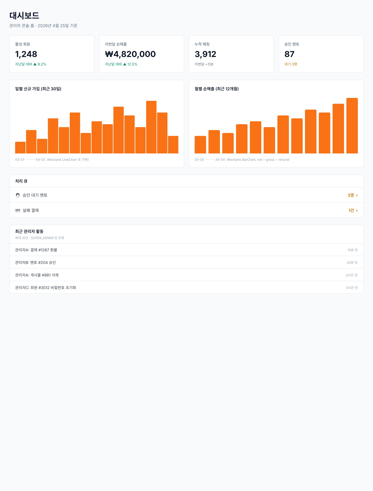

# Phase III UI — 관리자 콘솔 홈 대시보드 (Markdown 버전)

> `admin-mentor.md` / `admin-users.md` / `admin-payments.md` 와 동일 포맷. KPI + 차트 + 처리 큐 + (SUPER_ADMIN 한정) 감사 로그.

## 비주얼 목업 (Pencil export)



> SUPER_ADMIN 뷰. ADMIN 뷰는 "최근 관리자 활동" 섹션만 빠지고 나머지는 동일. 원본 `.pen` 파일: [`admin-dashboard.pen`](./admin-dashboard.pen).

---

## 공통

### 접근 제어

- `/admin/dashboard` 는 **ADMIN 역할** 이상 (ADMIN / SUPER_ADMIN).
- `GET /api/admin/dashboard/audit-log` 는 **SUPER_ADMIN 전용** — `SecurityConfig` 의 URL 패턴 규칙에 별도 라인 추가.
- ADMIN 으로 대시보드 진입 시 "최근 관리자 활동" 섹션은 **DOM 자체가 렌더되지 않음** (요청도 보내지 않음).

### 라우팅

| 경로 | 화면 | 비고 |
|------|------|------|
| `/admin` | → `/admin/dashboard` 리다이렉트 | 기존 `/admin/mentor` 대신 |
| `/admin/dashboard` | 대시보드 메인 | 본 페이지 |

### API 매핑 (전부 신규)

| 동작 | HTTP | 엔드포인트 | 권한 | 현황 |
|------|------|-----------|------|------|
| 요약(KPI + 차트 + 큐) | GET | `/api/admin/dashboard` | ADMIN+ | ❌ 없음, 신규 |
| 감사 로그 피드 | GET | `/api/admin/dashboard/audit-log` | SUPER_ADMIN | ❌ 없음, 신규 |

### 데이터 전제

- **DDL 변경 없음.** Phase II Feature 1~3 에서 이미 준비된 컬럼만 사용.
- `PaymentStatus.CONFIRMED` 기준 매출, `payments.cancelled_at` 기준 환불 (approved_at / refund_amount 컬럼 **없음** — 가정하지 말 것).
- **KST 기준** 월 경계 계산. `ZoneId.of("Asia/Seoul")`.
- **순매출 (Net revenue)** = CONFIRMED 합산 − CANCELLED 합산. 환불은 취소된 "시점" 월에 귀속 (환불된 원 결제의 월로 소급하지 않음).

---

## 1. `/admin/dashboard` — 대시보드 메인 (SUPER_ADMIN 뷰)

```
┌──────────────────────────────────────────────────────────────────────────────┐
│ 대시보드                                                                      │  h1 (2xl, semibold)
│ 관리자 콘솔 홈 · 2026년 4월 24일 기준                                         │  muted (sm)
└──────────────────────────────────────────────────────────────────────────────┘

─── ① KPI 카드 4개 ─────────────────────────────────────────────────────────────

┌───────────────────┐ ┌───────────────────┐ ┌───────────────────┐ ┌───────────────────┐
│ 활성 회원    👥  │ │ 이번달 순매출 💰 │ │ 누적 매칭    🤝  │ │ 승인 멘토    ✅  │
│                   │ │                   │ │                   │ │                   │
│     1,248         │ │    ₩4,820,000     │ │      3,912        │ │       87          │
│                   │ │                   │ │                   │ │                   │
│ 지난달 대비       │ │ 지난달 대비       │ │ 이번달 +128       │ │ 대기 3명          │
│ ▲ 8.2%            │ │ ▲ 12.5%           │ │                   │ │                   │
└───────────────────┘ └───────────────────┘ └───────────────────┘ └───────────────────┘
                                                                 (grid: 1 / sm:2 / lg:4)

─── ② 차트 2개 ────────────────────────────────────────────────────────────────

┌──────────────────────────────────────┐ ┌──────────────────────────────────────┐
│ 일별 신규 가입 (최근 30일)           │ │ 월별 순매출 (최근 12개월)            │
│ ─────────────────────────────────── │ │ ─────────────────────────────────── │
│        ●                            │ │    ▇                                 │
│   ●       ●●●                       │ │   ▇▇▇       ▇▇                      │
│  ●  ●●   ●   ●●     ●●  ●           │ │  ▇▇▇▇▇ ▇▇▇ ▇▇▇▇▇▇▇▇                  │
│ ●        ●      ●  ●   ● ●          │ │ ▇▇▇▇▇▇▇▇▇▇▇▇▇▇▇▇▇▇▇▇▇▇▇              │
│                                     │ │ ▇▇▇▇▇▇▇▇▇▇▇▇▇▇▇▇▇▇▇▇▇▇▇              │
│ 03-26 ──────────────────── 04-24    │ │ 25-05 ──────────────────── 26-04     │
│                                     │ │                                      │
│ Recharts LineChart, monotone,       │ │ Recharts BarChart, 단일 net bar,     │
│ dot=false, stroke=orange-500        │ │ fill=orange-500, radius=[4,4,0,0],   │
│ (#F97316)                           │ │ tickFormatter `${v/1e6}M`            │
└──────────────────────────────────────┘ └──────────────────────────────────────┘
                                                    (grid: 1 / lg:2)

─── ③ 처리 큐 ─────────────────────────────────────────────────────────────────

┌──────────────────────────────────────────────────────────────────────────────┐
│ 처리 큐                                                                       │  CardHeader
├──────────────────────────────────────────────────────────────────────────────┤
│  🧑 승인 대기 멘토                                        3명  ›              │  Link → /admin/mentor
├──────────────────────────────────────────────────────────────────────────────┤
│  💳 실패 결제                                             1건  ›              │  Link → /admin/payments?status=FAILED
└──────────────────────────────────────────────────────────────────────────────┘
  · 카운트 0 이면 슬레이트-400 회색, 1 이상이면 앰버-600 강조
  · 행 전체가 클릭 가능 (hover:bg-slate-50)

─── ④ 최근 관리자 활동 (SUPER_ADMIN 전용) ─────────────────────────────────────

┌──────────────────────────────────────────────────────────────────────────────┐
│ 최근 관리자 활동                                                              │
│ 최대 10건 · SUPER_ADMIN 만 조회                                               │  muted xs
├──────────────────────────────────────────────────────────────────────────────┤
│ 관리자A: 결제 #1287 환불                                     15분 전          │  → /admin/payments/1287
├──────────────────────────────────────────────────────────────────────────────┤
│ 관리자B: 멘토 #204 승인                                      42분 전          │  → /admin/mentor/204
├──────────────────────────────────────────────────────────────────────────────┤
│ 관리자A: 게시물 #981 삭제                                    2시간 전         │  → /admin/posts/981
├──────────────────────────────────────────────────────────────────────────────┤
│ 관리자C: 회원 #3012 비밀번호 초기화                          5시간 전         │  → /admin/users/3012
└──────────────────────────────────────────────────────────────────────────────┘
  · metadata (사유 원문) 은 **의도적으로 노출하지 않음** (스펙 §5.4)
  · 삭제된 관리자는 "(삭제된 관리자)" 로 폴백
```

### ADMIN 뷰 (SUPER_ADMIN 이 아닌 경우)

- ① KPI / ② 차트 / ③ 처리 큐 — 동일.
- ④ 최근 관리자 활동 섹션 **DOM 에서 완전 제거** (조건부 렌더). `/audit-log` 요청 자체가 발생하지 않음.

---

## 2. 상태별 렌더 — 섹션 단위 skeleton / 에러 / 빈 데이터

| 섹션 | 로딩 | 에러 | 빈 데이터 |
|------|------|------|----------|
| KPI | skeleton 4칸 (animate-pulse, h-[100px]) | `SectionError` + [재시도] | 값 0, delta "—" |
| 차트 | skeleton 2칸 (h-[280px]) | `SectionError` × 2 | 빈 축(라인이 바닥) |
| 처리 큐 | skeleton 1칸 (h-[130px]) | 숨김 (KPI 에러와 동일 원인) | "0명 / 0건" 회색 |
| 감사 로그 | skeleton 1칸 (h-[200px]) | `SectionError` + [재시도] | "최근 활동 없음" |

> **핵심 규칙**: 한 섹션 실패가 다른 섹션을 막지 않는다. `/api/admin/dashboard` 와 `/api/admin/dashboard/audit-log` 는 **병렬 호출**, 독립 에러 경로.

### 캐시 / 새로고침

- **캐시 없음** (스펙 §3 "no caching"). 페이지 방문 → 즉시 API 호출.
- 네트워크 실패 → `SectionError` 의 [재시도] 버튼 → 해당 섹션만 refetch (reloadKey 증가 패턴).

---

## 3. shadcn / Recharts 컴포넌트 매핑

| UI 요소 | 컴포넌트 | 비고 |
|---------|----------|------|
| 페이지 헤더 | 단순 `<h1>` + `<p>` | 다른 admin 페이지와 동일 |
| KPI 카드 | `<Card>` / `<CardContent>` (shadcn) or 커스텀 `rounded-lg border` div | 기존 admin 페이지가 커스텀 div 쓰고 있으면 맞춤 |
| KPI 아이콘 | `lucide-react`: `Users`, `Wallet`, `Handshake`, `UserCheck` | |
| 신규 가입 차트 | **Recharts** `LineChart` (monotone, stroke=`#F97316`, dot=false, strokeWidth=2) | `shadcn@latest add chart` 로 설치 |
| 순매출 차트 | **Recharts** `BarChart` (단일 net bar, fill=`#F97316`, radius=[4,4,0,0], + ReferenceLine y=0) | 동일 |
| 처리 큐 | 커스텀 `<ul>` + `<Link>` | `ChevronRight` 아이콘 |
| 감사 로그 | 커스텀 `<ul>` + `<Link>` | relative-time 자체 구현 (`방금 전` / `N분 전` / `N시간 전` / `N일 전`) |
| SectionError | 커스텀 — `border-red-200 bg-red-50` + [재시도] 버튼 | 대시보드 전용 공용 |

> **신규 의존성**: `recharts` (shadcn chart 가 peer dep 로 끌어옴). 기존 admin 페이지 번들에 없음 — 설치 필요.

### 사이드바 업데이트

기존:

```
🧑 멘토 심사
👥 회원 관리
💳 결제 관리
📝 게시물 관리
🛡️ 관리자 계정 (SUPER_ADMIN)
```

Phase III 이후:

```
📊 대시보드           ← 신규, 최상단
🧑 멘토 심사
👥 회원 관리
💳 결제 관리
📝 게시물 관리
🛡️ 관리자 계정 (SUPER_ADMIN)
```

- 아이콘: `lucide-react` 의 `LayoutDashboard`.
- `match`: `/admin/dashboard` 또는 그 하위.

---

## 4. 관찰 중 / 비포함 (Out of Scope)

- ❌ CSV/Excel export
- ❌ 기간 선택 UI (MTD / rolling 고정)
- ❌ 차트 드릴다운 (값 클릭 시 필터된 목록으로 이동 등)
- ❌ Redis 캐시 / `@Cacheable`
- ❌ 실시간 업데이트 (WebSocket/SSE)
- ❌ 신고 기반 처리 큐 — 신고 기능 자체가 Phase II 에 없음

후속 이터레이션(Phase III 이후) 에서 상기 항목 중 필요한 것을 재평가.

---

## 5. 다음 단계

1. 백엔드: `AdminDashboardController` + `AdminDashboardService` + 리포지토리 쿼리 5~6 개 추가.
2. 백엔드: `SecurityConfig` 에 `/api/admin/dashboard/audit-log` → SUPER_ADMIN 라우트 추가 (기존 `/api/admin/admins/**` 패턴 **위**).
3. 프런트: `shadcn@latest add chart` (recharts 끌어옴).
4. 프런트: `/admin/dashboard/page.tsx` + 섹션 컴포넌트 6 개 (`KpiCards`, `SignupTrendChart`, `RevenueTrendChart`, `ActionQueue`, `RecentAuditLog`, `SectionError`).
5. 프런트: `AdminSidebar` 최상단에 "📊 대시보드" 추가, `/admin` → `/admin/dashboard` 리다이렉트.
6. `docs/mockups/admin-console-overview.md` + `ROADMAP.md` 상태 업데이트.
