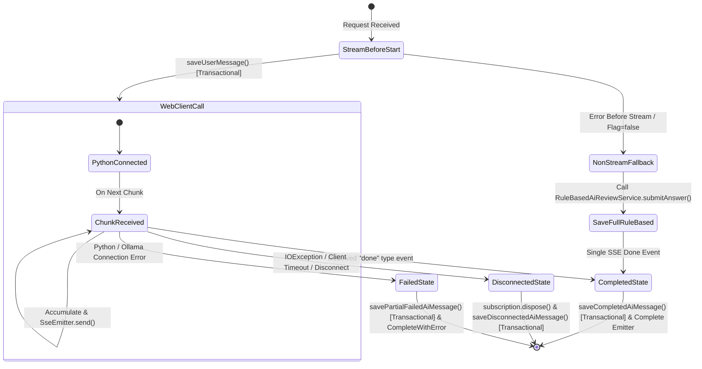

# AI Review Spring SSE Proxy Design

## 개요
본 문서는 Spring Boot 백엔드에서 WebFlux `WebClient`를 기반으로 Python AI 서비스의 실시간 스트리밍 데이터를 Proxy하고, 이를 `SseEmitter`를 통해 React 클라이언트로 반환하는 SSE Proxy 인프라 설계이다.

---

## 1. 아키텍처 원칙 및 수정 요건 반영

### 1.1 SseEmitter 라이프사이클 및 상태 관리
`SseEmitter.onCompletion`은 정상적으로 스트리밍이 완료된 경우에도 호출된다. 스트리밍 라이프사이클을 추적하고 중복 저장을 방지하기 위해 `AtomicReference<StreamingState>`를 활용하여 상태를 구분한다.
* **상태 종류**: `INIT`, `STARTED`, `COMPLETED`, `DISCONNECTED`, `FAILED`

이러한 상태 플래그를 통해 `onCompletion` 및 `onTimeout` 콜백 내에서 **이미 데이터베이스 저장이 완료되었거나 오류 처리가 끝난 상태**인 경우 추가 작업을 수행하지 않도록 방어 로직을 구축한다.

### 1.2 클라이언트 해제 및 IOException 대응
`SseEmitter.send()` 호출 중 `IOException`(예: 브라우저 탭 닫기, 네트워크 순간 단절 등)이 발생하는 경우:
1. 즉시 WebClient 스트림 구독(`subscription.dispose()`)을 해제한다.
2. 현재까지 `StringBuilder`에 누적된 부분 텍스트(`partial text`)를 바탕으로 `AiReviewMessage`를 생성한다.
3. 해당 메시지의 `aiQualityFlags`에 `STATUS:DISCONNECTED`를 태그로 붙여 DB에 안전하게 저장한다. (이때 별도의 가벼운 `@Transactional` 메서드를 활용한다)
4. 리소스를 조기에 반환하여 불필요한 LLM Generation 및 스레드 자원 낭비를 방지한다.

### 1.3 Feature Flag 비활성화 시 Fallback 전략
* **원칙**: 로직의 복사를 지양하고, 기존의 검증 및 핵심 비즈니스 로직이 담긴 `RuleBasedAiReviewService.submitAnswer(...)`를 **100% 그대로 재사용**한다.
* **동작**: `app.ai-review.streaming-enabled`가 `false`로 설정된 경우, 스트리밍 엔드포인트 요청에 대해 `submitAnswer(...)`의 결과를 동기적으로 받아온다. 받아온 결과를 단일 `done` 이벤트 형태의 SSE Chunk로 포장하여 `SseEmitter.send()`로 1회 전송한 뒤, 즉시 `emitter.complete()`를 실행하여 스트림을 정상 완료한다.

### 1.4 임시 상태 태그 저장 전략
* **전략**: DB 스키마 수정 및 SQL 마이그레이션을 피하기 위해, `AiReviewMessage` 엔티티의 `aiQualityFlags` 필드에 `STATUS:COMPLETED`, `STATUS:PARTIAL`, `STATUS:DISCONNECTED`, `STATUS:PARTIAL_FAILED` 문자열 형태로 결합하여 저장한다.
* **한계 및 개선 방안**: 이는 DB enum/migration을 우회하기 위한 **임시 전략**이다. 추후 아키텍처 고도화 시점에 `ai_review_messages` 테이블에 별도의 `status` 컬럼(Enum 형태)을 설계하고 마이그레이션 스크립트를 통해 이를 전용 필드로 분리할 예정이다.

### 1.5 비동기 트랜잭션 격리 및 관심사 분리
* **트랜잭션 세분화**: `streamAnswer(...)` 진입점 전체에 `@Transactional`을 두지 않는다. 비동기 Flux 리액티브 스레드 상에서 트랜잭션 경계가 유실되는 위험을 방지하기 위해, 오직 데이터베이스 영속화가 필요한 시점에만 `saveUserMessage()`, `saveCompletedAiMessage()`, `saveDisconnectedAiMessage()`, `savePartialFailedAiMessage()`와 같이 극도로 좁은 범위의 독립 트랜잭션 메서드를 명시적으로 분리 호출한다.
* **관심사 분리**: `WebClient`를 통한 파이썬 백엔드와의 통신 인프라는 `PythonAiReviewClient`에 `streamReview(...)` 메서드를 신규 추가하여 `Flux<String>` 형태로 반환하도록 위임한다. `AiReviewStreamingService`는 통신 관심사에서 독립되어 오직 `SseEmitter` 라이프사이클 관리, Reactor 스트림 생명주기 및 상태 추적 플래그 관리, 트랜잭션 데이터베이스 적재 처리만 전담한다.

### 1.6 SSE Event Parser 책임 명확화
* Python FastAPI에서 전송하는 chunk 데이터 포맷(`data: {"type": "chunk", "content": "..."}`) 및 done 데이터 포맷(`data: {"type": "done", "response": {...}}`)을 파싱하기 위해, 수신한 SSE 문자열에 대해 Jackson `ObjectMapper` 파서를 활용한다.
* `type == "chunk"`인 경우에는 클라이언트 `SseEmitter`로 전송함과 동시에 `StringBuilder`에 누적하고, `type == "done"`인 경우에는 내부 `response` 메타데이터(candidate_id, flags 등)를 추출하여 AI 응답 최종 영속화 시 활용한다.

---

## 2. 컴포넌트 설계 및 데이터 흐름

### 2.1 SseEmitter 상태 흐름도

