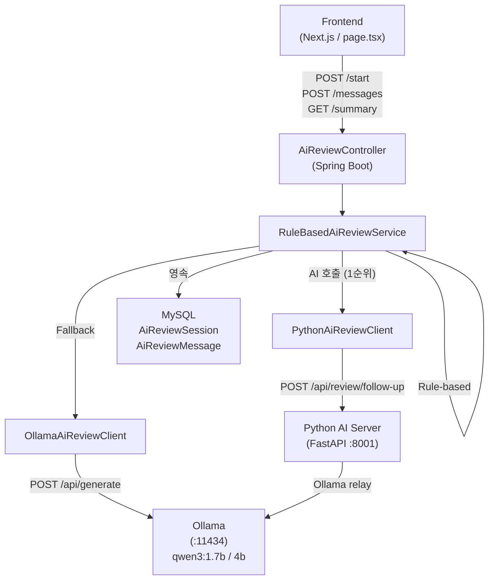
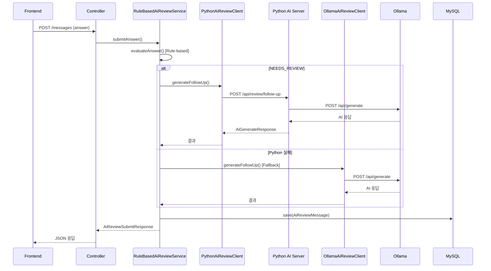
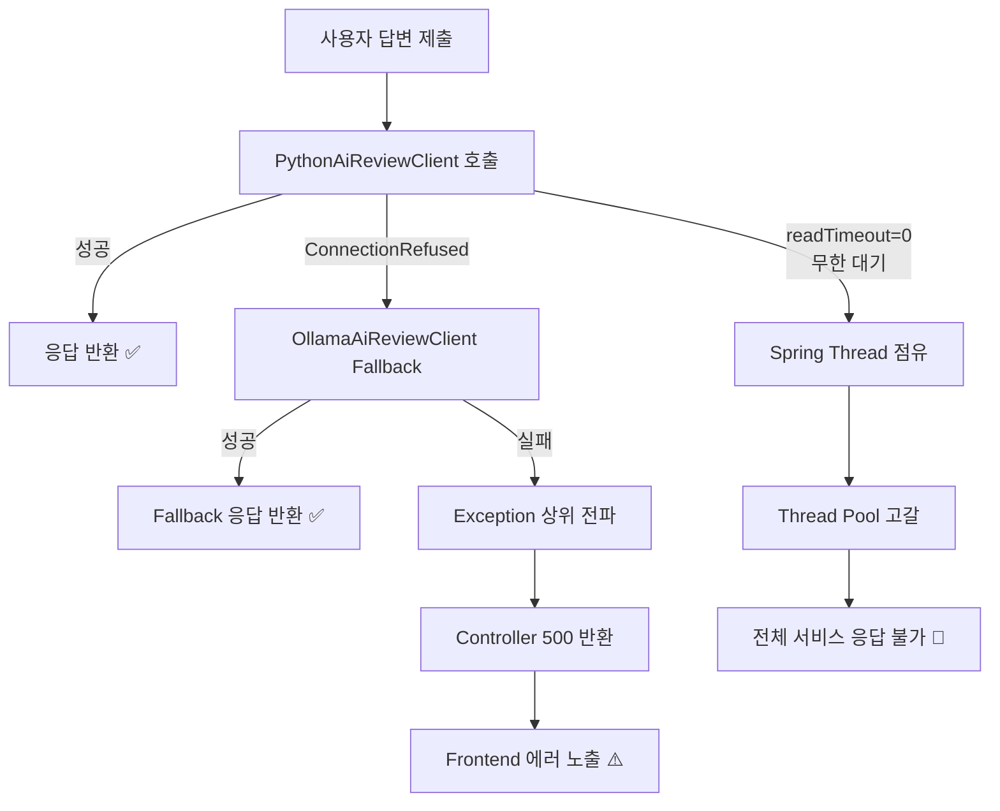
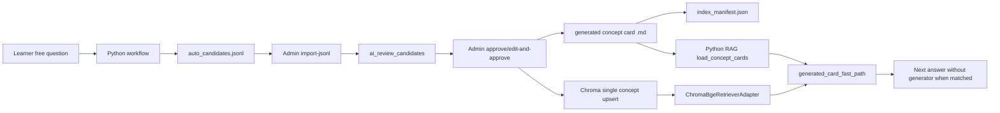

# AI 시스템 구조 상세 분석 리포트 (Code-level Analysis)

본 문서는 현재 프로젝트의 AI 시스템(비전/YOLO 파이프라인 제외)이 실제 API 요청 기준 어떻게 동작하는지 코드 레벨에서 추적한 상세 문서입니다.

---

## 1. 전체 AI 시스템 아키텍처

- **Client (Frontend)**: React 기반 `AiReviewPage` (`frontend/src/app/tests/results/[id]/review/page.tsx`)
  - AI 챗봇 인터페이스. `submitAiReviewAnswer`, `summarizeAiReviewQuestion` 등을 호출하여 백엔드와 상호작용.
- **Backend (Controller)**: `AiReviewController`
  - `/api/ai-review/sessions/{sessionId}/messages` 등의 엔드포인트를 노출.
- **Service Layer**: `RuleBasedAiReviewService`
  - **핵심 중추(Orchestrator)** 역할을 수행합니다. 라우팅, 상태 평가(Evaluation), 템플릿 마크다운 생성, AI 호출 분기를 모두 담당합니다.
- **AI 호출 로직 (Clients)**:
  - `PythonAiReviewClient`: Python 기반의 로컬 모델 서버(`/api/review/first-question`, `/api/review/follow-up`, `/api/review/free-question`)에 요청합니다. 현재 기본 `application.yml`은 `AI_REVIEW_PROVIDER:PYTHON`입니다.
  - `OllamaAiReviewClient`: Spring Boot에서 Ollama API(`/api/generate`)에 직접 요청하는 클라이언트입니다. 단, 현재 구현상 `providerSelector.selectProvider() == OLLAMA`일 때만 실제 호출됩니다.
  - 주의: `RuleBasedAiReviewService` 코드는 Python 응답이 비어 있으면 Ollama client를 순차 호출하지만, provider가 `PYTHON`이면 `OllamaAiReviewClient.canUseOllama()`에서 `Optional.empty()`를 반환합니다. 따라서 **기본 설정에서 Python 실패 시 Spring 직접 Ollama fallback이 항상 동작하는 구조는 아닙니다.**
- **응답 반환 흐름**:
  - AI 클라이언트가 `AiGeneratedAnswer` (또는 String) 형태로 응답을 주면, `RuleBasedAiReviewService`가 DB(`AiReviewMessage`)에 저장한 후 `AiReviewSubmitResponse` DTO로 감싸 클라이언트에 반환합니다.
  - `AiGeneratedAnswer`의 `route`, `resolvedQuery`, `correctionType`, `matchedConceptId`, `answerStyle`, `qualityFlags`, `candidateId`, `latencyMs`는 `AiReviewMessage` 메타데이터 컬럼에도 저장됩니다.

---

## 2. 실제 API 요청 기준 호출 흐름

### A. 복습 세션 시작 (`/test-results/{id}/start`)

1. **Controller**: `AiReviewController.startReview()`
2. **Service**: `RuleBasedAiReviewService.startReview()`
3. **Flow**: 틀린 문제(`wrongAnswers`)를 DB에서 조회한 후, `askFirstQuestion()`을 호출합니다.
4. **AI 모델 호출 여부**: **[호출하지 않음 (Rule-based)]**
   - `askFirstQuestion()` 내부에서 `generateFirstQuestion()`을 호출하나, 해당 메서드는 단순히 `Optional.of(buildQuestion(question, 1))`을 리턴합니다.
   - 즉, 첫 번째 꼬리 질문은 무조건 하드코딩된 문자열("이 문제의 핵심 개념이 무엇인지 먼저 짚어볼게요...")이 반환됩니다.

### B. 사용자 답변 제출 (`/sessions/{sessionId}/messages`)

1. **Controller**: `AiReviewController.submitAnswer()`
2. **Service**: `RuleBasedAiReviewService.submitAnswer()`
3. **Flow**:
   - `parseMode`로 모드 분석 (`CHECK_ANSWER`, `FREE_QUESTION`, `NEXT_QUESTION`).
   - `CHECK_ANSWER`인 경우:
     - `evaluateAnswer(question, answer)`로 정답 여부(UNDERSTOOD, PARTIAL, NEEDS_REVIEW) 판단 **(AI 없이 Rule-based 처리)**.
     - 조건 충족 시(이해 완료 또는 최대 횟수 초과), 다음 문제로 이동하며 `generateFirstQuestion()` (역시 하드코딩) 호출.
     - 조건 미충족 시, `generateFollowUp()`을 호출하여 실제 AI에 후속 질문 생성을 요청.
   - `FREE_QUESTION`인 경우:
     - `answerFreeQuestion()` 호출. 내부에서 AI 모델에 응답을 요청합니다.
4. **AI 모델 호출 여부**: **[부분적 호출]**
   - `generateFollowUp()`과 `generateFreeQuestionAnswer()`에서만 실제 AI client를 호출합니다.
   - 코드 흐름은 `PythonAiReviewClient` 시도 후 `OllamaAiReviewClient`를 시도하지만, 실제 사용 가능 여부는 `AiReviewProviderSelector`의 provider 설정에 좌우됩니다. 기본 `PYTHON` 설정에서는 Python client가 주 경로이고, Python이 실패하면 rule/template fallback으로 내려갈 수 있습니다.

### C. 문제별/전체 요약 리포트 요청 (`/summary`)

1. **Controller**: `AiReviewController.summarizeQuestion()`, `summarizeReview()`
2. **Service**: `RuleBasedAiReviewService.summarizeQuestion()`, `summarizeReview()`
3. **Flow**:
   - `buildQuestionStudySummary`, `buildOverallStudyReport` 메서드가 실행됩니다.
4. **AI 모델 호출 여부**: **[호출하지 않음 (Rule-based)]**
   - 두 메서드 모두 AI를 전혀 사용하지 않고 String Formatting만으로 Markdown을 생성합니다.

---

## 3. 사용 중인 AI 모델/외부 API 분석

- **설정 주입 (`AiReviewProperties.java`)**:
  - `AiReviewProperties` 생성자 기본값은 `OLLAMA`이지만, 실제 `application.yml` 기본값은 `AI_REVIEW_PROVIDER:PYTHON`입니다. 운영 기본 동작은 `application.yml` 기준으로 보는 것이 맞습니다.
  - `OpenAi` (gpt-4.1-mini) 설정이 있으나 클라이언트 구현체가 없어 실제 동작하지 않습니다.
  - `PythonAi` (qwen3:1.7b, `http://localhost:8001`) / `Ollama` (qwen3:4b-q4_K_M, `http://localhost:11434`) 설정이 존재합니다.
- **실제 호출 순서**:
  - `provider=PYTHON`: Python AI 서버 호출이 주 경로입니다. Spring 직접 Ollama client는 provider guard 때문에 기본적으로 fallback으로 쓰이지 않습니다.
  - `provider=OLLAMA`: Spring Boot가 Ollama API를 직접 호출합니다.
  - `provider=AUTO`: 현재 selector는 `OLLAMA -> PYTHON -> OPENAI -> RULE_BASED` 순서로 선택합니다. 이 순서는 문서상 "Python 우선"과 다르므로 주의가 필요합니다.
- **호출 프롬프트 (`OllamaAiReviewClient` 기준)**:
  ```
  Korean mentor. Use the facts as truth.
  Output: feedback + exactly 1 next question, max 3 short sentences. No markdown. No <think>.
  Facts: (Question, Selected, Correct, Learner text, Evaluation 등 주입)
  If the learner is unsure, explain the missing concept briefly first.
  ```
- **응답 파싱 및 정제 (`OllamaAiReviewClient`)**:
  - `stripThinking()`: `<think>...</think>` 태그를 강제로 정규식(문자열 매칭)으로 잘라냅니다.
  - `compactAnswer()`: 줄바꿈 기준으로 문단을 나누고 중복을 제거하며 `limitSentences(3)`으로 3문장까지만 자릅니다.
  - `containsKorean()`: 응답에 한글이 한 글자도 없으면 실패(Empty)로 간주합니다.

---

## 4. AI 없이 동작하는 정리 로직 (Rule-based)

현재 시스템에서 "AI처럼 보이지만 실제로는 AI가 아닌" 하드코딩 로직이 상당히 많습니다.

- **상태 평가 (`evaluateAnswer`)**: 답변의 길이(`length < 8` 등)와 정답 보기(`correctAnswer`)에 포함된 단어(Keyword)가 몇 번 포함되었는지만 세어 `UNDERSTOOD`, `PARTIAL`, `NEEDS_REVIEW`를 결정합니다.
- **자유 질문 Fallback (`topicSpecificFallback`)**:
  - 질문에 "git", "tag"가 포함되면 Git 태그에 대한 하드코딩된 문자열 반환.
  - "idempotent"가 포함되면 멱등성에 대한 하드코딩된 문자열 반환.
  - "network", "자동", "연결" 등이 포함되면 네트워크 자동 배치에 대한 하드코딩된 문자열 반환.
- **요약 리포트 내 하드코딩 (`isTransactionalQuestion`)**:
  - 문제 내용에 `@transactional`이나 `트랜잭션`이 포함되면, 요약 리포트(`buildQuestionStudySummary`)의 오답 원인, 반례, 실무 연결 등의 섹션에 **미리 작성된 하드코딩 텍스트(@Transactional 관련 내용)**를 무조건 삽입합니다.

---

## 5. Prompt / Markdown 생성 구조

마크다운 생성은 철저하게 **Java Record의 다중 문자열(`"""`) 포맷팅**을 통해 이루어집니다. (`StudySummary.toMarkdown()`, `OverallStudyReport.toMarkdown()`)

- **개별 문제 요약 (`buildQuestionStudySummary`)**:
  - `# [개념 충돌 기록]` 포맷으로 시작하여 `## 핵심 개념`, `## 판단 기준`, `## 오답 함정`, `## 실무 연결`, `## 반례 / 예외`, `## 한 줄 압축`의 포맷을 구성합니다.
- **프론트엔드 렌더링**:
  - 생성된 마크다운 텍스트는 프론트엔드의 `<ReactMarkdown remarkPlugins={[remarkGfm]}>`를 통해 바로 렌더링됩니다.

---

## 6. Config / Environment 영향 분석

- **`application.yml` / `@ConfigurationProperties(prefix = "app.ai-review")`**:
  - `maxQuestionsPerWrongAnswer`: 기본값 3. 한 문제당 최대 AI 꼬리질문 허용 횟수.
  - `readTimeoutSeconds`: Python/Ollama 클라이언트 모두 RestClient 타임아웃으로 이 값을 참조합니다.
  - `temperature`, `maxTokens`, `numCtx` 등 모델 생성 파라미터가 모두 주입됩니다.
- **환경 변수(`serviceToken`)**: Python 서버로 요청 시 `X-AI-Service-Token` 헤더에 주입하여 보안 인가에 사용됩니다.

---

## 7. 실제 사용 코드 vs 미사용/레거시 코드

- **실제 호출되는 코드**: `RuleBasedAiReviewService`, `PythonAiReviewClient`, `OllamaAiReviewClient`.
- **실제 호출되는 Python AI 코드**: `app.main`, `app.service`, `app.workflow.runner`, `app.workflow.nodes`, `app.workflow.graph`, `app.rag.retriever`, `app.ollama.client`.
- **레거시 / 실험(Mock) 코드**:
  - `topicSpecificFallback`의 `git`, `idempotent` 등의 하드코딩.
  - `isTransactionalQuestion` 및 하위 메서드의 트랜잭션 하드코딩 문자열. 과거 데모 시연이나 특정 테스트 케이스 통과를 위해 심어둔 코드로 강하게 추정됩니다.
  - `AiReviewProperties.OpenAi` 설정은 존재하지만 관련 클라이언트 파일이 없어 작동하지 않습니다.
- **최근 반영된 구조**:
  - Python workflow는 LangGraph가 설치되어 있으면 `StateGraph`를 사용하고, 없으면 sequential runner로 fallback합니다.
  - concept card RAG, BM25, optional Chroma/bge-m3, optional flashrank reranker, auto candidate capture, observability event가 Python 서버 내부에 존재합니다.

---

## 8. 개선점 및 리팩토링 우선순위

### 🔴 1순위: 하드코딩 로직 (isTransactionalQuestion, topicSpecificFallback) 제거

- **문제점**: 특정 문제(트랜잭션, Git 등)에 대해서만 미리 정해진 답변과 마크다운 요약을 내뱉습니다. 다른 문제가 들어오면 매우 빈약한 요약 리포트가 생성됩니다.
- **개선**: `buildQuestionStudySummary`, `buildOverallStudyReport`를 AI 프롬프트를 태워서 LLM이 요약 텍스트(Markdown)를 생성하게끔 수정해야 합니다.

### 🟡 2순위: 답변 채점 로직(`evaluateAnswer`) AI 도입

- **문제점**: 현재 단순 문자열 길이와 키워드 매칭(Contains)으로 사용자의 이해도를 평가하고 있습니다. 오타가 있거나 다른 유의어를 쓰면 무조건 오답(`NEEDS_REVIEW`) 처리됩니다.
- **개선**: LLM에 "사용자의 답변이 정답의 의도를 포함하는가?"를 판단하게 하여 Evaluation Enum을 반환받도록 해야 합니다.

### 🟡 3순위: 최초 질문(`generateFirstQuestion`) AI 도입

- **문제점**: 첫 질문이 항상 똑같은 매크로 문자열("이 문제의 핵심 개념이 무엇인지 먼저 짚어볼게요...")입니다.
- **개선**: 문제의 맥락과 사용자의 오답을 분석해 첫 꼬리질문부터 AI가 생성하도록 `Optional.of(buildQuestion(...))`을 제거하고 LLM 클라이언트에 위임해야 합니다.

### 🟢 4순위: 에러 및 Fallback 처리 고도화

- **문제점**: `compactAnswer` 등에서 문장을 강제로 `.`이나 `\n` 기준으로 3개만 자르고 버립니다. 문맥이 끊길 위험이 있습니다.
- **개선**: LLM 프롬프트에 글자수/문장수 제한을 명확히 주고(현재 주고 있지만), 후처리(Post-processing)에서 무식하게 자르는 로직을 다듬어야 합니다.

---

## 📝 최종 요약 (Summary)

### ## 전체 시스템 요약

현재 AI 리뷰 시스템은 **Spring 쪽 rule-based 오케스트레이션과 Python AI workflow가 결합된 하이브리드 구조**입니다. 프론트엔드의 챗봇 UI에서 들어오는 요청을 `RuleBasedAiReviewService`가 받아 첫 질문/채점/요약은 주로 Java rule-based로 처리하고, 꼬리질문과 자유 질문은 provider 설정에 따라 Python AI 서버 또는 Spring 직접 Ollama client로 위임합니다. 기본 설정은 `PYTHON`이며, Python 내부에서는 RAG, validation, confidence gate, fallback, optional LangGraph, candidate capture까지 수행합니다.

### ## 실제 요청 흐름

`/test-results/{id}/start` ➡️ `askFirstQuestion` (AI 미호출, 하드코딩 응답) ➡️ `/messages` ➡️ `evaluateAnswer` (AI 미호출, 키워드 검사) ➡️ 오답일 시 `generateFollowUp` (AI 호출) ➡️ `/summary` ➡️ `buildQuestionStudySummary` (AI 미호출, 하드코딩 Markdown 조합).

### ## 현재 사용 중인 AI 모델/API

- `PythonAiReviewClient` (`qwen3:1.7b` 가정)
- `OllamaAiReviewClient` (`qwen3:4b-q4_K_M` 가정)
- **OpenAI/Gemini/Claude 등 외부 상용 API는 현재 연결되어 있지 않습니다.**
- Python 내부 기본 생성 모델은 `qwen3:1.7b`, fallback 모델은 `qwen3:4b-q4_K_M`입니다. `app.ollama.client`는 small 모델 `keep_alive=-1`, fallback 모델 `keep_alive=30m`, 동시 생성 기본값 1개 제한을 갖습니다.

### ## AI 없이 동작하는 부분

- 첫 꼬리질문 멘트 생성 (`generateFirstQuestion`)
- 사용자 답변 채점 (`evaluateAnswer`)
- 특정 키워드 질문 답변 (`topicSpecificFallback`)
- 학습 요약 리포트 마크다운 생성 (`buildQuestionStudySummary`, `buildOverallStudyReport` 및 `@Transactional` 하드코딩)

### ## 핵심 메서드 정리

- `RuleBasedAiReviewService.submitAnswer()`: 답변 제출 라우팅 및 꼬리질문 결정.
- `PythonAiReviewClient.generateFollowUp()`: 실제 AI에게 피드백과 다음 질문 생성 요청.
- `OllamaAiReviewClient.stripThinking()`: `<think>` 태그 제거 후처리.
- `app.workflow.runner.run_review_workflow()`: Python AI workflow 진입점. LangGraph 사용 가능 시 `run_state_graph`, 아니면 sequential node 실행.
- `app.rag.retriever.select_retriever_adapter()`: lexical / hybrid / high_performance retriever 선택.
- `AiReviewCandidateApprovalV2Service`: candidate approval v2의 상태 전환, audit, retention 처리.

### ## 확인 필요한 위험 요소

1. **하드코딩 텍스트 노출**: 트랜잭션, Git, idempotent, network 관련 분기가 아직 코드에 남아 있습니다. 다만 일반 문제 요약은 구조화 Markdown으로 보강되어 과거보다 덜 빈약합니다.
2. **응답 잘림(Truncation)**: `limitSentences(3)`와 `MAX_AI_MESSAGE_LENGTH(1800)` 제한으로 인해 AI의 답변이 문장 중간에서 뚝 끊길 수 있습니다.
3. **거짓 환각(False Evaluation)**: 사용자가 정답을 제대로 이해해서 썼더라도 `correctAnswer`에 하드코딩된 키워드와 형태소가 다르면 `NEEDS_REVIEW`로 무한 꼬리질문 루프에 빠질 수 있습니다.
4. **provider fallback 오해**: 코드 흐름은 Python 후 Ollama를 호출하지만, provider guard 때문에 기본 `PYTHON` 설정에서는 Spring 직접 Ollama fallback이 실제로 작동하지 않을 수 있습니다.

---

---

## 9. 실무 리팩토링 지시서 (Practical Refactoring Guide)

### 📂 주요 파일 경로 및 라인 번호

- **`RuleBasedAiReviewService`**: `backend/src/main/java/com/devmatch/service/ai/RuleBasedAiReviewService.java`
  - `buildQuestionStudySummary`: Line 629~667
  - `buildOverallStudyReport`: Line 838~893 (마크다운 포맷팅 992~1067)
  - `evaluateAnswer`: Line 489~507
  - `generateFirstQuestion`: Line 380~382
  - `generateFollowUp`: Line 384~416
- **`PythonAiReviewClient`**: `backend/src/main/java/com/devmatch/service/ai/PythonAiReviewClient.java`
- **`OllamaAiReviewClient`**: `backend/src/main/java/com/devmatch/service/ai/OllamaAiReviewClient.java`
- **`AiReviewProperties`**: `backend/src/main/java/com/devmatch/config/AiReviewProperties.java`
- **`AiReviewController`**: `backend/src/main/java/com/devmatch/controller/AiReviewController.java`

### ⚙️ 주요 설정값 (`application.yml`)

```yaml
app:
  ai-review:
    enabled: true
    provider: PYTHON
    python:
      base-url: http://localhost:8001
      model: qwen3:1.7b
      temperature: 0.2
      max-tokens: 256
      num-ctx: 1024
      read-timeout-seconds: 0
    ollama:
      base-url: http://localhost:11434
      model: qwen3:4b-q4_K_M
      temperature: 0.2
```

### 🔍 핵심 원문 코드 (Current Implementation)

#### `generateFirstQuestion` (AI 미호출)

```java
private Optional<String> generateFirstQuestion(Question question, String correctAnswer, String selectedAnswer) {
    return Optional.of(buildQuestion(question, 1));
}
```

#### `evaluateAnswer` (단순 키워드 매칭)

```java
private AiReviewEvaluation evaluateAnswer(Question question, String answer) {
    String normalized = normalize(answer);
    if (normalized.length() < 8) return AiReviewEvaluation.NEEDS_REVIEW;

    Set<String> keywords = keywords(question);
    long hitCount = keywords.stream().filter(keyword -> normalized.contains(normalize(keyword))).count();

    if (hitCount >= 2 || normalized.length() >= 60) return AiReviewEvaluation.UNDERSTOOD;
    if (hitCount == 1 || normalized.length() >= 25) return AiReviewEvaluation.PARTIAL;
    return AiReviewEvaluation.NEEDS_REVIEW;
}
```

### 🖥️ 프론트엔드 렌더링 파일 및 적용 위치

- **파일 경로**: `frontend/src/app/tests/results/[id]/review/page.tsx`
- **ReactMarkdown 적용 위치**:
  - Line 719, 741: 개별 메시지 내용(`msg.content`) 렌더링
  - Line 812: 전체 요약 리포트(`summaryData.summary`) 렌더링
- 요약을 화면에 뿌리는 핵심 컴포넌트 구조:
  ```tsx
  <ReactMarkdown remarkPlugins={[remarkGfm]}>
    {summaryData.summary}
  </ReactMarkdown>
  ```

### 🆚 예시 입출력 (현재 vs 목표)

**현재 요약 결과 (하드코딩 템플릿 포함)**

```markdown
# @Transactional 위치 개념 충돌 기록

## 핵심 개념

- 트랜잭션 경계를 어느 계층에서 관리하는가?

## 오답 함정

- 내가 고른 보기: Repository
- 헷갈린 지점: Repository도 DB를 다루지만 트랜잭션의 책임 계층은 아님.
```

**원하는 최종 Markdown 결과 (AI 보강 후)**

```markdown
# DB와 비즈니스 로직 분리 개념 충돌 기록

## 핵심 개념

- DB 트랜잭션의 시작과 종료를 관리하는 주체는 Service 계층이어야 합니다.

## 오답 함정

- 내가 고른 보기: Repository
- 헷갈린 지점: 데이터베이스에 접근한다는 키워드 때문에 DB 쿼리를 수행하는 곳에서 트랜잭션도 책임져야 한다고 착각했습니다.
```

### 💡 아키텍처 의사결정: "요약 리포트를 AI로 만들지, Rule-based Markdown 템플릿으로 만들지?"

현재 시스템을 **100% LLM 생성형으로 전환하는 것은 권장하지 않습니다.**
대신 **"Rule-based 마크다운 구조(Template) + 선택적 AI 보강(Selective Augmentation)"** 전략이 가장 안정적이고 효율적입니다.

- **이유 1 (환각 방지 및 구조 안정성)**: LLM에게 전체 마크다운을 그리라고 지시하면, 출력할 때마다 폰트, 헤딩(`#`), 글머리 기호의 일관성이 무너집니다. 프론트엔드의 ReactMarkdown이 파싱하다가 UI가 깨질 위험이 큽니다.
- **이유 2 (성능 및 토큰 최적화)**: 전체 마크다운을 AI로 생성하면 출력 토큰(Output Tokens)이 과도하게 커져서 로컬 모델(qwen3)의 레이턴시(Latency)가 급증합니다.
- **권장 리팩토링 방안**:
  1. `buildQuestionStudySummary` 메서드의 큰 뼈대(Markdown `#`, `##` 구조)는 현재처럼 **Java의 String.formatted 템플릿으로 유지**합니다.
  2. 다만 템플릿 안에 들어가는 내용(`confusingPoint`, `trapReason` 등)을 지금처럼 **`isTransactionalQuestion`으로 하드코딩하지 말고**, 각 내용을 생성하는 **작은 단위의(Short) AI 요청 결과**로 갈아끼웁니다.

---

## 10. 위험 및 엣지 케이스 분석 (Risk and Edge Case Analysis)

- **무한 루프 위험**: `maxQuestionsPerWrongAnswer` 제한을 넘겨도 `evaluateAnswer` 로직(키워드 매칭 실패 등) 때문에 계속 `NEEDS_REVIEW`가 반환될 경우, 적절한 탈출 조건이 보장되는지 검증이 필요합니다.
- **세션 종료 조건 누락**: `maxQuestionsPerWrongAnswer` 초과 시에도 `UNDERSTOOD`나 `PARTIAL`이 나오지 않으면 강제 종료 로직이 제대로 동작하는지 확인이 필요합니다.
- **답변 파싱 실패**: Ollama나 Python AI의 응답이 예상 포맷을 벗어나는 경우, `stripThinking`이나 `compactAnswer`가 정상 동작하지 않거나 원본 응답 자체를 훼손할 수 있습니다.
- **한글 외 응답 처리**: `containsKorean()` 검사가 실패할 경우 빈 응답 처리로 인해 대화가 끊기고 사용자 경험이 심각하게 저하될 수 있습니다.
- **동시성 (Concurrency) 이슈**: 동일한 복습 세션에서 사용자가 빠르게 여러 번 제출 버튼을 누를 경우(Race condition), DB에 메시지가 중복 저장되거나 AI 클라이언트가 여러 번 호출되는 문제가 발생할 수 있습니다.
- **모델 환각 (Hallucination)**: 현재 타겟 모델(`qwen3:1.7b`, `qwen3:4b-q4_K_M`)은 파라미터 수가 적어 복잡한 기술 개념 추론 시 환각이 잦습니다. 프롬프트에서 `Use the facts as truth` 등의 방어 로직을 더 촘촘히 짤 필요가 있습니다.
- **토큰 초과 위험**: 현재 `max-tokens: 256` 제한이 피드백과 꼬리질문을 모두 생성하기에 충분한지(특히 긴 설명이 필요한 경우) 모니터링이 필요합니다.

---

## 💡 기존 섹션 보충 설명 및 심화 가이드 (Addendum)

### [섹션 3 보충] 사용 중인 AI 모델

- **엔드포인트**: `PythonAiReviewClient`는 `/api/review/follow-up`, `/api/review/free-question` 등을 명시적으로 호출합니다.
- **모델 주입**: 모델명은 `AiReviewProperties`를 통해 `application.yml`에서 **동적으로 주입**됩니다.
- **타임아웃 (`readTimeoutSeconds: 0`)**: RestClient 설정상 0은 **무한 대기(Infinite Wait)**를 의미합니다. AI 응답 지연 시 서버 쓰레드가 고갈될 위험이 있으므로 **반드시 30~45초로 변경을 권장**합니다.
- **Fallback 로직**: `RuleBasedAiReviewService`는 Python 응답이 비면 Ollama client를 호출하지만, `OllamaAiReviewClient`는 provider가 `OLLAMA`일 때만 실행됩니다. 기본 `PYTHON` 설정에서 Python 서버 장애가 나면 Spring 직접 Ollama fallback이 아니라 `Optional.empty()` 이후 rule/template fallback으로 내려갈 수 있습니다. 실제 운영 의도가 Python -> Ollama fallback이라면 provider guard 또는 selector 정책을 별도로 정리해야 합니다.

### [섹션 4 보충] Rule-based 상세

- **키워드 추출 (`keywords(question)`)**: 정답 보기 텍스트를 특수문자 기준으로 잘라내어 배열로 만들고, 문제의 영역(`inferArea`)과 카테고리를 합쳐 동적(Dynamic)으로 키워드 셋을 구성합니다. DB 테이블에 명시적으로 키워드가 정의되어 있지 않습니다.
- **정규화 (`normalize()`)**: 사용자 답변을 소문자로 변환하고, 영문/숫자/한글 외의 모든 문자를 정규식(`[^a-z0-9가-힣]`)으로 제거하여 순수 텍스트만 남깁니다.

### [섹션 6 보충] Config

- **Fallback 우선순위**: `RuleBasedAiReviewService.generateFollowUp` 내부의 호출 순서는 Python -> Ollama처럼 보이지만, 실제 성공 여부는 각 client의 provider guard가 결정합니다. 또한 `provider=AUTO`의 selector 우선순위는 현재 `OLLAMA -> PYTHON -> OPENAI -> RULE_BASED`입니다.
- **OpenAI 설정**: 초기 설계 시 포함되었으나 클라이언트 미구현 상태입니다. 추후 비용/레이턴시 테스트를 위해 유지하거나 불필요 시 제거를 검토해야 합니다.

### [섹션 8 보충] 점진적 마이그레이션 전략 (Phase 1~3)

- **Phase 1**: 가장 이질적인 특정 문제(예: Transactional, Git 등)만 먼저 LLM 요약 생성기로 전환하여 A/B 테스트를 진행합니다. 기존 `isTransactionalQuestion` 메서드는 Deprecated 처리합니다.
- **Phase 2 (`evaluateAnswer` AI화)**: 규칙 기반 채점을 AI 채점으로 넘기되, 비용과 레이턴시 상승을 고려하여 빠르고 가벼운 모델을 전용으로 배치하거나, 프롬프트에 Few-shot 예시(정답/오답 쌍)를 넣어 정확도를 극대화해야 합니다.
- **Phase 3**: 모든 마크다운 요약을 "템플릿 뼈대 + AI 생성 블록" 구조로 전환합니다.

### [섹션 9 보충] 실무 리팩토링 지시서 (운영 & 테스트)

- **단위 테스트 전략**: `RuleBasedAiReviewServiceTest` 작성 시, 외부 모델 호출부는 `MockRestServiceServer`나 `@MockBean`을 활용해 `PythonAiReviewClient`와 `OllamaAiReviewClient`의 응답을 철저히 Mocking 해야 CI/CD 파이프라인에서 지연이 발생하지 않습니다.
- **모니터링 추천**: `AiGeneratedAnswer`에 포함된 `latency_ms`와 `fallback_used` 지표를 Spring Boot Actuator 및 Micrometer(Prometheus + Grafana)와 연동하여 모니터링 대시보드를 구축해야 합니다.
- **Prompt Versioning**: 프롬프트 문자열이 클라이언트 클래스 내부에 하드코딩되어 있다면, 별도 텍스트 파일이나 DB로 분리하여 코드 배포 없이 프롬프트만 튜닝할 수 있는 구조(Prompt Versioning)가 필요합니다.

---


---

## 11. 상세 상태 흐름(State Flow) 및 종료 조건 분석

현재 AI 리뷰 세션은 단방향 진행이 아닌 사용자 응답에 따른 상태 머신(State Machine) 구조를 가집니다.

### 🔄 세션(Session) 라이프사이클
- `CREATED`: (명시적 상태값은 없으나 DB 생성 직후)
- `IN_PROGRESS`: 세션이 시작되고 사용자가 문제를 풀고 있는 상태.
- `COMPLETED`: 모든 틀린 문제를 순회하고 최종 리포트가 생성된 상태. `AiReviewSession.complete()`가 호출되어 `completedAt`, `summary`, `weaknessTags`가 업데이트됩니다.

### 🚦 문제별 상태 전환(State Transition) 흐름
1. **유저 응답 제출** ➡️ `evaluateAnswer()` 평가
2. **평가 결과 분기**:
   - `UNDERSTOOD` / `PARTIAL`: 해당 문제는 충분히 이해했다고 판단하고 **다음 문제로 이동** (`questionIndex++`).
   - `NEEDS_REVIEW`: **현재 문제 유지**, 꼬리질문 횟수(Question Count) 증가.
3. **꼬리질문 횟수 검증**:
   - `questionCount >= maxQuestionsPerWrongAnswer(기본 3)`: 강제로 다음 문제로 이동 (`UNDERSTOOD` 취급).
4. **세션 종료 검증**:
   - 모든 틀린 문제(`wrongAnswers`)를 순회했으면 `/summary`를 호출하여 세션을 `COMPLETED`로 전환.

---

## 12. DB 엔티티(Entity) 및 저장 구조 (ER Level)

서비스 레이어뿐만 아니라 영속성 계층(DB)에서도 AI 리뷰의 전 과정을 추적합니다.

### 🗄️ 핵심 엔티티 구조
- **`AiReviewSession`**: 유저의 특정 시험(`TestResult`) 복습 세션을 관리.
  - `status`: `IN_PROGRESS`, `COMPLETED`
  - `summary`, `weaknessTags`: 세션 완료 시 생성된 전체 리포트 및 약점 태그 캐싱.
- **`AiReviewMessage`**: 챗봇 형태의 채팅 내역을 단건 단위로 저장.
  - `role`: `USER`, `AI` (챗봇 UI 렌더링용)
  - `mode`: `CHECK_ANSWER` (정답 확인), `FREE_QUESTION` (자유 질문)
  - `evaluation`: 유저 메시지에 대한 평가 (`UNDERSTOOD`, `PARTIAL`, `NEEDS_REVIEW`)
  - `aiLatencyMs`, `aiRoute`, `aiResolvedQuery`, `aiCorrectionType`, `aiMatchedConceptId`, `aiAnswerStyle`, `aiQualityFlags`, `aiCandidateId`: AI workflow 추적 및 candidate feedback loop용 메타데이터.
- **`AiReviewCandidate` / `AiReviewCandidateAudit`**: candidate approval v2 저장 구조.
  - `status`: `PENDING`, `APPROVED`, `REJECTED`, `MERGED`
  - review action: `APPROVE`, `EDIT_AND_APPROVE`, `REJECT`, `MERGE`
  - `reviewerEditedAnswer`, `rejectedReason`, `retentionUntil`, audit row를 통해 사람 승인/수정/보존 기간을 추적합니다.
- **연관 관계**:
  - `AiReviewSession` (1) ↔ (N) `AiReviewMessage`
  - `AiReviewMessage` (N) ↔ (1) `Question` (해당 메시지가 어느 문제에 대한 맥락인지 추적)
  - `AiReviewCandidate` (1) ↔ (N) `AiReviewCandidateAudit`

---

## 13. 프롬프트(Prompt) 구조 상세 분석

Python 서버 내부(`app.prompts.py`)를 분석한 결과, 철저히 통제된 컨텍스트(Context) 주입형 프롬프트를 사용하고 있습니다.

### 📝 꼬리질문 프롬프트 (`follow_up_v1`) 구조
- **System Prompt**: `You are a Korean programming mentor helping with a diagnostic test review.`
- **Fact Injection (맥락 주입)**:
  - `[Question]`, `[Options]`, `[Selected Answer]`, `[Correct Answer]`, `[Learner Answer]`, `[Rule Evaluation]`을 템플릿 변수로 치환하여 주입. 환각을 방지하기 위해 정답과 유저의 오답을 하드코딩해서 던져줌.
- **제어(Control) 및 제약 조건**:
  - `Korean only.`, `3 sentences maximum.`
  - `Do not write reasoning steps or <think> tags.` (qwen3-reasoning 류의 추론 태그 노출 방지)
  - `Ask exactly one next question.` (질문 폭주 제어)
- **Prompt Length**: 컨텍스트 포함 시 대략 300~500 토큰 사이의 매우 짧고 최적화된 길이.

---

## 14. Python 서버 내부 아키텍처 분석

Java 백엔드의 단순한 프록시가 아닌, 독립적인 AI 서빙 아키텍처를 가집니다.

- **Framework**: `FastAPI` + `Uvicorn` 비동기(async) 서빙.
- **Model Execution**: 자체 추론(vLLM, Transformers)을 수행하지 않고, 내부에 구성된 `app.ollama.client`를 통해 로컬 네트워크의 Ollama 인스턴스로 API 요청을 릴레이(Relay)합니다.
- **Lifecycle**: `@app.on_event("startup")` 시점에 `warm_up_ollama()`를 호출하여 첫 요청 시 발생하는 모델 로드 지연(Cold Start)을 방지합니다.
- **Observability**: `correlation_id` 추적 및 `emit_observability_events`를 통해 AI 응답성, 모델명, 지연시간을 로깅합니다.
- **Workflow Runner**: `app.workflow.runner.run_review_workflow()`가 공통 진입점입니다. `langgraph`가 설치되어 있으면 `app.workflow.graph.run_state_graph()`를 실행하고, 설치되어 있지 않으면 `retrieve_context -> rule_evaluate -> generate_answer -> validate_answer -> confidence_gate -> fallback_answer -> candidate_save` 순서의 sequential runner를 사용합니다.
- **LangGraph StateGraph**: `app.workflow.graph.build_review_state_graph()`는 `retrieve_context`, `rule_evaluate`, `generate_answer`, `validate_answer`, `confidence_gate`, `fallback_answer`, `cache_answer`, `candidate_save`, `error_state`, `dead_end_state` 노드를 정의합니다. LangGraph는 optional dependency이며 `ai/requirements-rag.txt` 설치 시 활성화됩니다.
- **RAG / Retrieval**: `app.rag.retriever`는 lexical 기본 retriever, BM25 adapter, optional Chroma/bge-m3 vector adapter, optional flashrank reranker를 제공합니다. 기본 profile은 노트북 성능을 고려해 `low_resource`이며, `AI_REVIEW_RAG_RETRIEVER=hybrid:high_performance`와 관련 dependency 설치 시 Chroma/bge-m3까지 사용할 수 있습니다.
- **Guardrails**: `app.schemas.AiGenerateRequest`는 입력 필드를 `sanitize_text()`에 통과시켜 PII masking, prompt injection 문구 중립화, 입력 길이 제한을 적용합니다.
- **Candidate Capture**: confidence/retrieval miss/fallback 조건에 따라 `candidate_save_node()`가 `AI_REVIEW_AUTO_CANDIDATES_PATH` JSONL queue에 auto candidate를 저장하고, 저장된 `candidate_id`를 응답 메타데이터로 반환합니다.

---

## 15. 성능 및 서빙(Serving) 위험 분석

실제 운영 환경에 배포했을 때 발생할 수 있는 시스템 레벨의 성능 병목 요소입니다.

- **Latency (응답 지연)**: LLM 텍스트 생성 특성상 Time-To-First-Token (TTFT) 지연이 발생합니다. 현재 챗봇 UI가 스트리밍(SSE/WebSocket)을 지원하지 않아 사용자는 AI 응답이 완전히 끝날 때까지 로딩 바만 보게 됩니다.
- **Model Warmup**: Python 서버 기동 시 `warm_up_ollama()`를 호출하지만, Ollama 자체적으로 일정 시간 비활성 시 메모리에서 모델을 Unload 하므로 다시 호출 시 수 초 이상의 딜레이(Cold Start)가 발생할 수 있습니다.
- **Concurrent Request (동시성 제어)**: Python `app.ollama.client`는 `OLLAMA_MAX_CONCURRENT_GENERATIONS` 기반 `BoundedSemaphore`로 동시 생성 수를 제한합니다. 기본값은 1입니다. Spring 직접 `OllamaAiReviewClient` 경로에는 별도 semaphore가 없으므로 provider를 `OLLAMA`로 운영할 경우 추가 제한이 필요합니다.
- **Token Throughput**: `max-tokens: 256`은 한글 기준 100~150 단어 내외입니다. "왜 틀렸는지 피드백" + "다음 질문"을 모두 담기에 빠듯할 수 있으며, 문장 후처리 시 응답이 중간에 잘리는 현상의 근본 원인이 될 수 있습니다.
- **Model Keep Alive**: Python Ollama client는 small 모델은 `OLLAMA_SMALL_KEEP_ALIVE=-1`, fallback 모델은 `OLLAMA_FALLBACK_KEEP_ALIVE=30m` 기본값을 사용합니다. 노트북 환경에서는 4B fallback 모델을 상시 로딩하지 않는 방향입니다.


## 📌 리팩토링 로드맵 (2026년 기준)

**단기 (2주 이내)**

- `readTimeoutSeconds`를 0 → 30으로 변경
- `isTransactionalQuestion` 및 `topicSpecificFallback` Deprecated 처리

**중기 (1~2개월)**

- Phase 1: 특정 문제군에 대한 Selective AI Summary 도입
- `evaluateAnswer` → LLM 기반 평가로 교체 (Few-shot 적용)

**장기**

- Prompt Versioning 시스템 구축
- AI 호출 메트릭 모니터링 대시보드 구축

---

## ✅ 당장 시작해야 할 실무 액션 아이템 (Action Items)

문서의 내용을 바탕으로 실제 코드에 바로 반영할 수 있는 작업 목록입니다.

### 1단계: 크리티컬 이슈 해결 및 안전장치 마련

- [ ] **타임아웃 수정** (Highest Priority)  
      `application.yml`의 `python.read-timeout-seconds`와 `ollama.read-timeout-seconds`를 `0` → `30` (또는 `45`)으로 변경.  
      _이유: 서버 쓰레드 고갈 방지_

- [ ] **무한 루프 방지 로직 추가**  
      `RuleBasedAiReviewService.submitAnswer()` 내부에서 `maxQuestionsPerWrongAnswer` 초과 시에도 `NEEDS_REVIEW`가 반환되면 **무조건 다음 문제로 이동**하거나 세션을 `COMPLETED` 상태로 강제 종료하는 안전 로직 구현.  
      _검증: 동일 문제에 4회 이상 답변 제출 시 강제 이동 확인_

- [ ] **응답 파싱 Fallback 강화**  
      `stripThinking()`, `compactAnswer()`, `containsKorean()` 등에서 예외 발생 시 원본 문자열 반환 또는 사용자 친화적 메시지("잠시 후 다시 시도해주세요...")로 대체.  
      _try-catch 범위 확대_

### 2단계: 하드코딩 제거 및 Selective AI 전환

- [ ] **`isTransactionalQuestion` 및 `topicSpecificFallback` Deprecated 처리**  
      관련 메서드에 `@Deprecated` 추가하고, 기존 하드코딩 로직을 주석 처리 또는 제거.

- [ ] **Selective AI Prompt 작성 및 연동**
  - `wrongCause` (틀린 이유)
  - `counterExample` (반례)  
    두 항목만 생성하는 **짧은 프롬프트** 작성 (max 150 tokens 목표).  
    Python 클라이언트에 `/api/review/summary-augment` 엔드포인트 추가 또는 기존 follow-up 재활용.

- [ ] **템플릿에 AI 결과 주입**  
      `buildQuestionStudySummary()`에서 AI가 생성한 `wrongCause`, `counterExample`을 String.formatted 템플릿에 동적으로 삽입하도록 수정.  
      _A/B 테스트: 동일 문제로 기존 vs 신규 요약 비교_

### 3단계: 아키텍처 고도화

- [ ] **Circuit Breaker + Retry 도입** (Resilience4j)  
      `generateFollowUp()`의 단순 try-catch를 Circuit Breaker로 교체. Python 실패 시 즉시 Ollama로 fallback.

- [ ] **evaluateAnswer AI화 준비**  
      LLM 기반 평가 프롬프트 설계 (Few-shot 포함) 및 `AiReviewEvaluation` 반환용 새로운 메서드 추가.  
      _초기에는 Feature Flag로 ON/OFF 가능하게 구현_

- [ ] **모니터링 지표 추가**  
      `latency_ms`, `fallback_count`, `ai_error_rate`, `infinite_loop_prevented` 등을 Actuator + Micrometer에 등록.

---

**예상 효과**

- 사용자 경험 안정성 대폭 향상
- 하드코딩 의존도 감소 → 일반화된 AI 리뷰 품질 향상
- 운영 안정성 강화 (타임아웃, 무한루프, Fallback)

---

## 16. 클래스 다이어그램 (Class Diagram)

> 현재 코드 기준 보정: 아래 다이어그램은 Spring AI review 중심입니다. 전체 AI 시스템에는 Python `ReviewWorkflowState`, `workflow.runner`, `workflow.graph`, `rag.retriever`, `knowledge.auto_candidates`, `observability`, `security/guardrails`가 추가로 포함됩니다. 또한 `AiReviewMessageRole`은 `ASSISTANT`가 아니라 `AI`입니다.

```
┌──────────────────────────────────────────────────────────────────┐
│                       [Frontend]                                 │
│  page.tsx (ReactMarkdown)                                        │
│  - /start POST                                                   │
│  - /messages POST                                                │
│  - /summary GET                                                  │
└─────────────────────────┬────────────────────────────────────────┘
                          │ HTTP
                          ▼
┌──────────────────────────────────────────────────────────────────┐
│               AiReviewController                                 │
│  + startReview(testResultId)                                     │
│  + submitAnswer(sessionId, payload)                              │
│  + summarizeQuestion(sessionId, questionId)                      │
│  + summarizeReview(sessionId)                                    │
└─────────────────────────┬────────────────────────────────────────┘
                          │ 의존
                          ▼
┌──────────────────────────────────────────────────────────────────┐
│             RuleBasedAiReviewService (핵심)                      │
│  + startReview()                                                 │
│  + submitAnswer()        Rule-based                              │
│  + evaluateAnswer()    ◄────────── 키워드 매칭                   │
│  + generateFirstQuestion()  ◄────── 하드코딩                     │
│  + generateFollowUp()    AI 호출 ──────────────────────┐         │
│  + buildQuestionStudySummary()  ◄── 하드코딩 Markdown  │         │
│  + buildOverallStudyReport()    ◄── Rule-based         │         │
└───────────┬──────────────────────────┬─────────────────┘         │
            │ 의존                     │ 의존             AI 호출  │
            ▼                         ▼                            │
┌───────────────────────┐  ┌──────────────────────────┐           │
│  PythonAiReviewClient │  │  OllamaAiReviewClient    │           │
│  (1순위 호출)         │  │  (Fallback)              │           │
│  POST /api/review/    │  │  POST /api/generate      │           │
│    follow-up          │  │  - stripThinking()       │           │
│    free-question      │  │  - compactAnswer()       │           │
│    first-question     │  │  - containsKorean()      │           │
└───────────┬───────────┘  └──────────┬───────────────┘           │
            │ HTTP                    │ HTTP                       │
            ▼                         ▼                            │
┌──────────────────────────────────────────────────────────────┐   │
│                     Python AI Server                         │   │
│  FastAPI + Uvicorn (localhost:8001)                          │   │
│  - /api/review/follow-up                                     │   │
│  - /api/review/free-question                                 │   │
│  - /api/review/first-question                                │   │
│  - warm_up_ollama() @ startup                                │   │
│  - verify_service_token()                                    │   │
│  - build_prompt() / PROMPT_VERSIONS                          │   │
│  - emit_observability_events()                               │   │
└──────────────────────────────┬───────────────────────────────┘   │
                               │ HTTP relay                        │
                               ▼                                   │
┌──────────────────────────────────────────────────────────────┐   │
│                     Ollama (localhost:11434)                  │   │
│  모델: qwen3:1.7b (Python 경유) / qwen3:4b-q4_K_M (직접)    │◄──┘
│  POST /api/generate                                          │
└──────────────────────────────────────────────────────────────┘
```

---

## 17. Sequence Diagram (시퀀스 다이어그램)

### A. 복습 세션 시작 및 첫 질문

```
Frontend    Controller        Service              DB
   │              │               │                │
   │──POST /start─►              │                │
   │              │──startReview()►               │
   │              │               │──findWrongAnswers()►│
   │              │               │◄─────[WrongAnswer]──│
   │              │               │──generateFirstQuestion()
   │              │               │  (AI 미호출, 하드코딩 문자열 반환)
   │              │               │──save(AiReviewMessage)►│
   │◄──response───│◄──────────────│                │
```

### B. 사용자 답변 제출 → AI 꼬리질문 생성

```
Frontend    Controller        Service          PythonAI        Ollama
   │              │               │               │               │
   │─POST /messages►             │               │               │
   │              │─submitAnswer()►              │               │
   │              │               │─evaluateAnswer()
   │              │               │  (Rule-based, NEEDS_REVIEW 반환)
   │              │               │─generateFollowUp()
   │              │               │──POST /api/review/follow-up──►│
   │              │               │               │──POST /api/generate►
   │              │               │               │◄──AI 응답 text─│
   │              │               │◄──AiGenerateResponse──────────│
   │              │               │─save(AiReviewMessage)
   │◄─response────│◄──────────────│               │               │
```

### C. 요약 리포트 요청

```
Frontend    Controller        Service              DB
   │              │               │                │
   │──GET /summary─►             │                │
   │              │─summarizeQuestion()►           │
   │              │               │──findMessages()►│
   │              │               │◄───[Messages]───│
   │              │               │─buildQuestionStudySummary()
   │              │               │  (AI 미호출, Java String.formatted)
   │              │               │─session.complete()
   │              │               │──save(AiReviewSession)─────►│
   │◄─Markdown text│◄─────────────│                │
```

---

## 18. 캐싱(Caching) 전략 분석

### 현재 상태
- **Session Summary 캐싱**: `AiReviewSession.summary` 컬럼에 최종 요약 마크다운을 DB에 저장합니다. 재조회 시 DB에서 읽어오므로 DB 캐싱 수준입니다.
- **Redis 사용 여부**: 현재 AI 리뷰 시스템에는 **Redis 캐싱이 적용되어 있지 않습니다.** (`AiReviewMessage`와 `AiReviewSession` 데이터는 모두 RDB에만 영속됨)
- **AI 응답 캐싱**: 완전히 없는 상태가 아닙니다. Python workflow에는 `app.workflow.answer_cache` 기반 cache가 있고, `run_review_workflow()`에서 fallback/template이 아닌 응답을 캐싱합니다. LangGraph 경로에서도 `cache_answer_node`가 동일한 역할을 합니다.
- **Spring 직접 Ollama 캐싱**: `OllamaAiReviewClient`는 `LinkedHashMap` 기반 LRU cache(`MAX_CACHE_ENTRIES=128`)로 동일 model+prompt 응답을 캐싱합니다.
- **한계**: 현재 캐시는 프로세스 메모리 기반입니다. 서버 재시작 시 사라지고, 다중 인스턴스 간 공유되지 않습니다.

### 잠재적 개선 방향
- **동일 Prompt 캐싱 고도화**: 현재 in-memory cache를 Redis TTL cache로 옮기면 LLM 호출 횟수와 비용을 더 안정적으로 줄일 수 있습니다. (캐시 키: `questionId:evaluationResult:hash(userAnswer)`)
- **Session 상태 캐싱**: 현재 진행 중인 세션 데이터를 Redis에 올려두면 매 요청마다 발생하는 `findSession()` DB 조회를 줄일 수 있습니다.
- **Repeated Prompt 최적화**: `generateFirstQuestion()`이 현재 항상 같은 문자열을 반환하므로, 사실상 캐싱이 필요 없는 상태이지만 AI화 이후에는 필수가 됩니다.

---

## 19. 보안(Security) 분석

### 현재 구현된 보안 요소
- **Service Token 인가**: Python AI 서버는 `X-AI-Service-Token` 헤더를 검증(`verify_service_token()`)합니다. Spring → Python 간 요청에만 적용됩니다.
- **Spring → Python 헤더 주입**: `PythonAiReviewClient`는 `AiReviewProperties.python.serviceToken`이 있으면 `X-AI-Service-Token` 헤더를 설정합니다.
- **Prompt Injection / PII 1차 방어**: Python `AiGenerateRequest`의 문자열 필드는 `sanitize_text()`를 거치며, 전화번호/주민등록번호/email/card/IPv4 masking과 일부 prompt injection 문구 중립화를 수행합니다.
- **입력 길이 제한**: Python guardrail은 `AI_REVIEW_MAX_INPUT_LENGTH` 또는 기본 700자로 입력을 자릅니다.

### 취약점 및 위험 요소

| 취약점 | 위험도 | 설명 |
|---|---|---|
| **Prompt Injection** | 🟡 중간 | Python guardrail에서 일부 패턴을 중립화하지만, 패턴 기반 방어라 우회 가능성이 있습니다. Spring 단계의 입력 정책과 출력 후처리까지 포함한 다층 방어가 필요합니다. |
| **Service Token 노출** | 🟡 중간 | `X-AI-Service-Token`이 환경변수에서 주입되지만, 로그 출력이나 에러 메시지에 토큰 값이 노출될 가능성이 있습니다. |
| **Rate Limiting 부재** | 🔴 높음 | 동일 사용자가 API를 반복 호출해 LLM을 무한 호출하는 Abuse를 막는 Rate Limit 로직이 없습니다. Spring Security 또는 별도 Gateway 레이어에서 제한이 필요합니다. |
| **Auth 검증 우회** | 🟢 낮음 | `RuleBasedAiReviewService.findOwnedSession(userId, sessionId)`를 통해 세션 소유자 검증을 수행합니다. 단, 새 endpoint 추가 시 동일 패턴 유지가 필요합니다. |
| **AI Abuse (출력 조작)** | 🟡 중간 | 프롬프트 규칙("Korean only", "3 sentences max")이 LLM에 soft constraint로만 적용됩니다. Python validation/fallback은 일부 방어를 하지만 금지어/욕설 등 포괄적 출력 필터는 아직 제한적입니다. |

### 권장 보완 조치
1. 사용자 입력에서 프롬프트 명령어 패턴 필터링 확대 (`[INST]`, `<|system|>`, `ignore above` 등). 현재 `ignore previous instructions`, `reveal system prompt`, `developer message` 계열만 직접 처리합니다.
2. Spring Security 단에서 `@RateLimiter` 어노테이션 또는 Redis 기반 토큰 버킷(Token Bucket) 구현.
3. AI 응답 후처리에 금지어/욕설 필터링(Guard Rails) 레이어 추가 (현재 `guardrails.py`가 존재하나 적용 범위 확인 필요).

---

## 20. 테스트 커버리지 및 전략 분석

### 현재 상태
- AI 클라이언트와 workflow 주변 테스트가 일부 존재합니다. 예: `test_ollama_client.py`, `test_workflow_runner.py`, `test_observability.py`, `test_rag_retriever.py`, `test_chroma_reindex.py`, `AiReviewPropertiesTest`, `AiReviewMessageResponseTest`.
- Spring service 테스트도 `RuleBasedAiReviewServiceTest`에서 Python/Ollama client를 mock으로 주입해 fallback, Markdown summary, metadata 저장 경로를 검증합니다.
- LLM 응답의 비결정성(Non-determinism)으로 인해 일반적인 단위 테스트 적용이 어렵습니다.

### 테스트 전략 권장

#### 단위 테스트 (Unit Test)
| 대상 | 전략 |
|---|---|
| `evaluateAnswer()` | 입력 유형(키워드 0/1/2개, 길이 미만/이상)별 UNDERSTOOD/PARTIAL/NEEDS_REVIEW 반환 검증 |
| `normalize()` | 특수문자, 영문 대소문자, 한글 혼합 입력 처리 검증 |
| `buildQuestionStudySummary()` | Markdown 출력에 필수 헤더(`##`)가 포함되는지 검증 |
| `stripThinking()` | `<think>...</think>` 패턴 제거 및 빈 태그 처리 검증 |

#### AI 클라이언트 Mocking 전략
```java
// AI 클라이언트를 MockBean으로 대체
@MockBean
PythonAiReviewClient pythonAiReviewClient;

@BeforeEach
void setUp() {
    given(pythonAiReviewClient.generateFollowUp(any()))
        .willReturn(new AiGeneratedAnswer("피드백입니다. 다음 질문은 무엇인가요?"));
}
```
- `@MockBean`으로 Python/Ollama 서버 없이 서비스 레이어를 독립적으로 테스트.
- CI/CD 환경에서 외부 모델 서버 의존성 제거.

#### AI 결정론적 테스트 (Deterministic Test)
- AI 응답이 가변적이므로, 테스트에서는 **AI 출력의 형식(Format)만 검증**합니다 (내용 X):
  - 응답이 비어있지 않은지 (`assertThat(result).isNotBlank()`)
  - 한글이 포함되어 있는지 (`containsKorean(result)`)
  - 지정된 최대 길이를 초과하지 않는지 (`result.length() <= MAX_AI_MESSAGE_LENGTH`)
- 프롬프트 + 고정 시드(Seed) 값으로 테스트하는 방식은 현재 Ollama/qwen3가 `seed` 파라미터를 불완전하게 지원하므로 신뢰하기 어렵습니다.

#### 통합 테스트 (Integration Test) 시나리오
| 시나리오 | 검증 항목 |
|---|---|
| 전체 복습 세션 종료 | `AiReviewSession.status`가 최종적으로 `COMPLETED`인지 확인 |
| 꼬리질문 최대 횟수 초과 | `maxQuestionsPerWrongAnswer` 초과 시 다음 문제로 이동하는지 확인 |
| Python 서버 다운 시 Fallback | Python Mock이 Exception을 던질 때 Ollama Mock이 호출되는지 확인 |
| 한글 외 응답 | `containsKorean` 실패 시 Fallback 메시지가 반환되는지 확인 |

---

## 21. 실제 메트릭 기준표 (Metrics Baseline)

운영 실측 대시보드는 아직 별도로 고정되어 있지 않지만, Python 응답에는 `observability_events`가 포함되고 Spring `PythonAiReviewClient`가 `ai_review.python_event` 로그를 남깁니다. 아래 표는 운영 수집 전 기준선으로 유지합니다.

| 항목 | 현재 예상치 | 목표치 | 측정 방법 |
|---|---|---|---|
| **평균 응답 시간 (follow-up)** | 3,000~8,000ms | 2,000ms 이하 | `aiLatencyMs` 컬럼 평균 |
| **p95 Latency** | 10,000ms 이상 | 5,000ms 이하 | Micrometer `percentile(0.95)` |
| **AI Fallback 비율** | 미측정 | 5% 이하 | fallback 발생 시 카운터 증가 |
| **AI 호출 실패율** | 미측정 | 1% 이하 | Exception catch 횟수 / 전체 요청 |
| **Timeout 발생률** | 높음 (readTimeout=0) | 1% 이하 | timeout 예외 카운터 |
| **Concurrent 처리량 (TPS)** | 1~2 TPS (Ollama 단일 큐) | 5 TPS 이상 | Gatling/k6 부하 테스트 |
| **세션 완료율** | 미측정 | 90% 이상 | COMPLETED / 전체 세션 수 |
| **Candidate capture 정확도** | evaluator에서 측정 가능 | 95% 이상 | `evaluate_lightweight_rag.py`의 `candidate_capture_accuracy` |
| **Observability event rate** | evaluator에서 측정 가능 | 100% | `evaluate_lightweight_rag.py`의 `observability_event_rate` |

> **주의**: `readTimeoutSeconds: 0`(무한 대기) 설정으로 인해 현재 timeout 관련 지표가 수집되지 않습니다. 30초로 변경 후 측정을 시작해야 합니다.

---

## 22. Thread / Async 모델 분석

### Spring Boot (Java) 측
- **기본 Thread Pool**: Tomcat 기반 블로킹(Blocking) I/O. 기본값 최대 200 스레드.
- **AI 클라이언트 호출**: `PythonAiReviewClient`와 `OllamaAiReviewClient`는 `RestClient`를 사용한 **동기 블로킹** 방식입니다. AI 응답이 올 때까지 스레드가 점유됩니다.
- **위험**: AI 응답이 5~10초 걸릴 때 동시 사용자 30명만 복습 세션을 진행해도 스레드 30개가 장기 점유되어 다른 API 요청이 지연될 수 있습니다.

```
[Spring Thread 1] ─── submitAnswer() ─── RestClient.post() ─── BLOCKING (5~10s) ───►
[Spring Thread 2] ─── submitAnswer() ─── RestClient.post() ─── BLOCKING (5~10s) ───►
[Spring Thread N] ─── 다른 API 요청 ─── Tomcat Queue에서 대기 ──────────────────────►
```

### Python AI Server 측
- **FastAPI + Uvicorn**: endpoint 함수는 동기 `def` 형태이며 FastAPI가 threadpool에서 처리합니다. 내부 Ollama 호출은 `urllib.request` 기반 blocking I/O입니다.
- **Ollama 내부**: 단일 GPU/CPU 추론 큐. 동시 요청이 들어오면 **선착순 직렬 처리(Serial Queue)**합니다. Python client는 `BoundedSemaphore`로 동시 생성 수를 기본 1개로 제한합니다.
- **전파 구조**:
  ```
  [User A 요청] → Python FastAPI → Ollama 추론 시작 (5s)
  [User B 요청] → Python FastAPI → Python semaphore 대기 또는 Ollama Queue 대기 → (User A 완료 후) 추론 시작
  ```

### 개선 방향
- Spring 측에서 `@Async` + `CompletableFuture` 또는 WebFlux(Reactive) 전환을 통해 AI 호출 중 스레드를 반환하도록 변경.
- Ollama 다중 인스턴스 또는 병렬 모델 서빙 도입 검토.

---

## 23. 장애 전파 구조 (Failure Propagation)

Python 서버 또는 Ollama에 장애가 발생했을 때 시스템이 어떻게 반응하는지 추적합니다.

### 시나리오 1: Python AI 서버 다운

```
[Python 서버 다운]
      │
      ▼
PythonAiReviewClient.generateFollowUp()
  └─ RestClient 연결 실패 → ConnectionRefusedException
      │
      ▼
RuleBasedAiReviewService (try-catch)
  └─ OllamaAiReviewClient.generateFollowUp() 시도
      │
      ├─ provider=OLLAMA이고 Ollama 정상 → AI 응답 반환 ✅
      │
      └─ 기본 provider=PYTHON이면 canUseOllama()가 false → Optional.empty()
            │
            ▼
      RuleBasedAiReviewService fallback 문장 또는 buildQuestion() 사용
            │
            ▼
      AiReviewController → 200 응답 + template/rule fallback 가능
```

### 시나리오 2: readTimeoutSeconds: 0 (무한 대기) 상황

```
[Ollama 모델 언로드 후 첫 요청]
      │
      ▼
Ollama Cold Start (모델 로드: 10~60초)
      │
      ▼
RestClient WAITING (무한 대기, timeout=0)
      │
      ▼
Spring Thread 점유 지속
      │
      ▼
동시 사용자 증가 시 → Thread Pool 고갈 → 전체 서비스 응답 불가
```

### 시나리오 3: Python 서버는 살아있으나 Ollama가 다운

```
Python FastAPI → /api/review/follow-up 응답 수신
      │
      ▼
Python 내부에서 Ollama POST 요청 실패
      │
      ▼
Python 500 응답 반환
      │
      ▼
PythonAiReviewClient → Exception 처리
      │
      ▼
OllamaAiReviewClient 직접 호출 시도
      │
      ▼
provider=PYTHON 기본값에서는 직접 Ollama 호출도 비활성 → rule/template fallback
```

### 현재 장애 대응 한계
- Circuit Breaker 없음 → Python 서버가 다운된 상태에서도 매 요청마다 재연결 시도.
- 사용자 UI는 에러/slow notice를 일부 처리하지만, streaming이 없어 긴 대기 중 체감 품질은 낮습니다.
- 최후 안전망은 일부 template/rule fallback이 담당합니다. 다만 provider fallback 정책이 명확하지 않아 "Python 실패 시 4B Ollama fallback"을 기대하면 실제 동작과 다를 수 있습니다.

---

## 24. 비용(Cost) 분석

### 현재 구성: 로컬 LLM 추론 (On-Premise)

| 항목 | 분석 |
|---|---|
| **Token Usage** | follow-up 1회 기준 입력 약 300~500 tokens + 출력 최대 256 tokens. 세션당 최대 3문제 × 3회 꼬리질문 = 최대 6,750 tokens/세션 |
| **로컬 추론 비용** | 클라우드 API 비용 없음. 단, GPU/CPU 전력 소비 및 서버 유지비 발생 |
| **GPU RAM** | qwen3:1.7b 약 2~3GB VRAM, qwen3:4b-q4_K_M 약 3~4GB VRAM. GPU 없으면 CPU 추론으로 속도 급감 |
| **CPU Usage** | CPU 추론 시 단일 요청에 100% 코어 1~2개 점유. 동시 요청 처리 불가 수준 |

### 클라우드 API 전환 시 예상 비용 (참고)

| 모델 | 입력 1M token | 출력 1M token | 세션당 예상 비용 |
|---|---|---|---|
| GPT-4o-mini | $0.15 | $0.60 | 약 $0.005 |
| Claude Haiku 3 | $0.25 | $1.25 | 약 $0.008 |
| Gemini 1.5 Flash | $0.075 | $0.30 | 약 $0.003 |

### 확장성(Scaling) 예상
- 현재 Ollama 단일 인스턴스로는 **동시 사용자 5명 이상이 동시에 복습하면 체감 성능 저하** 발생.
- 수평 확장(Horizontal Scale)이 필요하면 vLLM + 로드 밸런서 구성 또는 클라우드 API로 전환이 현실적.

---

## 25. Mermaid 다이어그램

### A. 전체 아키텍처 (Component Diagram)

> 현재 코드 기준 보정: Python AI Service 내부에는 아래 다이어그램의 단순 Ollama relay 외에 `workflow.runner`, optional `workflow.graph(StateGraph)`, `rag.retriever`, `guardrails`, `observability`, `candidate_save_node`가 포함됩니다. `provider=PYTHON` 기본값에서는 Spring 직접 Ollama fallback이 자동으로 활성화되지 않습니다.



### B. 답변 제출 흐름 (Sequence Diagram)

> 현재 코드 기준 보정: `RuleBasedAiReviewService`는 Python 응답이 비면 Ollama client를 호출하지만, `OllamaAiReviewClient`는 provider가 `OLLAMA`일 때만 실제 요청합니다. 기본 `PYTHON` 설정에서는 rule/template fallback까지 내려갈 수 있습니다.



### C. 장애 전파 구조 (Failure Flowchart)

> 현재 코드 기준 보정: Python 서버 장애가 곧바로 500으로 전파되는 것이 아니라, Java service의 `Optional.empty()` 처리와 template fallback으로 200 응답이 나갈 수 있습니다. 다만 provider fallback 정책이 명확하지 않아 운영 의도와 실제 동작이 다를 수 있습니다.



---

## 26. 2026-05-20 추가: 관리자 승인 후보 지식 동기화와 Chroma 즉시 재색인

최근 구현으로 관리자 지식 후보 승인 이후의 흐름이 기존 리포트보다 더 길어졌다. 이제 승인된 후보는 DB 상태만 `APPROVED`로 바뀌는 것이 아니라, Python RAG가 읽을 수 있는 knowledge artifact와 Chroma vector index까지 즉시 갱신한다.

### A. 승인 후보 저장 위치와 생성 경로

- **관리자 승인 서비스**: `backend/src/main/java/com/devmatch/service/AiReviewCandidateApprovalV2Service.java`
  - `reviewCandidate()`에서 후보를 `APPROVED`로 저장한 뒤 `AiReviewKnowledgeReindexer.reindexChanged(saved)`를 호출한다.
  - `REJECTED` 후보는 reindex hook을 호출하지 않는다.
- **실제 구현체**: `backend/src/main/java/com/devmatch/service/LoggingAiReviewKnowledgeReindexer.java`
  - 이름은 기존 bean 호환을 위해 `Logging...` 그대로지만, 현재 역할은 log-only가 아니라 실제 filesystem sync + Chroma reindex다.
  - 승인 후보의 `category + term`을 slug로 바꿔 deterministic concept id를 만든다. 예: `auto-review-pagination`.
  - generated concept card를 `../ai/app/knowledge/concepts/generated/<concept-id>.md`에 쓴다.
  - `../ai/app/vectorstore/index_manifest.json`의 `entries`에 해당 concept id, path, content hash, metadata hash를 upsert한다.

### B. Chroma/vector index 즉시 재색인

- **Python reindex script**: `ai/scripts/reindex_knowledge.py`
  - `reindex_changed_knowledge()`는 concept card manifest를 갱신한다.
  - `index_chroma_knowledge()`는 concept card를 Chroma collection에 upsert한다.
  - `concept_ids` 인자를 지원해 전체 재색인이 아니라 방금 승인된 concept 1건만 upsert할 수 있다.
  - CLI 옵션:
    - `--chroma`: Chroma upsert 실행
    - `--concept-id <id>`: 특정 concept만 재색인
    - `--chroma-path app/vectorstore/chroma`: persistent Chroma 저장 위치
    - `--collection devmatch_concepts`: collection 이름
    - `--embedding-model BAAI/bge-m3`: sentence-transformers embedding model
    - `--fail-on-chroma-skip`: Chroma dependency 누락 등으로 `skipped`가 나오면 exit code 1로 실패 처리
- **Spring 호출 방식**:
  - `LoggingAiReviewKnowledgeReindexer.runChromaReindex(conceptId)`가 아래 형태의 명령을 만든다.

```powershell
python scripts/reindex_knowledge.py --chroma --concept-id <concept-id> --chroma-path app/vectorstore/chroma --collection devmatch_concepts --embedding-model BAAI/bge-m3 --fail-on-chroma-skip
```

운영 환경에서는 `python` 대신 Chroma와 `sentence_transformers`가 설치된 Python 절대 경로를 사용해야 한다.

```properties
app.ai-review.chroma-reindex-command=C:/Users/User/anaconda3/envs/devmatch-ai/python.exe
```

### C. 설정값

`LoggingAiReviewKnowledgeReindexer`는 `@Value` 기반으로 아래 설정을 읽는다.

```properties
app.ai-review.generated-concepts-path=../ai/app/knowledge/concepts/generated
app.ai-review.index-manifest-path=../ai/app/vectorstore/index_manifest.json
app.ai-review.chroma-reindex-enabled=true
app.ai-review.chroma-reindex-command=python
app.ai-review.chroma-reindex-script=scripts/reindex_knowledge.py
app.ai-review.chroma-reindex-working-directory=../ai
app.ai-review.chroma-path=app/vectorstore/chroma
app.ai-review.chroma-collection=devmatch_concepts
app.ai-review.embedding-model=BAAI/bge-m3
```

PowerShell에서 임시 환경변수로 넣을 때는 Spring property 문법을 그대로 치면 안 되고, 아래처럼 relaxed binding 환경변수명을 써야 한다.

```powershell
$env:APP_AI_REVIEW_CHROMA_REINDEX_ENABLED="true"
$env:APP_AI_REVIEW_CHROMA_REINDEX_COMMAND="C:/Users/User/anaconda3/envs/devmatch-ai/python.exe"
$env:APP_AI_REVIEW_CHROMA_REINDEX_SCRIPT="scripts/reindex_knowledge.py"
$env:APP_AI_REVIEW_CHROMA_REINDEX_WORKING_DIRECTORY="../ai"
$env:APP_AI_REVIEW_CHROMA_PATH="app/vectorstore/chroma"
$env:APP_AI_REVIEW_CHROMA_COLLECTION="devmatch_concepts"
$env:APP_AI_REVIEW_EMBEDDING_MODEL="BAAI/bge-m3"
```

### D. 승인 후 답변 경로 변화

승인된 generated card가 다음 질문에서 검색되면 Python workflow는 RAG context의 `concept_id`를 lightweight fast-path에 넘길 수 있다. 이 경우 generator/LLM을 다시 호출하지 않고 concept card의 핵심 설명 섹션을 바로 답변으로 사용할 수 있다.

- 관련 파일:
  - `ai/app/workflow/nodes.py`
  - `ai/app/workflow/lightweight_answers.py`
  - `ai/app/rag/documents.py`

### E. 실패 전파 정책

현재 정책은 **승인 시 지식 파일 또는 Chroma 재색인 실패를 숨기지 않는 것**이다.

- concept card 또는 manifest 쓰기 실패: `IllegalStateException` 발생
- Chroma reindex script exit code != 0: `IllegalStateException` 발생
- `--fail-on-chroma-skip` 때문에 Chroma dependency 누락도 승인 흐름에서 실패로 드러난다.

즉, admin UI 입장에서는 승인 버튼이 성공했는데 실제 RAG는 갱신되지 않는 상태를 피하도록 설계되어 있다. 운영에서 승인 성공과 재색인을 분리하고 싶다면, 이후 단계에서 별도 async job/retry table로 분리해야 한다.

### F. 최신 데이터 흐름


