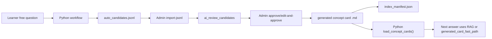

# AI Review Approved Candidate Knowledge Sync Design

## Goal

When an admin approves an AI review knowledge candidate, the approved definition should become a generated concept card immediately so the Python RAG path can use it on the next question without requiring a separate manual promotion script.

## Current State

Free-question answers can create auto candidates in `ai/app/knowledge/candidates/auto_candidates.jsonl`. The admin page imports those rows into Spring DB rows under `ai_review_candidates`. Admin approval updates the DB row and writes an audit record.

The current approval-side reindex hook is `AiReviewKnowledgeReindexer.reindexChanged(AiReviewCandidate)`, but the concrete implementation only logs the candidate. It does not write markdown concept cards and does not update the manifest. Python RAG reads markdown files through `load_concept_cards()` under `ai/app/knowledge/concepts`, so DB approval alone is not enough for later answers to use the approved knowledge.

## Selected Approach

Use a Spring-side file writer during candidate approval:

1. `AiReviewCandidateApprovalV2Service.reviewCandidate()` approves or edit-and-approves the DB candidate.
2. If the saved status is `APPROVED`, call `AiReviewKnowledgeReindexer.reindexChanged(saved)`.
3. Replace the logging-only implementation with a writer that:
   - renders one markdown concept card under `../ai/app/knowledge/concepts/generated`
   - writes a deterministic concept id such as `auto-review-pagination`
   - writes Korean-friendly concept sections compatible with the existing parser
   - updates `../ai/app/vectorstore/index_manifest.json` with the changed card hash
4. Python RAG will read the generated markdown card on the next process request because `load_concept_cards()` scans `ai/app/knowledge/concepts/**/*.md`.

Chroma vector indexing stays out of this first implementation. The existing lexical/BM25 paths use the generated markdown directly, and Chroma requires heavier Python dependencies/runtime state. A later step can add an explicit vector reindex job after the markdown sync is stable.

## Generated Card Format

The generated file should live at:

`ai/app/knowledge/concepts/generated/<concept-id>.md`

The card should include front matter and the sections the Python parser already understands:

```markdown
---
id: auto-review-pagination
category: auto-review
difficulty: intermediate
version: admin-approved-candidate
last_updated: 2026-05-20
---

# pagination

## 핵심 설명
관리자가 승인한 정의 본문.

## 사용 맥락
- 원 질문: pagination이 뭐야?
- 해석된 질문: pagination
- 승인자: admin-ui

## 주의할 점
- 승인된 후보 답변을 우선 사용하되, 더 구체적인 문제 맥락이 있으면 RAG 생성 답변에서 함께 고려한다.

## 검색 키워드
- pagination
- auto-review
- source:auto-123
```

The current Python fast path checks generated card sections by exact section title. If existing generated cards still use mojibake section names, implementation should make `lightweight_answers.py` tolerant of both the old section title and the new Korean `핵심 설명` section. This avoids writing new mojibake while preserving old card compatibility.

## File Responsibilities

- `backend/src/main/java/com/devmatch/service/AiReviewKnowledgeReindexer.java`
  - Keep the existing interface.

- `backend/src/main/java/com/devmatch/service/LoggingAiReviewKnowledgeReindexer.java`
  - Replace or rename to a real Spring component that writes generated concept cards and updates the manifest.
  - Responsibility: translate an approved DB candidate into filesystem knowledge artifacts.

- `backend/src/test/java/com/devmatch/service/AiReviewKnowledgeReindexerTest.java`
  - Verify approved candidates produce stable markdown files.
  - Verify manifest entries are written or updated.
  - Verify rejected or non-approved candidates do not write files if directly passed.

- `backend/src/test/java/com/devmatch/service/AiReviewCandidateApprovalV2ServiceTest.java`
  - Keep the existing interaction test verifying `knowledgeReindexer.reindexChanged(candidate)` is called for approved candidates.
  - Add or keep negative verification for rejected candidates if missing.

- `ai/app/workflow/lightweight_answers.py`
  - Update generated card answer extraction to check both `핵심 설명` and the legacy generated-card definition section title.

- `ai/tests/test_lightweight_evaluator.py` or a focused Python test file
  - Verify a loaded concept card with `핵심 설명` can be returned as `generated_card_fast_path`.

## Data Flow



## Error Handling

Approval must not leave the DB row half-updated because the file writer failed silently. The implementation should throw an unchecked exception if it cannot create the generated card or manifest. Because approval is transactional for DB writes, this makes failure visible to the admin instead of pretending the candidate is usable.

If the generated directory or manifest parent directory does not exist, the writer creates it. If an existing file for the same concept id exists, it overwrites it deterministically with the latest approved definition.

## Testing Strategy

Follow TDD:

1. Write a failing Java test for markdown generation from an approved candidate.
2. Implement the minimal writer.
3. Write a failing Java test for manifest update.
4. Implement manifest update.
5. Write or update a Python test proving `핵심 설명` generated cards can be used by the fast path.
6. Run targeted backend and Python tests.
7. Run a broader backend test slice and frontend build if touched indirectly.

## Out Of Scope

- Automatic Chroma embedding updates.
- Calling Python services from Spring.
- Admin UI redesign.
- Migrating all old generated cards to new Korean headings.
- Cleaning existing mojibake data in JSONL files.

## Decision

Use filesystem sync as the first production path. Chroma sync can be added later behind an explicit script or async job once local deployment dependencies are clearer.
